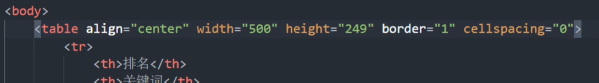

# HTML&CSS

## 1 HTML

### 1.1 超链接


锚点链接


相应跳转的部分标识为


### 1.2 特殊字符


### 1.3 表格属性


实际代码为



### 1.4 列表

#### 1.4.1 无序列表


##### 去掉list前面的小圆点

```
list-style:none
```

#### 1.4.2 自定义列表


### 1.5 表单标签

#### 1.5.1 表单域


#### 1.5.2 input 表单


##### type属性值


注意单选一定要设定选项的 **name** ；**id** 用于设定 label 可以点击文字等选择该选项。

##### label 标签


#### 1.5.3 select 表单


#### 1.5.4 textarea 表单


## 2 CSS

### 2.1 基础知识

#### 2.1.1 基础选择器

选择器分为**基础选择器**和**复合选择器**两个大类


##### 标签选择器

基础选择器是由单个选择器组成的

基础选择器又包括:标签选择器、类选择器、id选择器和通配符选择器


##### 类选择器

###### 基础语法


在显示时可指明使用哪一个类


###### 多类名

调用不同类用空格隔开

##### id 选择器

相较于类，id最大的不同是**只能调用一次**


##### 通配符选择器


#### 2.1.2 字体属性

 字体（font-family）、字体大小（font-size）、字体粗细（font-weight）、字体风格（font-style）

复合属性

```
font: font-style font-weight font-size/line-height font-family;
# for example
font: italic 70016px 'Microsoft yahei';
```

文本对齐

```
text-align:center/right/left;
```

想要图片居中，可以将其放入一个段落，令段落的style规定文本居中

文本装饰

```
text-decoration:line-through/overline/underline/none;
```

文本缩进

```
text_indent:10px/2ems;
```

行间距

```
line-height:26px;
```

#### 2.1.3 引入方式

主要使用外部引用，行内引用和内部引用适用于样式很少的情况。


#### 2.1.4 Emmet 语法

div + tab键  快速生成

div + .classname  快速生成带有相应class的div

div + #idname  快速生成带有相应id的div

div + *3  快速生成3个div

div + .classname$*5   快速生成多个带有不同序号相应class的div

div + {文字}  生成带有对应内容的div

alt + shift 选中一列中相同的光标处


##### 快速格式化代码


#### 2.1.5 复合选择器

其中后代、链接、伪链接比较常用


##### 后代选择器


##### 子选择器


##### 并集选择器


##### 链接伪类选择器


对链接和鼠标经过链接的样式分别进行规定


##### focus伪类选择器

光标部分


### 2.2 元素显示模式

#### 2.2.1 块元素

常见的块元素有&lt;h1&gt;~&lt;h6&gt;、&lt;p&gt;、&lt;div&gt;、&lt;u&gt;、&lt;ol&gt;、&lt;li&gt;等，其中&lt;div&gt;标签是最典型的块元素。
块级元素的特点:

①比较霸道，自己独占一行。

②高度，宽度、外边距以及内边距都可以控制。个

③宽度默认是容器(父级宽度)的100%。

④是一个容器及盒子，里面可以放行内或者块级元素。

注意

文字类的元素内不能使用块级元素；

&lt;p&gt;签主要用于存放文字，因此里面不能放块级元素，特别是不能放&lt;div&gt;；

同理，&lt;h1&gt;~&lt;h6&gt;等都是文字类块级标签，里面也不能放其他块级元素。

#### 2.2.2 行内元素

 常见的行内元素有&lt;a>、&lt;strong>、&lt;b>、&lt;em>、&lt;i>、&lt;del>、&lt;s>、&lt;ins>、&lt;u>、&lt;span>等，其中&lt;span>标签是最典型的行内元素。有的地方也将行内元素称为内联元素。

行内元素的特点∶

①相邻行内元素在一行上，一行可以显示多个。

②高、宽直接设置是无效的。

③默认宽度就是它本身内容的宽度。

④行内元素只能容纳文本或其他行内元素。

注意

链接里面不能再放链接

特殊情况链接&lt;a>里面可以放块级元素，但是给&lt;a>转换一下块级模式最安全

#### 2.2.3 行内块元素

在行内元素中有几个特殊的标签——&lt;img />、&lt;input />、&lt;td>，它们同时具有块元素和行内元素的特点。有些资料称它们为行内块元素。

行内块元素的特点∶

①和相邻行内元素(行内块)在一行上，但是他们之间会有空白缝隙。一行可以显示多个(行内元素特点)。

②默认宽度就是它本身内容的宽度(行内元素特点)。

③高度，行高、外边距以及内边距都可以控制(块级元素特点)。 

 

##### 元素转换


snipaste截图工具 

案例


### 2.3 文字垂直居中

设置盒子的高度和文字的行高一致

height = 50px

line-height = 50px

### 2.4 背景

背景颜色  background-colour:

背景图片  background-image:

背景平铺  background-repeat:repeat|no-repeat|repeat-x|repeat-y


譬如，同时加背景颜色和图片


效果如图所示


### 2.5 层叠性&继承性&优先级

##### 优先级


注意


### 2.5 盒子模型


#### 边框--border

表格的边框合并问题

```
borger-collapse:collapse;
```

#### 内边距--padding


用处：设置导航栏不同字数的选项卡间距相同，只需要对其设置左右的padding是一致的即可

注意：盒子如果本身没有写width、height属性，再写padding则不会撑开父亲盒子的大小。

#### 外边距--margin

同padding

##### 应用：块级盒子水平居中对齐 

前提：盒子必须**指定宽度**，且盒子的**左右外边距**都设置为了**auto**

譬如：

```
.header{ width:960px;  margin:0 auto;}s
```

另附：**行内元素、行内块元素水平居中**

给父元素添加  text-align:center

##### 嵌套块元素垂直外边距的塌陷

①为父元素定义边框border

②为父元素定义内边距padding

③为父元素添加overflow: hidden 

##### 清除内外边距

```
*{
	margin:0;
	padding:0;
}
```

注意：**行内元素**为了照顾兼容性，尽量只设置左右内外边距，不设置上下内外边距，一定需要的话可以转换为块级和行内块元素

#### PS工具


#### 圆角边框 border-radius

四个角变圆形

```
 border-radius:10px或者20%;
```

百分比指的是和矩形宽和长的比例

圆角矩形可以设置为 height 的一半

四个角分别设置按顺时针执行

```
border-radius:10px,20px,30px,40px;
```

两个对角设置只需要两个参数

```
border-radius:10px,30px;
```

也可以四个角分别设置 border-top-left-radius、border-top-right-radius、border-bottom-right-radius和
border-bottom-left-radius

#### 盒子阴影 box-shadow


例如：

```
box-shadow:10px 10px 10px 10px black;
```

原本没有影子，鼠标经过时显现的效果

```
div:hover{
	box-shadow:10px 10px 10px -4px rgba(0,0,0,.3)}
```

默认是外阴影，需要的话加inset是内阴影，但是outset是非法语句

#### 文字阴影 text-shadow


格式与盒子阴影类似

### 2.6 浮动

#### 布局三种方式

- 标准流/普通流

  按照标签，即块元素、行元素、行内块元素——**用于纵向排列**

- 浮动

- ——**用于横向排列**

- 定位

#### 浮动

**float** 属性用于创建浮动框，将其移动到一边，直到左边缘或右边缘触及包含块或另一个浮动框的**边缘**。


##### 语法

```
选择器 { float:属性值; }
```

##### 特性

1 脱离标准普通流的控制（浮)移动到指定位置(动),(俗称脱标)

2 浮动的盒子不再保留原先的位置 

3 浮动的元素具有行内块元素

4 如果块级盒子没有设置宽度，默认宽度和父级一样宽，但是添加浮动后，它的大小根据内容来决定

5 浮动的盒子中间是没有缝隙的，是紧挨着一起的

6 浮动的盒子只会影响盒子后面的标准流，不会影响前面的标准流

##### 清除浮动

为了处理父级没有设置高度，子有浮动格式，影响后面布局的情况。 

语法

```
选择器{clear:属性值}
```


1. 额外标签法也称为隔墙法

   在最后一个元素的后面添加一个新标签，在该标签中定义样式

   ```
   clear:both
   ```

   那么其左侧的就不浮动了

2. 父级添加overflow属性

   ```
   overflow:hidden或者auto或者scroll;
   ```

3. 父级添加 after 伪元素

   

   其中

   ```
   *zoom:1;  --用于兼容IE6、7的清除代码
   ```

4. 父级添加双伪元素

   

四种方式对比


### 2.7 切片


### 2.8 CSS书写顺序


实际应用中的默认规定：

##### 1 导航栏


此外


### 2.9 定位

#### 语法

定位 = 定位模式 + 边偏移

##### 定位模式


##### 边偏移


#### 相对定位

```
/* 是相对自己原来位置，向右、向下平移100px */
position:relative;
top:100px;
left:100px;
```

相对定位的特点:(务必记住)
1．它是相对于自己原来的位置来移动的（移动位置的时候参照点是自己原来的位置）。
2．原来在标准流的位置继续占有，后面的盒子仍然以标准流的方式对待它。(不脱标，继续保留原来位置)

#### 绝对定位

绝对定位的特点∶(务必记住)
1．如果没有祖先元素或者祖先元素没有定位，则以浏览器为准定位（Document文档）。
2．如果祖先元素有定位（相对、绝对、固定定位），则以最近一级的有定位祖先元素为参考点移动位置。3．绝对定位不再占有原先的位置。（脱标）

通常做法：**子绝父相**——即父盒子需要定位，但由于不能让其他盒子占据其原始位置，因此使用**相对定位**；而子盒子需要在父盒子中随意定位，因此基于父盒子进行**绝对定位**。

#### 固定定位

固定定位的特点∶(务必记住)
1．以浏览器的可视窗口为参照点移动元素。
--跟父元素没有任何关系
--不随滚动条滚动。
2．固定定位不在占有原先的位置。
固定定位也是脱标的，其实固定定位也可以看做是一种特殊的绝对定位。

- 固定定位小技巧∶固定在版心右侧位置。

  1．让固定定位的盒子left: 50%.走到浏览器可视区（也可以看做版心）)的一半位置。

  2．让固定定位的盒子margin-left:版心宽度的一半距离。多走版心宽度的一半位置就可以让固定定位的盒子贴着版心右侧对齐了。

#### 粘性定位

粘性定位的特点:
1．以浏览器的可视窗口为参照点移动元素（固定定位特点）

2．粘性定位占有原先的位置（相对定位特点）

3．必须添加top .left、right、bottom其中一个才有效

#### 总结


#### 定位叠放次序

在使用定位布局时，可能会出现盒子重叠的情况。此时，可以使用z-index来控制盒子的前后次序(z轴)

- 数值可以是正整数、负整数或0,默认是auto，数值越大，盒子越靠上
- 如果属性值相同，则按照书写顺序，后来居上
- 数字后面不能加单位
- 只有定位的盒子才有z-index属性

#### 其他


##### 1.绝对定位的盒子居中

加了绝对定位的盒子不能通过 margin:0 auto水平居中，但是可以通过以下计算方法实现水平和垂直居中。

① left: 50%;:让盒子的左侧移动到父级元素的水平中心位置。
② margin-left:-100px;:让盒子向左移动自身宽度的一半。

##### 2.定位特殊特性

绝对定位和固定定位也和浮动类似。

① 行内元素添加绝对或者固定定位，可以直接设置高度和宽度。
② 块级元素添加绝对或者固定定位，如果不给宽度或者高度，默认大小是内容的大小。

##### 3.脱标的盒子不会触发外边距塌陷

浮动元素、绝对定位(固定定位)元素的都不会触发外边距合并的问题。

##### 4.绝对定位(固定定位）会完全压住盒子

浮动元素不同，只会压住它下面标准流的盒子，但是不会压住下面标准流盒子里面的文字(图片)但是绝对定位（固定定位）会压住下面标准流所有的内容。

### 总结

1.标准流

可以让盒子上下排列或者左右排列，垂直的块级盒子显示就用标准流布局。

⒉浮动

可以让多个块级元素一行显示或者左右对齐盒子，多个块级盒子水平显示就用浮动布局。

3.定位

定位最大的特点是有层叠的概念，就是可以让多个盒子前后叠压来显示。如果元素自由在某个盒子内移动就用定位布局。

## 3 进阶

### 3.1 元素的显示与隐藏

#### 3.1.1 diaplay

display: none  --隐藏对象

display: block  --显示对象

* 隐藏后位置不再保留

#### 3.1.2 visibility

visibility: hidden  --隐藏对象

visibility: visible  --显示对象

* 隐藏后位置仍然保留

#### 3.1.3 overflow

overflow: hidden  --隐藏对象

overflow: visible  --显示对象

overflow: scroll  --滚动条

overflow: auto  --根据需要自动添加或删除滚动条

#### 3.1.4 实例


相应的结构为


### 3.2 精灵图 sprites

主要用于永恒不变的背景、标签图片等。

使用精灵图核心总结:
1.精灵图主要针对于小的背景图片使用。
2.主要借助于背景位置来实现---background-position。
3.一般情况下精灵图都是负值。(千万注意网页中的坐标︰x轴右边走是正值，左边走是负值，y轴同理。)

譬如


### 3.3 字体图标

轻量级∶一个图标字体要比一系列的图像要小。一旦字体加载了，图标就会马上渲染出来，减少了服务器请求
●灵活性:本质其实是文字，可以很随意的改变颜色、产生阴影、透明效果、旋转等
●兼容性:几乎支持所有的浏览器，请放心使用
注意:字体图标不能替代精灵技术，只是对工作中图标部分技术的提升和优化。
总结:
   1．如果遇到一些结构和样式比较简单的小图标，就用字体图标。

2.   如果遇到一些结构和样式复杂一点的小图片，就用精灵图。

#### 字体图标的引入

下载后解压，将文件放置到网页同级目录下

```
font-face {
    font-family: "icomoon ' ;
    src: url ( 'fonts/icomoon.eot?7kkyc2 ' ) ;
    src: url ( 'fonts/icomoon.eot?7kkyc2#iefix') format('embedded-opentype') ,
        url ( ' fonts/ icomoon.ttf? 7kkyc2') format('truetype'),
        url ( ' fonts/icomoon.woff?7kkyc2') format('woff'),
        url ( ' fonts/icomoon.svg?7kkyc2#icomoon') format('svg');
    font-weight: normal;
    font-style: normal;
}
```

并将上述字体声明复制在style中，注意其中实际的文件路径

### 3.4 三角制作


呈现的效果是


另一个实例


结合定位，可以达到如此效果


### 3.5 用户界面样式

#### 3.5.1 鼠标样式


#### 3.5.2 轮廓线

用于去掉点击文本框进行输入时，其默认有一个蓝色框的问题。

outline:none;

#### 3.5.3 防止拖拽文本域

<textarea cols='30' rows='10'> </textarea>>

使用

resize: none;

#### 3.5.4 vertical-align

用于实现文字和图片的对齐方式，即面向行内块元素们之间的对齐


譬如


##### 解决图片底部默认空白缝隙问题

由于默认是基线对齐，图片下面默认会有一行白线，如果想要消除它，有两种办法：

① 将对齐方式设置为 top、middle、bottom 三种

② 将图片转换为块级元素，即 display:block;

#### 3.5.5 溢出的文字用省略号显示

##### 单行文本

三个条件

```css
/*1．先强制一行内显示文本*/
white-space: nowrap;(默认normal自动换行)
/*2．超出的部分隐藏*/
overflow: hidden;
/*3．文字用省略号替代超出的部分*/
text-overflow : ellipsis;
```

##### 多行文本

```css
overflow : hidden;
text-overflow: ellipsis;
/*弹性伸缩盒子模型显示*/
display: -webkit-box;
/*限制在一个块元素显示的文本的行数*/
-webkit-line-clamp: 2;
/*设置或检索伸缩盒对象的子元素的排列方式*/
-webkit-box-orient : vertical;
```

#### 3.5.6 鼠标移动至盒子时有边框出现

1. 让每个盒子margin 往左侧移动–1px正好压住相邻盒子边框

2. 鼠标经过某个盒子的时候，提高当前盒子的层级即呵（如果没有有定位，则加相对定位（保留位置），如果有定位，则加z-index )

   

#### 3.5.7 浮动实现图片与文字对齐

实现的效果为


#### 3.5.8 制作直角三角形


将代码可精简为

```css
width: 0;
height: 0;
border-color: transparent red transparent transparent;
border-style: solid;
border-width: 22px 8px 0 0;
```

实现的效果为


### 3.6 初始化

### 


## 4 HTML5 新特性

### 4.1 语义标签


### 4.2 视频标签


### 4.3 音频标签


### 4.4 新增input

#### 4.4.1 表单类型

注意：要在表单域当中<form>


#### 4.4.2 表单属性


## 5 CCS3 新特性

### 5.1 新增选择器

#### 属性选择器


示例1：


示例2：


示例3：


示例4：


#### 结构伪类选择器


示例


child 和 type 的差别在于


其中


小结

- 结构伪类选择器一般用于选择父级里面的第几个孩子
- nth-child对父元素里面所有孩子排序选择（序号是固定的）先找到第n个孩子，然后看看是否和E匹配
- nth-of-type对父元素里面指定子元素进行排序选择。先去匹配E，然后再根据E找第n个孩子
- 关于nth-child ( n ）我们要知道n是从О开始计算的，要记住常用的公式
- 如果是无序列表，我们肯定用nth-child更多
- 类选择器、属性选择器、伪类选择器，权重为10。

#### 伪元素选择器


##### 清除浮动

采用伪元素选择器可以简化网页结构


盒子两端都考虑更为严谨


### 5.2 新盒子模型


### 5.3 新功能——模糊、函数、过渡

#### 模糊


#### 函数


#### 过渡


示例1：前两个属性是必须的，后两个可以省略


示例2：4个属性都具备


示例3：多个属性都设置过渡


示例4：全部属性都设置过渡


## 6 网站制作示例

### 6.1 网站 favicon 图标

一、制作favicon图标

比特虫网站

二、favicon图标放到网站根目录下

即html文件所在文件夹

三、HTML页面引入favicon图标


### 6.2 网站TDK三大标签SEO优化

SEO ( SearchEngine Optimization )汉译为搜索引擎优化，是一种利用搜索引擎的规则提高网站在有关搜索引擎内自然排名的方式
SEO的目的是对网站进行深度的优化，从而帮助网站获取免费的流量，进而在搜索引擎上提升网站的排名，提高网站的知名度。


1.title网站标题

title具有不可替代性，是我们内页的第一个重要标签，是搜索引擎了解网页的入口和对网页主题归属的最佳判断点。
建议：网站名(产品名)–网站的介绍（尽量不要超过30个汉字)

2.description网站说明

简要说明我们网站主要是做什么的。
我们提倡，description作为网站的总体业务和主题概括，多采用“我们是.”、“我们提供..”、“x××网作为.….”、“电话:010.….”之类语句。


3.keywords关键字

