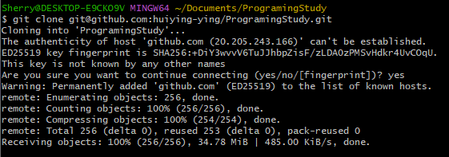
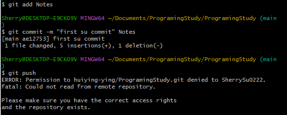
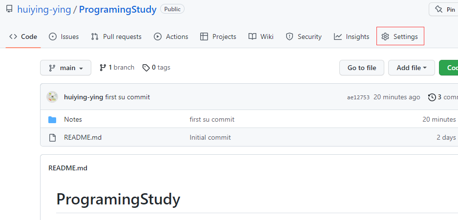
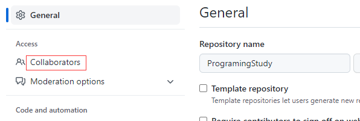
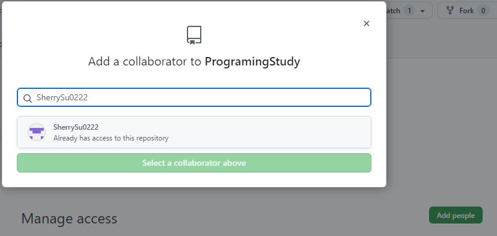
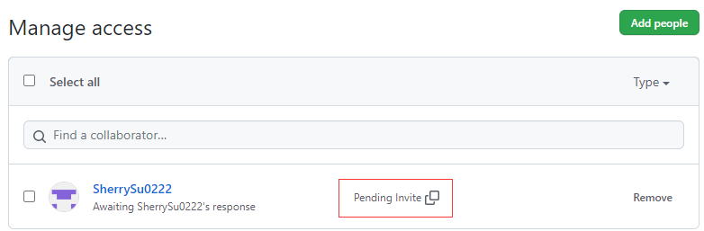
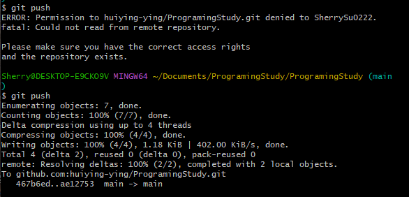

# Git

## 1 基础知识

### 1.1 常用命令


#### 签名


#### 附：Vim操作

|      |     指令      |   操作   |
| :--: | :-----------: | :------: |
|  1   | vim hello.txt | 新建文档 |
|  2   |      yy       |   复制   |
|  3   |       p       |   粘贴   |
|  4   |      wq       |   保存   |

另，windows里换行符是LF，Linux里换行符是CRLF

#### 附：Linux查看隐藏文件

ll -a

### 1.2 版本


------------------------------------------------------------------------------------------------------------------------------------------------------


---------------------

### 1.3 分支


当在本地创建了新的分支，而远程库还没有时，需要以下代码（以新分支hot-fix为例）

```
git push --set-upstream origin hot-fix
```

合并分支时，是处于master或者main的分支中，使用 git merge hot-fix 命令将分支hot-fix合并到master。

## 2 Github

#### 附--Github访问方法

[Github访问方法 Github被墙最新hosts 每日更新 2022年 - LabVIEWs](https://www.labviews.cn/d/16-github-githubhosts-2022)

1. 打开“C:\Windows\System32\drivers\etc”，使用记事本修改“hosts”文件

2. 新增一行，从http://git.yoqi.me/lyq/github-host/raw/master/hosts中找github的IP地址

3. 最后打开cmd，执行 ipconfig/flushdns


-----

### 2.1 git remote -v  &  git remote add


-----------

### 2.2 git push


### 2.3 git pull


查看拉取后的本地状态


### 2.4 git clone

-----------


----------------


--------


-----

#### 2.4.1 http协议

如果使用http协议访问需要有一个登录的操作


--------------


#### 2.4.2 SSH协议

通过SSH协议实现免密登录


----------

相关设置步骤为


----

打开用户的目录，直到看到.ssh文件夹

删除.ssh目录

```
rm - rvf .ssh
```

运行命令生成.ssh密钥目录

```
ssh-keygen -t rsa -C 邮箱@.com
```

之后操作3次enter即可生成


---------

 查看公钥文件


----

在Gitlab中添加ssh设置


--------


-----


### 2.5 团队内协作


虽然任意人有读的权限，即可以clone下来



但是如果想要push，就会报如下错误



因此需要给团队内其他成员设置权限，步骤如下



------



然后点击Add people，输入用户名进行查找



----


----



将邀请链接Pending Invite发给团队内成员，成员复制后在gitlab中搜索，在如下页面中同意邀请。


此后再push，相比上次就会push成功



### 2.6 团队间协作


外部人员修改时通过链接或者查找锁定原代码，点右上角fock叉一份到自己的仓库


修改-->add-->commit-->push  到自己仓库后，点上方的pull request


之后create request后编辑好注释和留言后完成


-----


内部管理者可以看到request，经过审查后合并到本仓库


最后提交合并后的版本


## 3 IDEA集成Git

