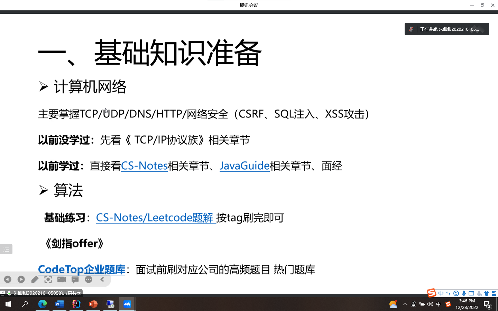
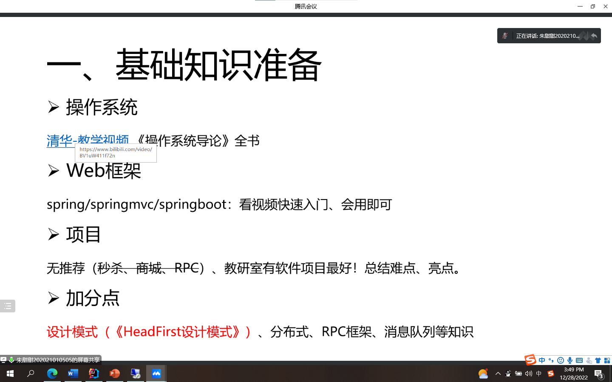
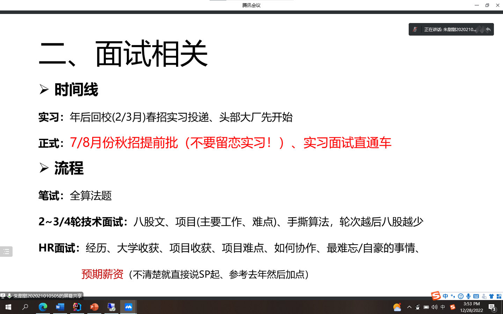
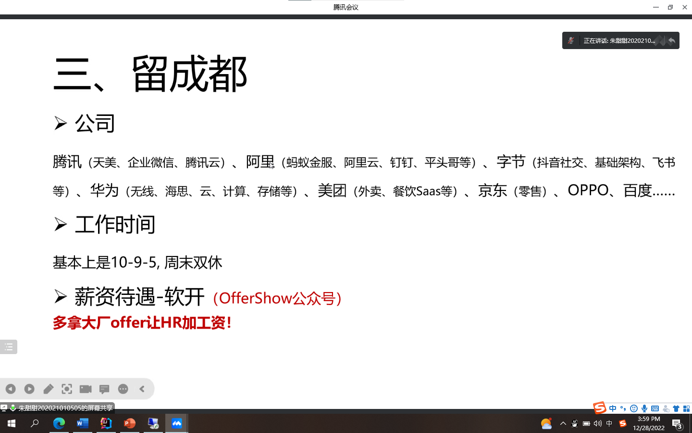
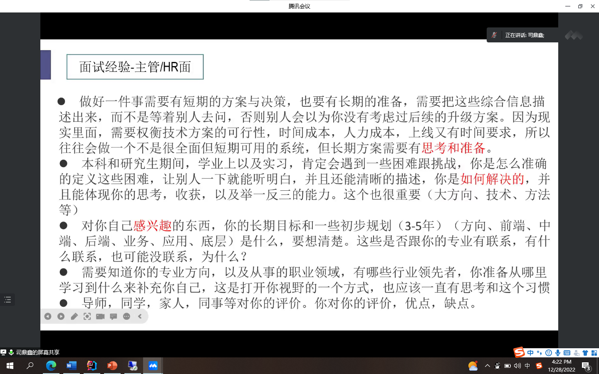
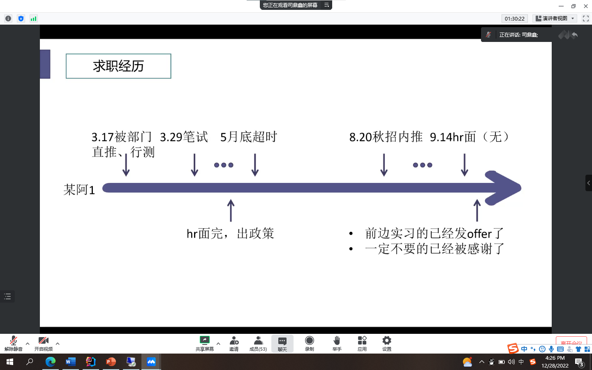
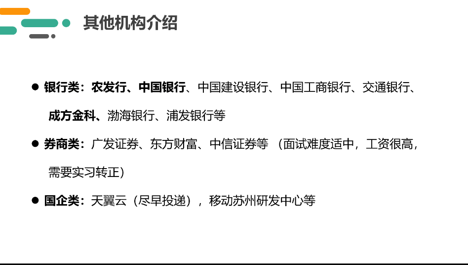
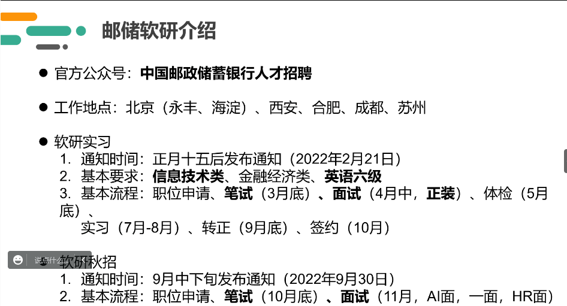

## 刷题过程中所遇到的问题

String 拼接

ArrayList 添加一个集合

ArrayList 删除一个元素（直接删除它本身）

Array 取数组的子数组

```java
Arrays.copyOfRange(array, start, end);
```

String.join(",","a", "b");

LinkedList作参数创建一个ArrayList对象

#### 数组的拼接

```java
public int[] combat(int[] a, int[] b){
        int[] c = new int[a.length + b.length];
        System.arraycopy(a,0, c,0, a.length);
        System.arraycopy(b,0, c, a.length, b.length);
        return c;
    }
```

#### 比较器详解

[Java对List集合，String数组排序 - 简书 (jianshu.com)](https://www.jianshu.com/p/98b3faf324a5)

##### 重写比较器

```java
Arrays.sort(people, (a, b) -> {
            if (a[0] == b[0]) return a[1] - b[1];
            return b[0] - a[0];
        });
```

这里注意一个事情是，**上述只针对计算过程中不超过Integer.MAX的计算，如遇到2^31-(-2^31-1)则会出现错误，这里有现成整型数据比较的更完备的方案**。

```java
Arrays.sort(points, (a, b) -> Integer.compare(a[0], b[0]));
```

#### 优先级队列

#### 数组与列表相互转化

```java
String[] strArray = strList.toArray(new String[strList.size()]);
```

```java
String[] strArray = { "array-a", "array-b" };
List<String> strList = new ArrayList<>(strArray.length);
Collections.addAll(strList, strArray);
```

#### 列表升序&降序

[Java ArrayList sort() 方法实现集合的升序降序_初夏0811的博客-CSDN博客_arraylist的sort升序](https://blog.csdn.net/m0_37899908/article/details/112502858)

## 犯错误

遍历集合时用到了remove函数，那么 **for each** 和 **iterator** 会报错

### 值得二刷（当时没想到）

##### 53 最大子序和

##### 45 跳跃游戏II

##### 135 分发糖果

##### 714 买卖股票的最佳时机含手续费

















