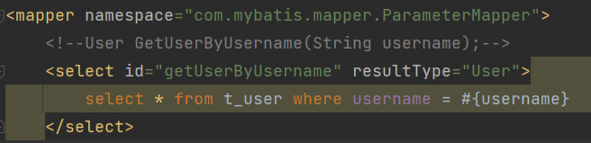

# 0 简介


## 历史

MyBatis:最初是Apachel的个开源项目iBatis,2010年6月这个项目由Apache Software Foundation迁移到了
G0 ogle Code。随若开发团队转投Google Code旗下，iBatis.3.X正式更名为MyBatis。代码于2013年11月迁移到
Github.
iBatis一词来源于"internet'和abatis"的组合，是一个基于]ava的特久层框架。Batis提供的持久层框架包括SQL
MapsData Access Objects (DAO)

## 特性

1) MyBatis是支持定制化SQL、存储过程以及高级映射的优苏的持久层框架
2) MyBatis避免了几乎所有的DBC代码和手动设置参数以及获取结果集
3) MyBatisi可以使用简单的XML或注解用于配置和原始映射，将接口和ava的POJO(Plain Old Java Objects,普
   通的ava对象）映射成数据库中的记录
4) MyBatis是-个半自动的 **ORM(Object Relation Mapping)** 框架（半自动指的是自己需要写sql语句，全自动的话只需要配置文件就可以运行了）

## 比较

- JRBC
  - SQL夹杂在ava代码中相合度高，导致硬编码内伤
  - 维护不易且实际开发需求中SQL有变化，领繁修改的情况多见
  - 代码冗长，开发效率低

- Hibernate和JPA
  - 操作简便，开发效率高
  - 程序中的长难复杂SQL需要绕过框架
  - 内部自动生产的SQL，不容易做特殊优化
  - 甚于全映射的全自动框架，大量字段的POO进行部分映射时比较困难
  - 反射操作太多，导致数据库性能下降

- MyBatis
  - 轻量级，性能出色
  - SQL和ava编码分开，功能边界清浙。Java代码专注业务、SQL语句专注数据
  - 开发效率稍逊于Hibernate,但是完全能够接受

# 1 搭建 MyBatis

##### 1 开发环境

IDE:idea 2019.2
构建工具：maven3.5.4
MySQL版本：MySQL5.7
MyBatis版本：MyBatis3.5.7

##### 2 依赖

```xml
<!--设置打包方式为jar包-->
<packaging>jar</packaging>

<dependencies>
    <!--Mybatis核心-->
    <dependency>
        <groupId>org.mybatis</groupId>
        <artifactId>mybatis</artifactId>
        <version>3.5.7</version>
    </dependency>
    <!--junit测试-->
    <dependency>
        <groupId>junit</groupId>
        <artifactId>junit</artifactId>
        <version>4.12</version>
        <scope>test</scope>
    </dependency>
    <!--MySQL驱动-->
    <dependency>
        <groupId>mysql</groupId>
        <artifactId>mysql-connector-java</artifactId>
        <version>5.1.3</version>
    </dependency>
</dependencies>
```

##### 3 创建MyBatis的核心配置文件

习惯上命名为mybatis-config.xml,这个文件名仅仅只是建议，并非强制要求。将来整合Spring之后，这个配
置文件可以省略，所以大家操作时可以直接复制、粘贴。
核心配置文件主要用于配置连接数据库的环境以及MyBatis的全局配置信息
核心配置文件存放的位置是src/main/resources目录下


```xml
<?xml version="1.0" encoding="UTF-8"?>
<!DOCTYPE configuration
         PUBLIC "-//mybatis.org//DTD Config 3.0//EN"
        "http://mybatis.org/dtd/mybatis-3-config.dtd">
<configuration>
    <!--配置连接数据库的环境-->
    <environments default="development">
        <environment id="development">
            <transactionManager type="JDBC"/>
            <dataSource type="POOLED">
                <property name="driver" value="com.mysql.jdbc.Driver"/>
                <property name="url" value="jdbc:mysql://localhost:3306/mybatis"/>
                <property name="username" value="root"/>
                <property name="password" value="suxujia520"/>
            </dataSource>
        </environment>
    </environments>
    <!--引入映射文件（这里还没设置）-->
    <mappers>
        <mapper resource="org/mybatis/example/BlogMapper.xm1"/>
    </mappers>
</configuration>
```

##### 4 创建mapper接口

MyBatis中 的 mapper 接口相当于以前的 dao。但是区别在于，mapper仅仅是接口，我们不需要提供实现类。

##### 5 创建MyBatis的映射文件

相关概念：ORM(Object Relationship Mapping)对象关系映射。

- 对象：Java的实体类对象
- 关系：关系型数据库
- 映射：二者之间的对应关系

| java概念 | 数据库概念 |
| -------- | ---------- |
| 类       | 表         |
| 属性     | 字段（列） |
| 对象     | 记录（行） |

1、映射文件的命名规则：

表所对应的实体类的类将+Mapper.xml

例如：表user ，映射的实体类为User，所对应的映射文件为 UserMapper.xml  

因此一个映射文件对应一个实体类，对应一张表的操作  **（表  对应  Mapper接口  对应  配置文件）**

MyBatis映射文件用于编写SQL，访问以及操作表中的数据

MyBatis映射文件存放的位置是src/maln/resources/mappers目录下

注：xml 文件中的 .dtd 文件不同


之后再 mybatis.xml 文件中添加相应的映射文件

```java
<?xml version="1.0" encoding="UTF-8"?>
<!DOCTYPE configuration
         PUBLIC "-//mybatis.org//DTD Config 3.0//EN"
        "http://mybatis.org/dtd/mybatis-3-config.dtd">
<configuration>
    <!--配置连接数据库的环境-->
    <environments default="development">
        <environment id="development">
            <transactionManager type="JDBC"/>
            <dataSource type="POOLED">
                <property name="driver" value="com.mysql.jdbc.Driver"/>
                <property name="url" value="jdbc:mysql://localhost:3306/mybatis?characterEncoding=utf8"/>  // 这里和教程有差别，？之后的部分不加的话会报错，这里说的是编码的问题要明确一下，猜测可能是mysql版本造成的
                <property name="username" value="root"/>
                <property name="password" value="suxujia520"/>
            </dataSource>
        </environment>
    </environments>
    <!--引入映射文件-->
    <mappers>
        <mapper resource="mappers/UserMapper.xm1"/>
    </mappers>
</configuration>
```

2、MyBatis中可以面向接口操作数据，要保证两个一致：

- 映射文件的namespace要和mapper接口的全类名保持一致


- 映射文件中SQL语句的id要和mapper接口中的方法名一致（id）


##### 6 通过junit测试功能

```java
package com.mybatis.test;**
import com.mybatis.mapper.UserMapper;
import org.apache.ibatis.io.Resources;
import org.apache.ibatis.session.SqlSession;
import org.apache.ibatis.session.SqlSessionFactory;
import org.apache.ibatis.session.SqlSessionFactoryBuilder;
import org.junit.Test;

import java.io.IOException;
import java.io.InputStream;

public class MyBatisTest001 {
    @Test
    public void testMybatis() throws IOException {
        // 加载核心配置文件
        InputStream is = Resources.getResourceAsStream("mybatis_config.xml");
        // 获取SqlSessionFactoryBuilder
        SqlSessionFactoryBuilder sqlSessionFactoryBuilder = new SqlSessionFactoryBuilder();
        // 获取SqlSessionFactory
        SqlSessionFactory sqlSessionFactory = sqlSessionFactoryBuilder.build(is);
        // 获取SqlSession(默认不自动提交事务，若要自动提交事务，可以是)
        // sqlSessionFactory.openSession(true);
        SqlSession sqlSession = sqlSessionFactory.openSession();
        // 获取Mapper接口对象
        UserMapper mapper = sqlSession.getMapper(UserMapper.class);
        // 测试功能
        int result = mapper.insertUser();
        // 提交事务
        sqlSession.commit();
        System.out.println("result:" + result);
    }
}
```

##### 7 加入log4j日志功能

###### 加入依赖

```xml
<!--Log4j日志-->
<dependency>
    <groupId>log4j</groupId>
    <artifactId>log4j</artifactId>
    <version>1.2.17</version>
</dependency>
```

###### 加入 log4j 配置文件

```xml
<?xml version="1.0" encoding="UTF-8"?>
<!DOCTYPE log4j:configuration SYSTEM "log4j.dtd">
<log4j:configuration xmlns:log4j="http://jakarta.apache.org/log4j/">
    <appender name="STDOUT" class="org.apache.log4j.ConsoleAppender">
        <param name="Encoding" value="UTF-8"/>
        <layout class="org.apache.log4j.PatternLayout">
            <param name="ConversionPattern" value="%-5p %d{MM-dd HH:mm:ss,SSs}%m (%F:%L) \n"/>
        </layout>
    </appender>
    <logger name="java.sql">
        <level value="debug"/>
    </logger>
    <logger name="org.apache.ibatis">
        <level value="info"/>
    </logger>
    <root>
        <level value="debug"/>
        <appender-ref ref="STDOUT"/>
    </root>
</log4j:configuration>
```

###### 日志的级别

FATAL(致命>ERROR（错误）>WARN（警告）>INFO（信息）>DEBUG（调试）

从左到右打印的内容越来越详细

###### 附：增删改查映射文件中的例子

```xml
<?xml version="1.0" encoding="UTF-8"?>
<!DOCTYPE mapper
        PUBLIC "-//mybatis.org//DTD Mapper 3.0//EN"
        "http://mybatis.org/dtd/mybatis-3-mapper.dtd">
<mapper namespace="com.mybatis.mapper.UserMapper">
    <!--int insertUser();-->
    <insert id="insertUser">
        insert into t_user values(2, "jack", "123456", 23, 'm', "1234@qq.com")
--         insert into t_user_another values(1, 'admin')
    </insert>
    <!--void updateUser();-->
    <update id="updateUser">
        update t_user set username = '张三' where id = 1
    </update>
    <!--void deleteUser();-->
    <delete id="deleteUser">
        delete from t_user where username = '张三'
    </delete>
    <!--User getUserById();
    查询功能的标签必须设置resultType或resultMap
    resultType:设置默以的映射关系（字段名和属性名一致）
    resultMap:设置自定义的映射关肃（字段名和属性名不一致或一对多）-->
    <select id="getUserById" resultType="com.mybatis.pojo.User">
        select * from t_user where id = 1
    </select>
    <!--List<User> getAllUser();-->
    <select id="getAllUser" resultType="com.mybatis.pojo.User">
        select * from t_user
    </select>
</mapper>
```

# 2 核心配置文件详解

简单做了解，之后由springboot管理

#### mybatis_config.xml 详解

```xml
<?xml version="1.0" encoding="UTF-8"?>
<!DOCTYPE configuration
         PUBLIC "-//mybatis.org//DTD Config 3.0//EN"
        "http://mybatis.org/dtd/mybatis-3-config.dtd">
<configuration>
    <!--配置连接数据库的环境-->
    <!--environments：配置多个连接数据库的环境
            属性：
            default：设置默认使用的环境的d
        -->
    <environments default="development">
        <!-- environment:配置某个具体的环凭
            属性：
            id:表示连接数据库的环境的唯一标识，不能重复
        -->
        <environment id="development">
            <!--transactionManager:设置事务管理方式
                属性：
                type="JDBC MANAGED"
                JDBC：表示当前环境中，执行SQL时，使用的是JDBC中原生的事务管理方式,事务的提交或回漓需要手动处理
                MANAGED:被管理，例如spring
            -->
            <transactionManager type="JDBC"/>
            <!--datasource:配置数据源(之后spring会承包)
            属性：
            type：设置数据源的类型
            type="POOLED |UNPOOLED JNDI"
            POOLED:表示使用故据库连接池缓存数据库连接
            UNPOOLED:表示不使用数据库连接池
            JNDI:表示使用上下文中的数据源
            -->
            <dataSource type="POOLED">
                <!--驱动-->
                <property name="driver" value="com.mysql.jdbc.Driver"/>
                <!--连接地址-->
                <property name="url" value="jdbc:mysql://localhost:3306/mybatis?characterEncoding=utf8"/>
                <!--用户名-->
                <property name="username" value="root"/>
                <!--密码-->
                <property name="password" value="suxujia520"/>
            </dataSource>
</environment>
</environments>
<!--引入映射文件-->
    <mappers>
        <mapper resource="mappers/UserMapper.xml"/>
    </mappers>
</configuration>
```

#### 数据库配置文件

##### mybatis_config.xml

```xml
<?xml version="1.0" encoding="UTF-8"?>
<!DOCTYPE configuration
         PUBLIC "-//mybatis.org//DTD Config 3.0//EN"
        "http://mybatis.org/dtd/mybatis-3-config.dtd">
<configuration>
    <properties resource="jdbc.properties"/>
   。。。
   。。。
            <dataSource type="POOLED">
                <!--驱动-->
                <property name="driver" value="${jdbc.driver}"/>
                <!--连接地址-->
                <property name="url" value="${jdbc.url}"/>
                <!--用户名-->
                <property name="username" value="${jdbc.username}"/>
                <!--密码-->
                <property name="password" value="${jdbc.password}"/>
            </dataSource>
</environment>
</environments>
<!--引入映射文件-->
    <mappers>
        <mapper resource="mappers/UserMapper.xml"/>
    </mappers>
</configuration>
```

##### jdbc.properties

```properties
jdbc.driver=com.mysql.jdbc.Driver
jdbc.url=jdbc:mysql://localhost:3306/mybatis?characterEncoding=utf8
jdbc.username=root
jdbc.password=suxujia520
```

#### 类型别名

```xml
<configuration>
    <!--
    MyBatis核心配置文件中，标签的顺序：
    properties?,settings?,typeAliases?,typeHandlers?,objectFactory?,
    objectWrapperFactory?,reflectorFactory?,plugins?,
    environments?,databaseIdProvider?,mappers?
    -->
    <properties resource="jdbc.properties"/>
    <!--设置类型别名（不区分大小写）-->
    <typeAliases>
        <!--<typeAlias type="com.mybatis.pojo.User" ></typeAlias>  &lt;!&ndash;不写就是和类名一样，也就是和下一行效果一样&ndash;&gt;-->
        <!--<typeAlias type="com.mybatis.pojo.User" alias="User"></typeAlias>-->
        <!--以包为单位，将包下所有的类型设置默认的类型别名，类名且不区分大小写-->
        <package name="com.atguigu.mybatis.pojo"/>
    </typeAliases>
    <!--typeAlias：设置某个类型的别名
        属性：
        type:设置需要设置别名的类型
        alias：设置某个类型的别名，若不设置该属性，那么该类型拥有默认的别名，且类名不区分大小写
        -->
```

运行实例


#### 映射文件

```xml
<!--引入映射文件-->
<mappers>
    <!--<mapper resource="mappers/UserMapper.xml"/>-->
    <!--
        以包为单位引入映射文件
        要求：
        1,mapper接口所在的包要和映射文件所在的包一致
        2,mapper接口要和映射文件的名字一致
        -->
    <package name="com.mybatis.mapper"/>
</mappers>
```

# 3 MyBatis 的增删改查

#### 添加

```xml
<!--int insertUser();-->
<insert id="insertUser">
    insert into t_user values(2, "jack", "123456", 23, 'm', "1234@qq.com")
    --         insert into t_user_another values(1, 'admin')
</insert>
```

#### 删除

```xml
<!--void deleteUser();-->
<delete id="deleteUser">
    delete from t_user where username = '张三'
</delete>
```

#### 修改

```xml
<!--void updateUser();-->
<update id="updateUser">
    update t_user set username = '张三' where id = 1
</update>
```

#### 查询一个实体类对象

```xml
<!--User getUserById();
查询功能的标签必须设置resultType或resultMap
resultType:设置默以的映射关系（字段名和属性名一致）
resultMap:设置自定义的映射关肃（字段名和属性名不一致或一对多）-->
<select id="getUserById" resultType="com.mybatis.pojo.User">
    select * from t_user where id = 1
</select>
```

#### 查询集合

```xml
<!--List<User> getAllUser();-->
<select id="getAllUser" resultType="com.mybatis.pojo.User">
    select * from t_user
</select>
```

# 4 MyBatis获取参数值的两种方式

获取参数值的两种方式

MyBatis获取参数值的两种方式：${}和#(}

- $}本质字符串拼提
- #{)本质占位符赋值

MyBatis获取参数值的各种情况：

1. mapper.接口方法的参数为单个的字面量类型
   可以通过本}和#{}以任意的名称获取参数值，但是需要注意部}的单引号问题

2. mapper.接口方法的参数为多个时

   此MyBatis会讲这些参数放在一个map集合中，以两种方式进行存储
   a>以arg0,arg1.··为键，以参数为值
   b>以param1,param2.·为键，以参数为值
   因此只需要通过#}和感}以键的方式访问值即可，但是需要注意廊}的单引号问网

3. 若mapper接口方法的参数有多个时，可以手动将这些参数放在一个map中存储

4. mapper接口方法的参数是实体类类型的参数

   只需要通过#{}和${}以属性的方式访问属性值即可，但是需要注意${}的单引号问题

5. 使用Param,注解命名参数
   此lyBatis会将这些参数放在一个map集合中，以两种方式进行存储
   a>以@Param,注解的值为键，以参数为值
   b>以@param1,@param2.的值为键，以参数为值
   因此只需要通过#{}和${}以键的方式访问值即可，但是需要注意都）的单引号问题

#### 第一种：#{}

单个参数



多个参数


多参数以map形式


参数为实体类


使用@Param

```java
User checkLoginByParam(@Param("username") String username, @Param("password") String password);
```


#### 第二种：${}

单个参数


多个参数


# 5 MyBatis的各种查询功能

#### 查询一个实体类对象

- 可以通过实体类对象接收
- 可以通过ist集合接附
- 可以通过map集合接收


##### 查询单条数据转为map集合


#### 查询多个实体类对象


- a>可以通过实体类类型的 List 集合接收
- b>可以通过map类型的 List 集合接收
- c>可以在napper接口的方法上添加@MapKey注解，此时就可以将每条数据转换的map集合作为值

注意：一定不能通过实体类对象接收，此时会抛异常TooManyResultsException

##### 查询多条数据转为map集合


或者


# 6 特殊SQL的执行

### 模糊查询


用 **$** 不出错


或者拼接


第三种（最常用）


### 批量删除

sql 语句中只有使用 **$** 才能正确删除


例子


### 动态设置表名

sql 语句中只有使用 **$** 才能正确


例子


### 添加功能获取自增的主键

例子


注：这里返回值为空，因此把得到的主键放在id这里


# 7 自定义映射resultMap

resultMap：处理字段和属性的映射关系

#### 解决字段名和属性名不一致的情况

- 为字段起别名，保持和属性名的一致

  

- 设置全局配置，将_自动映射为驼峰（在maybatis_config.xml中设置） 

  

- 通过 resultMap 设置自定义的映射关系（但要求需要把对象的所有属性都写明）

  - id：唯一标识，不能重复

  - type：设置映射关系中的实体类类型

  - 子标签：

    - id：设置主键的映射关系

    - result：设置普通字段的映射关系

  - 属性：

    - property：设置映射关系中的属性名，必须是 type 属性所设置的实体类类型中的属性名
    - column:：设置映射关系中的字段名，必须是 sql 语句查询出的字段名

  

#### 多对一映射

##### 级联方式


##### association 处理多对一映射关系

property：需要处理多对的映射关系的属性名
javaType：该属性的类型


##### 分步查询（更常用）

select：设置分步查询的sql的雕一标识(namespace.SQLId.或napper.接口的全类名，方法名)
coLumn：设置分布查询的条件

在各步骤的接口上定义方法


在映射文件中分步骤应用


##### 延迟加载

分步查询的优点：可以实现**延迟加载**，但是必须在核心配置文件中设置全局配置信息：
lazyLoadingEnabled：延迟加载的全局开关。当开启时，所有关联对象都会延迟加载（访问才去加载，不访问就不加载）
aggressiveLazyLoading：当开启时，任何方法的调用都会加载该对象的所有属性。否则，每个属性会按需加载

此时就可以实现**按需加载**，获取的数据是什么，就只会执行相应的sql。此时可通过 association 和 collection 中的 fetchType 属性设置当前的分步查间是否使用延迟加载，fetchType="lazy（延迟加载）eager（立即加载）。

在开启全局延迟加载的情况下，通过 **fetchType** 设置部分内容立即加载

**fetchType**：当**开启了全局的延迟加载之后**，可通过此属性**手动控制延迟加载**的效果


#### 一对多映射

##### collection

collection：处理一对多的映射关系
ofType：表示该属性所对应的集合中存储数据额类型


##### 分步查询

DeptMapper 接口中


映射文件中


EmpMapper 接口中


映射文件中


DeptMapper 中设置 select 语句，包含包名和方法名


再填上 resultMap 的 id

# 8 动态SQL

Mybatis框架的动态SQL技术是一种根据特定条件动态拼装SQL语句的功能，它存在的意义是为了解决拼接SQL语句字符串时的痛点问题。

## if

if 标签可通过test属性的表达式进行判断，若表达式的结果为true,则标签中的内容会执行：反之标签中的内容不会执行


