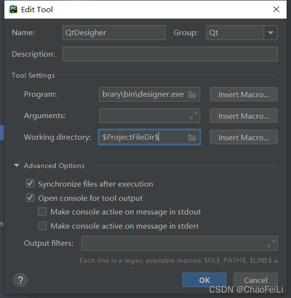
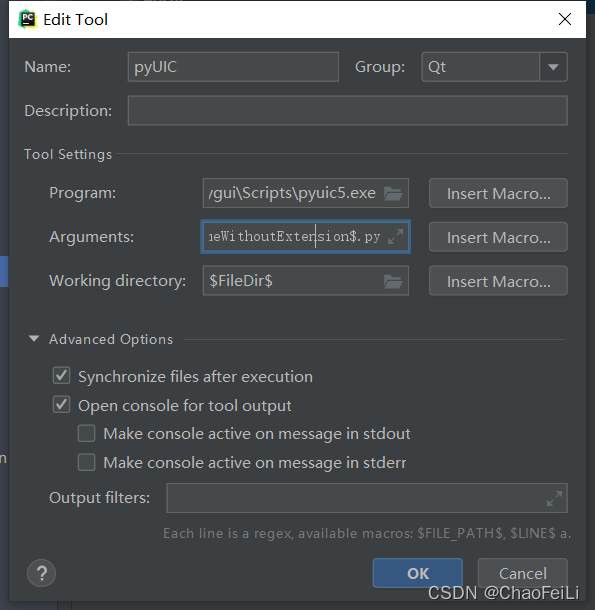

# pyQT

## 0 学习路线

- Qt Designer
- PyQt5基本窗口控件（QMainwindow、Qwidget、Qlabel、QLineEdit、菜单、工具栏等）
- PyQt5高级组件（QTableView、QListView、容器、多线程等）
- PyQt5布局管理（QBoxLayout、QGridlayout、QFormLayout、嵌套布局等）
- PyQt5信号与槽（事件处理、数据传递等）
- PyQt5图形与特效（定制窗口风格、绘图、QSS与UI美化、不规则窗口、设置样式等）
- PyQt5扩展应用（制作PyQt5安装程序、数据处理、第三方绘图库在PyQt5中的应用、UI自
  动化测试等）

搭建PyQt5开发环境

必须使用两个类：QApplication和QMidget。都在pyQts.Qtwidgets。

## 1 前期配置

### 1.1 PyCharm配置PyQt5

打开PyCharm，在setting里打开external tools，点击左上角的加号，作如下配置：

#### （1）配置QtDesigner

Name: QtDesigner
Group: Qt
Program: xxxxx\xxxxxx\designer.exe(参考路径：D:\Anaconda3\Library\bin\designer.exe)
Working Directory: $ProjectFileDir$


这里重点说一下这一步：
Program填写designer.exe的绝对路径，这里的路径因人而异，如果跟我一样是使用Anaconda创建的虚拟环境那么路径应该跟下面这条路径类似。

```
D:\Anaconda3\Library\bin\designer.exe
```

#### （2）配置PyUIC

Name中输入：PyUIC
Program选择PyQt 虚拟环境pygui安装目录中的路径（参考路径：D:\Anaconda3\envs\pygui\Scripts\pyuic5.exe）
Arguments为$FileName$ -o $FileNameWithoutExtension$.py
Working directory为：$FileDir$
如下图所示：



### 1.2 Pycharm使用PyQt

使用QtDesigner进行界面设计：在工具栏找到“Tools”–>Qt–>QtDesigner即可进行界面设计，设计完成会保存为一个.ui文件，右键点击选择external tools里的PyUIC即可将其转为一个.py文件。

## 2 Qt Designer

将图形（.ui）文件自动生成代码（.py）

方法一：python -m PyQt5.uic.pyuic demo.ui -o demo·py

方法二：调用扩展工具

### 2.1 布局与分割线

包括水平布局、垂直布局、栅格布局、表单布局，可以轻易地实现等距规则的排列各个控件

此外，水平、垂直分割线可以在上述布局的基础上，将不同类别的控件间隔开

### 2.2 尺寸

- 设置 minimumSize 和 maximumSize 设定最小、最大的边界值

- 尺寸策略（sizePolicy）

读取期望尺寸  sizeHint  （和控件的当前尺寸没有关系）

```
self.pushButton.sizeHint（）.width（）
self.pushButton.sizeHint（）.height（）
```

其中会常用到的有expanding，比如水平延展部分设置了2，就是在水平方向上永远占其他控件宽度的2倍

### 2.3 伙伴关系

Edit --> 编辑伙伴 --> 将相关联的两个空间连接在一起


结合 **热键** 进行使用


可以实现 **alt + 相应字母** 直接光标移在相应的输入区

### 2.4 修改控件的Tab顺序

默认Tab（光标移动）的顺序是防置控件的顺序

方法一：Edit --> 编辑Tab顺序

方法二：右键 --> 制表符顺序

### 2.5 信号(signal)与槽(slot)

信号：是由对象或控件发射出去的消息，可以理解为事件

按钮的单击事件——当单击按钮时，按钮就会向外部发送单击的消息，这些发送出去的信号需要一些代码来拦截，这些代码就是**槽**
槽：本质上是一个函数或方法，可以理解为事件函数

需要将信号和槽绑定：一个信号可以和多个槽绑定，一个槽可以拦截多个信号

Edit --> 编辑信号和槽 --> 鼠标点击不放开，拖动到要控制的控件上

示例1：关闭窗口


示例2：控制输入是否显示和是否可用


### 2.6 菜单栏、工具栏

右键添加或删除


对于编辑各个动作


## 3 窗口

### 3.1 主窗口类型

- QMainWindow：可以包含菜单栏、工具栏、状态栏和标题栏，是最常见的窗口形式
- QD1alog：是对话窗口的基类。没有菜单栏、工具栏、状态栏。
- QWidget：不确定窗口的用途，就使用QWidget。

示例：继承QMainWindow的类的实现

#### 代码

```python
import sys
from PyQt5.QtWidgets import QMainWindow, QApplication, QDesktopWidget
from PyQt5.QtGui import QIcon

# 只存在5秒的消息
class FirstMainWin(QMainWindow):
    def __init__(self,parent=None):
        super(FirstMainWin,self).__init__(parent)

        # 设置主窗口的标题
        self.setWindowTitle('第一个主窗口应用')
        # 设置窗口的尺寸
        self.resize(400, 300)
        self.status = self.statusBar()
        self.status.showMessage('只存在5秒的消息', 5000)

if __name__=='__main__':
    # 创建QApplication类的实例
    app = QApplication(sys.argv)
    app.setWindowIcon(QIcon('./images/atom.ico'))
    main = FirstMainWin()
    main.show()
    sys.exit(app.exec_())
```

### 3.2 窗口居中

需要手动计算，确定窗口左上角的坐标


#### 代码

```python
import sys
from PyQt5.QtWidgets import QMainWindow, QDesktopWidget, QApplication

class CenterForm(QMainWindow):
    def __init__(self):
        super(CenterForm,self).__init__()
        #设置主窗口的标题
        self.setWindowTitle('第一个主窗口应用')
        #设置窗口的尺寸
        self.resize(400,300)
    def center(self):
        # 获取屏幕坐标系
        screen = QDesktopWidget().screenGeometry()
        # 获取窗口坐标系
        size = self.geometry()
        newLeft = (screen.width() - size.width()) / 2
        newTop = (screen.height()- size.height()) / 2
        self.move(newLeft, newTop)
if __name__=='__main__':
    # 创建QApplication类的实例
    app = QApplication(sys.argv)
    main = CenterForm()
    main.show()
    sys.exit(app.exec_())
```

### 3.3 退出窗口

手写代码定义信号与槽：信号时单击按钮，槽是关闭应用程序，即**按钮单击事件的方法**


#### 代码

```python
import sys
from PyQt5.QtWidgets import QHBoxLayout, QMainWindow, QApplication, QPushButton, QWidget
class QuitApplication(QMainWindow):
    def __init__(self):
        super(QuitApplication,self).__init__()
        self.resize(300,120)
        self.setWindowTitle('退出应用程序')
        #添加Button
        self.button1 = QPushButton('退出应用程序')
        self.button1 = QPushButton('退出应用程序')
        #将信号与槽关联
        self.button1.clicked.connect(self.onclick_Button)
        layout = QHBoxLayout()
        layout.addWidget(self.button1)
        mainFrame = QWidget()
        mainFrame.setLayout(layout)
        self.setCentralWidget(mainFrame)

    # 按钮单击事件的方法（自定义的槽）
    def onclick_Button(self):
        sender = self.sender()
        print(sender.text() + '按钮被按下')
        app = QApplication.instance()
        # 退出应用程序
        app.quit()
if __name__=='__main__':
    # 创建QApplication类的实例
    app = QApplication(sys.argv)
    main = QuitApplication()
    main.show()
    sys.exit(app.exec_())
```

### 3.4 屏幕坐标系

这里展示3种方式获取窗口（工作区）位置及大小信息

####  代码

```python
import sys
from PyQt5.QtWidgets import QApplication, QPushButton, QWidget
def onClick_Button():
    print("1")
    print("widget.x() = %d" % widget.x())  # 窗口横坐标
    print("widget.y() = %d" % widget.y())  # 窗口纵坐标
    print("widget.width() = %d" % widget.width())  # 工作区宽度
    print("widget.height() = %d" % widget.height())   # 工作区高度

    print("2")
    print("widget.geometry().x() = %d" % widget.geometry().x())  # 工作区横坐标
    print("widget.geometry().y() = %d" % widget.geometry().y())  # 工作区纵坐标
    print("widget.geometry().width() = %d" % widget.geometry().width())  # 工作区宽度
    print("widget.geometry().height() = %d" % widget.geometry().height())  # 工作区高度

    print("3")
    print("widget.frameGeometry().x() = %d" % widget.frameGeometry().x())  # 窗口横坐标
    print("widget.frameGeometry().y() = %d" % widget.frameGeometry().y())  # 窗口纵坐标
    print("widget.frameGeometry().width() = %d" % widget.frameGeometry().width())  # 窗口宽度
    print("widget.frameGeometry().height() = %d" % widget.frameGeometry().height())   # 窗口高度
if __name__=='__main__':
    app = QApplication(sys.argv)
    widget = QWidget()
    btn = QPushButton(widget)
    btn.setText("按钮")
    btn.clicked.connect(onClick_Button)
    btn.move(24, 52)
    widget.resize(300, 240)  # 设置工作区尺寸
    widget.move(250, 200)
    widget.setWindowTitle('屏幕坐标系')
    widget.show()
    sys.exit(app.exec_())
```

在windows下的效果


### 3.5 图标

窗口的setWindowIcon方法用于设置窗口的图标，只在Windows中可用

QAplication中的setWindowIcon,方法用于设置主窗口的图标和应用程序图标，但调用了窗口的setWindowIcon方法

QAplication中的setwindowIcon方法就只能用于设置应用程序图标了

#### 代码

```python
import sys
from PyQt5.QtWidgets import QMainWindow, QApplication
from PyQt5.QtGui import QIcon

class IconForm(QMainWindow):
    def __init__(self):
        super(IconForm,self).__init__()
        self.initUI()
    def initUI(self):
        self.setGeometry(300,300,250,250)
        #设置主窗口的标题
        self.setWindowTitle('设置窗口图标')
        #设置窗口图标1
        self.setWindowIcon(QIcon('./images/atom.ico'))
if __name__=='__main__':
    # 创建QApplication类的实例
    app = QApplication(sys.argv)
    main = IconForm()
    main.show()
    sys.exit(app.exec_())
```

## 4 控件

### 4.1 显示提示信息

窗口/控件**.setToolTip('Message')**

```python
import sys
from PyQt5.QtWidgets import QMainWindow, QApplication, QToolTip
from PyQt5.QtGui import QFont


class TooltipForm(QMainWindow):
    def __init__(self):
        super().__init__()
        self.initUI()
    def initUI(self):
        QToolTip.setFont(QFont('SansSerif', 12))
        self.setToolTip('今天是<b>星期五</b>')
        self.setGeometry(300, 300, 200, 300)
        self.setWindowTitle('设置控件提示消息')
if __name__=='__main__':
    # 创建QApplication类的实例
    app = QApplication(sys.argv)
    main = TooltipForm()
    main.show()
    sys.exit(app.exec_())
```

### 4.2 QLabel

- 
  setAlignment(）：设置文本的对齐方式
- setIndent(）：设置文本缩进
- text(）：获取文本内容
- setBuddy(）：设置伙伴关系
- setText(）：设置文本内容
- selectedText(）：返回所选择的字符
- setWordWrap(）：设置是否允许换行

常用的信号（事件）

1. 当鼠标滑过OLabel控件时触发：linkHovered
2. 当鼠标单击QLabel控件时触发：linkActivated

以划过时触发为例

```python
import sys
from PyQt5.QtWidgets import QMainWindow, QApplication, QToolTip
from PyQt5.QtGui import QFont

class TooltipForm(QMainWindow):
    def __init__(self):
        super().__init__()
        self.initUI()
    def initUI(self):
        QToolTip.setFont(QFont('SansSerif', 12))
        self.setToolTip('今天是<b>星期五</b>')
        self.setGeometry(300, 300, 200, 300)
        self.setWindowTitle('设置控件提示消息')
if __name__=='__main__':
    # 创建QApplication类的实例
    app = QApplication(sys.argv)
    main = TooltipForm()
    main.show()
    sys.exit(app.exec_())
```


## 5 报错解决

### 5.1 QtWebEngineWidgets


QtWebKitWidgets 是老版的代码，新版需要替换成 QtWebEngineWidgets 的包


相应代码也许进行更换


[GitHub热榜第一，标星近万：这个用Python做交互式图形的项目火了 - 腾讯云开发者社区-腾讯云 (tencent.com)](https://cloud.tencent.com/developer/article/1461931?from=article.detail.1487043)
