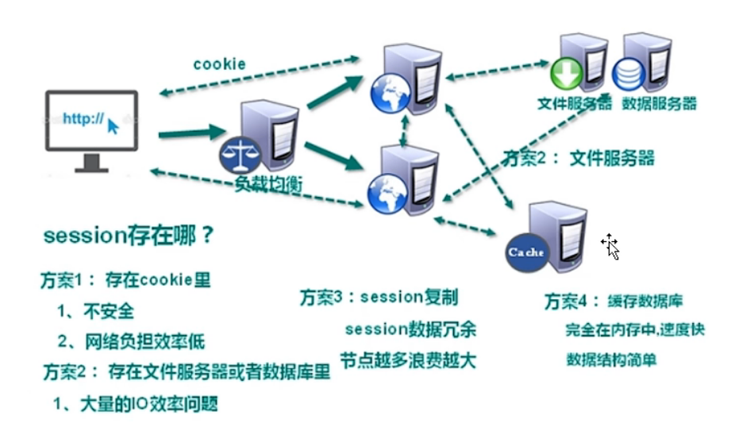
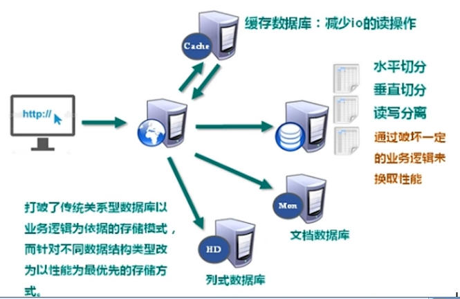
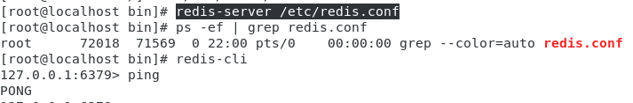
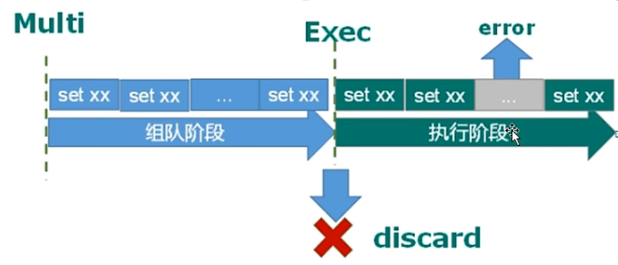

# Redis 6

## 1 NoSQL简介

#### CPU及内存压力



#### IO压力




**优势**：直接通过内存进行读取；能够作为缓存数据库，减少io的读操作。

相较于MySQL等关系型数据库，NoSQL不依赖业务逻辑方式纯存储，而以简单的key-value模式存储，因此大大增加了数据库的扩展能力

- 不遵循SQL标准
- 不支持ACID（原子性，一致性，隔离性，事务性）
- 远超于SQL的性能

##### 适用场景

对数据高并发的读写

海量数据的读写

对数据高可扩展性的

##### 不适用的场景

需要事务支持

基于sq的结构化查询存储，处理复杂的关系，需要即席查询。

(用不着sql的和用了sql也不行的情况，请考虑用NoSql)

##### 举例

1. ###### Memcache

   很早出现的NoSql数据库；数据都在内存中，一般不持久化；支持简单的key-value模式，支持类型单一；一般是作为缓存数据库辅助持久化的数据库·

2. ###### redis

   几乎覆盖了Memcached的绝大部分功能；数据都在内存中，支持持久化，主要用作备份恢复；除了支持简单的key-value模式，还支持多种数据结构的存储，比如list、set、hash、zset等；一般是作为缓存数谣库辅助持久化的数据库

3. ###### mongoDB

   高性能、开源、模式自由（schema free)的文档型数据库；数据都在内存中，如果内存不足，把不常用的数据保存到硬盘；虽然是key-value模式，但是对value(尤其是json)是供了丰富的查询功能；支持二进制数据及大型对象；可以根据数据的特点替代RDBMS，成为独立的数据库；或者配合RDBMS,存储特定的数据。

 

##### 多样的数据存储持久化数据

最新N个数据  <----     通过 List 实现按自然时间排序的数据
排行榜，TopN  <----    利用zset（有序集合）
时效性的数据，比如手机验证码   <----    Expire过期
计数器，秒杀   <----    原子性，自增方法INCR，DECR
去除大量数据中的重复数据   <----    利用Set集合
构建队列   <----    利用Iist集合
发布订阅消息系统   <----    pub/sub模式

## 2 安装

### 2.1 安装目录

###### /usr/local/bin

redis-benchmark：性能测试工具，可以在自己本子运行，看看自己本子性能如何
redis-check-aof：修复有问题的AOF文件，rdb和aof后面讲
redis-check-dump：修复有问题的dump.rdb文件
redis-sentinel：Redis集群使用
redis-server：Redis服务器启动命令
redis-cli：客户端，操作入口

### 2.2 前台启动

不建议：命令行窗口不能关闭，否则服务器停止

命令：redis-server


### 2.3 后台启动

命令：redis-server /etc/redis.conf



其中

```linux
# 查看当前进程
ps -ef | grep redis.conf  

# 连接客户端
redis-cli

# 检查是否连接
ping
```

### 2.4 关闭

- 单实例关闭：redis-cli shutdown


- 进入终端口关闭


- 多实例关闭：redis-cli -p 6379 shutdown


### 2.5 相关知识

Redis是单线程+多路IO复用

统一密码管理，所有库同样密码。

```
select<dbid>         切换数据库。如：select8
dbsize               查看当前数据库的key的数量
flushdb              清空当前库
flushall             通杀全部库
```

## 3 五大数据类型

### 3.1 Key 操作

```
keys*        查看当前库所有key（匹配：keys*1）
exists key   判断某个key是否存在
type key     查看你的key是什么类型
del key      删除指定的key数据，
unlink key   根据value选择非阻塞删除（仅将 keys 从 keyspace 元数据中删除，真正的删除会在后续异步操作）
expire key 10     10秒钟：为给定的key设置过期时间，
ttl key       查看还有多少秒过期，-1表示永不过期，-2表示已过期，

以上 key 指的是具体的 key 的名称，如 k1,k2...

select    命令切换数据库
dbsize    查看当前数据库的key的数量
flushdb   清空当前库
flushall  通杀全部库
```

### 3.2 String

String类型是二进制安全的。意味着Redis的string可以包含任何数据。比如 jpg 图片或者序列化的对象。
String类型是Redis最基本的数据类型，一个Redis中字符串value最多可以是512M。

#### 基本操作

```
get <key>               查询对应键值
append <key> <value>    将给定的<value>追加到原值的末尾
strlen <key>            获得值的长度
setnx <key> <value>     只有在key不存在时设置key的值
```

#### 针对value是整数的操作

```
incr <key>                  将key中储存的数字值增1，只能对数字值操作，如果为空，新增值为1
decr <key>                  将key中储存的数字值减1
incrby/decrby <key> <步长>   将key中储存的数字值增减，自定义步长
```

##### 原子操作

这种操作不会被线程调度机制打断，一旦开始，就一直运行到结束，中间不会有任何context switch(切换到另
个线程）。

(1)在单线程中，能够在单条指令中完成的操作都可以认为是"原子操作”"，因为中断只能发生于指令之间。

(2)在多线程中，不能被其它进程（线程）打断的操作就叫原子操作。

Redis 单命令的原子性主要得益于 Redis 的单线程。

#### 多目标操作

——原子性，有一个失败则都失败

```
# 同时设置一个或多个 key-value 对
mset <key1> <valuel> <key2> <value2>

#同时获取一个或多个value
mget <key1> <key2> <key3>
 
# 同时设置一个或多个key-value对，当且仅当所有给定key都不存在
msetnx <key1> <valuel> <key2> <value2>
```

#### 其他

```
# 获得值的范围，类似java中的substring，前包，后包
getrange <key> <start> <end>    

# 用<value>覆写<key>所储存的字符串值，从<起始位置>开始索引从0开始
setrange <key> <start> <value>
```

如


```
# 设置键值的同时，设置过期时间，单位秒
setex <key> <过期时间> <value>
# 以新换旧，设置了新值同时获得旧值
getset <key>  <value>
```

#### 数据结构

String 的数据结构为简单动态字符串(Simple Dynamic String，缩写SDS)，是可以修改的字符串，内部结构实现上类似于Java的ArrayList，采用预分配冗余空间的方式来减少内存的频繁分配。

如图中所示，内部为当前字符串实际分配的空间capacity一般要高于实际字符串长度 len。当字符串长度小于1M时，扩容都是加倍现有的空间，如果超过1M，扩容时一次，只会多扩1M的空间，需要注意的是字符串最大长度为512M。

### 3.2 List

单键多值
Redis列表是简单的字符串列表，按照插入顺序排序。你可以添加一个元素到列表的头部（左边）或者尾部（右边）。
它的底层实际是个双向链表，对两端的操作性能很高，通过索引下标的操作中间的节点性能会较差。

#### 常用命令

```
lpush/rpush <key> <value1> <value2> <value3>     从左边/右边插入一个或多个值
lpop/rpop <key>                                  从左边/右边吐出一个值。值在键在，值光键亡
rpoplpush <key1> <key2>                          从<key1>列表右边吐出一个值，插到<key2>列表左边
lrange <key> <start> <stop>                      按照索引下标获得元素（从左到右）
lrange mylist 0 -1                               0是左边第一个，-1右边第一个，(0-1表示获取所有)
```

举例


注：push时依次放入值，因此v3在最左边，取值时从左至右，所以v3先取出来。

```
lindex <key> <index>                                按照索引下标获得元素（从左到右）
llen <key>                                          获得列表长度
linsert <key> before/after <value> <newvalue>       在<value>的后面/前面插入<newvalue>插入值
lrem <key> <n> <value>                              从左边删除n个value(从左到右)
lset <key> <index> <value>                          将列表key下标为index的值替换成value,
```

#### 数据结构

List的数据结构为快速链表quickList。。
首先在列表元素较少的情况下会使用一块连续的内存存储，这个结构是zpl1is1,也即是压缩列表。
它将所有的元素紧挨着一起存储，分配的是一块连续的内存。

当数据量比较多的时候才会改成quicklist。。
因为普通的链表需要的附加指针空间太大，会比较浪费空间。比如这个列表里存的只是 int 类型的数据，结构上还需要两个额外的指针prev和next。


Redis将链表和ziplist结合起来组成了quicklist。。也就是将多个ziplist使用双向指针串起来使用。这样既满足了快速的插入删除性能，又不会出现太大的空间冗余。

### 3.3 Set

Redis set 对外提供的功能与 list 类似是一个列表的功能，特殊之处在于set是可以自动排重的，当你需要存储一个列表数据，又不希望出现重复数据时，set是一个很好的选择，并且 set 提供了判断某个成员是否在一个 set 集合内的重要接口，这个也是 list 所不能提供的。
Redis的 Set 是 string 类型的无序集合。它底层其实是一个value为nul的hash表，所以添加，删除，查找的复杂度都是0(1).
个算法，随着数据的增加，执行时间的长短，如果是O(1),数据增加，查找数据的时间不变

#### 常用命令

```
sadd <key> <value1> <value2>   将个或多个member元素加入到集合key中，已经存在的member元素将被忽略
smembers <key>                 取出该集合的所有值
sismember <key>< value>        判断集合<key>是否为含有该<value>值，有1，没有0
scard <key>                    返回该集合的元素个数。
srem <key> <value1> <value2>   删除集合中的某个元素
spop <key>                     随机从该集合中吐出一个值
srandmember <key> <n>          随机从该集合中取出n个值。不会从集合中删除
smove <source> <destination> <value>  把集合中一个值从一个集合移动到另一个集合
sinter <key1> <key2>           返回两个集合的交集元素。
sunion <key1> <key2>           返回两个集合的并集元素。
sdif <key1> <key2>             返回两个集合的差集元素(key1中的，不包含key2中的)
```

#### 数据结构

Set 数据结构是 dict 字典，字典是用哈希表实现的。

Java中 HashSet 的内部实现使用的是HashMap，只不过所有的 value 都指向同个对象。
Redis的 set 结构也是一样，它的内部也使用 hash 结构，所有的 value 都指向同一个内部值。

### 3.4 Hash

Redis hash 是个键值对集合。
Redis hash 是一个 string 类型的 field 和 value 的映射表，hash特别适合用于存储对象。

类似Java里面的Map<String,object>

用户ID为查找的key，存储的 value 用户对象包含姓名，年龄，生日等信息，如果用普通的 key/value 结构来存储
主要有以下2种存储方式：


采用 Hash 思想


#### 常用命令

```
hset <key> <field> <value>        给<key>集合中的<field>键赋值<value>
hget <key> <field>                从<keyl>集合<feld>取出value
hset <key> <field1> <valuel> <field2> <value2>..     批量设置hash的值
hexists <key> <field>             查看哈希表key中，给定域field是否存在。
hkeys <key>                       列出该hash集合的所有field
hvals <key>                       列出该hash集合的所有value
hinerby <key> <field> <increment> 为哈希表key中的域field的值加上增量1,-1
hsetnx <key> <field> <value>      将哈希表key中的域 field 的值设置为 value，当且仅当域field不存在
```

#### 数据结构

Hash 类型对应的数据结构是两种：ziplist（压缩列表），hashtable（哈希表）。当 field-value 长度较短且个数较少时，使用 ziplist，否则使用 hashtable。

### 3.5 有序集合Zset

Redis有序集合zset与普通集合set非常相似，是一个没有重复元素的字符串集合。
不同之处是有序集合的每个成员都关联了一个评分 (score) ，这个评分 (score) 被用来按照从最低分到最高分的方式排序集合中的成员。集合的成员是唯的，但是评分可以是重复了。
因为元素是有序的，所以你也可以很快的根据评分 (score) 或者次序 (position) 来获取一个范围的元素。
访问有序集合的中间元素也是非常快的，因此你能够使用有序集合作为一个没有重复成员的智能列表。

#### 常用命令

```
# 将一个或多个member元素及其score值加入到有序集key当中。
zadd <key> <score1> <value1> <score2> <value2>...

# 返回有序集key中，下标在<start><stop>之间的元素（0,-1 返回全部值）；带WITHSCORES，可以让分数一起和值返回到结果集。
zrange <key> <start> <stop> [WITHSCORES]   

# 返回有序集key中，所有score值介于 min 和 max 之间(包括等于 min 或 max)的成员。有序集成员按 score 值递增（从小到大）次序排列。
zrangebyscore <key> <min> <max> [withscores][limit offset count]

# 同上，改为从大到小排列。
zrevrangebyscore key maxmin [withscores][limit offset count]

# 为元素的score加上增量：
zincrby <key> <increment> <value>

# 删除该集合下，指定值的元素
zrem <key> <value>

# 统计该集合，分数区间内的元素个数
zcount <key> <min> <max>

# 返回该值在集合中的排名，从0开始。
zrank <key> <value>
```

#### 数据结构

SortedSet(zet)是Redis提供的一个非常特别的数据结构，一方面它等价于Java的数据结构Map<String,Double>，可以给每一个元素value赋予一个权重score,另一方面它又类似于 TreeSet ，内部的元素会按照权重score进行排序，可以得到每个元素的名次，还可以通过score的范围来获取元素的列表。

zset底层使用了两个数据结构，
(1) hash：hash的作用就是关联元素value和权重score，保障元素value的唯一性，可以通过元素value找到相应的score值。
(2 )跳跃表：跳跃表的目的在于给元素value排序，根据score的范围获取元素列表。

##### 跳跃表

###### 简介

有序集合在生活中比较常见，例如根据成绩对学生排名，根据得分对玩家排名等。对于有序集合的底层实现，可以用数组、平衡树、链表等。数组不便元素的插入、删除；平衡树或红黑树虽然效率高但结构复杂；链表查询需要遍历所有效率低。Rdis采用的是跳跃表。跳跃表效率堪比红黑树，实现远比红黑树简单。

###### 实例

对比有序链表和跳跃表，从链表中查询出51。

（1）有序链表


要查找值为51的元素，需要从第一个元素开始依次查找、比较才能找到。共需要6次比较。

（2）跳跃表


从第2层开始，1节点比51节点小，向后比较。

21节点比51节点小，继续向后比较，后面就是NULL了，所以从21节点向下到第1层

在第1层，41节点比51节点小，继续向后，61节点比51节点大，所以从41向下

在第0层，51节点为要查找的节点，节点被找到，共查找4次。

从此可以看出跳跃表比有序链表效率要高。

## 4 配置文件

/etc/redis.conf

#### Units 单位

 ——配置大小单位，开头定义了一些基本的度量单位，只支持bytes，不支持bit，大小写不敏感

#### Include 包含

 ——包含其他文件

#### Network 网络配置 

1. bind

默认情况 bind=127.0.0.1，只能接受本机的访问请求，不写的情况下，无限制接受任何 ip 地址的访问

生产环境肯定要写你应用服务器的地址；服务器是需要远程访问的，所以需要将其注释掉。

如果开启了protected-mode，那么在没有设定bindip且没有设密码的情况下，Redis只允许接受本机的响应。

2. protected-mode

是否支持远程访问，默认是yes，也就是开起了保护模式，不支持远程访问

想要远程访问的配置条件：1.注释掉bind=127.0.0.1  2.protected-mode 改为 no

3. port

4. tcp-backlog 511

设置tcp的backlog，backlog其实是一个连接队列。

backlog队列总和=未完成三次握手队列+已经完成三次握手队列。

在高并发环境下你需要一个高bāckog值来避免慢客户端连接问题。·

注意Linux内核会将这个值减小到proc/sys/het/core/somaxconn的值(128)，所以需要确认增大proc/sys/het/core/somaxconn 和 proc/sys/net/ipv4/tcp_max_syn_backlog(128) 两个值来达到想要的效果。

5. timeout 0

超时设置，超过以秒为单位的时间则断开连接，0表示永不超时。

6. tcp-keeplive 300

心跳时间

检测如果超过这个时间没有操作，那就释放连接

#### General  通用设置

1. pidfile

存放pid文件的位置，每个实例会产生一个不同的pid文件

2. loglevel

日志级别，包括4个，分别是debug，verbose，notice，warning

3. logfile

设置输出文件路径，默认为空

4. databases 

数据库的数量，默认是16个库

#### Security 安全设置

#### Limits 限制

1. maxclients 

   设置redis同时可以与多少个客户端进行连接。

   默认情况下为10000个客户端。

   如果达到了此限制，redis则会拒绝新的连接请求，并且向这些连接请求方发出 “max number of clients reached" 以作回应。

2. maxmemory

   设置redis可以使用的内存量

3. maxmemory-policy

   - volatile-lru：使用LRU算法移除key,只对设置了过期时间的键；（最近最少使用）

   - alkeys-lru：在所有集合key中，使用LRU算法移除key

   - volatile-random：在过期集合中移除随机的key,只对设置了过期时间的键

   - allkeys--random：在所有集合key中，移除随机的key

   - volatile-出：移除那些TTL值最小的key,即那些最近要过期的key。

   - noeviction：不进行移除。针对写操作，只是返回错误信息。

maxmemory-samples

设置样本数量，LRU算法和最小TTL算法都并非是精确的算法，而是估算值，所以你可以设置样本的大小，redis默认会检查这么多个key并选择其中LRU的那个
般设置3到7的数字，数值越小样本越不准确，但性能消耗越小。

## 5 发布和订阅

### 5.1 简介

Redis发布订阅(pub/sub)是一种消息通信模式：发送者(pub)发送消息，订阅者(sub)接收消息。
Redis客户端可以订阅任意数量的频道。


### 5.2 命令行实现

1. 打开一个客户端订阅 channel1

   SUBSCRIBE channel1

2. 打开另一个客户端，给channel1发布消息

   publish channel1 hello

   返回值是订阅者数量


注：发布的消息没有持久化，如果在订阅的客户端收不到 hello，只能收到订阅后发布的消息

## 6 新数据类型

### 6.1 Bitmaps

#### 6.1.1 简介

现代计算机用二进制（位）作为信息的基础单位，1个字节等于8位，例如“abc”字符串是由3个字节组成，但实际在计算机存储时将其用二进制表示，“abc”分别对应的ASCII码分别是97、98、99，对应的二进制分别01100001、01100010和01100011。

合理地使用操作位能够有效地提高内存使用率和开发效率。Redis提供了Bitmaps这个“数据类型”可以实现对位的操作：
（1）Bitmaps本身不是一种数据类型，实际上它就是字符串(key-value)，但是它可以对字符串的位进行操作。“
（2）Bitmaps单独提供了一套命令，所以在Redis中使用Bitmaps和使用字符串的方法不太相同。可以把Bitmaps想象成一个以位为单位的数组，数组的每个单元只能存储0和1，数组的下标在Bitmaps中叫做偏移量。

#### 6.1 2 命令

##### setbit

```
setbit <key> <offset> <value>       设置Bitmaps中某个偏移量的值(0或1)。偏移量从0开始
```

每个独立用户是否访问过网站存放在 Bitmaps 中，将访问的用户记做1，没有访问的用户记做0，用偏移量作为用户的id.
设置键的第offset个位的值(从0算起)，假设现在有20个用户，userid=1,6,11,15,19的用户对网站进行了访问，那么当前Bitmaps初始化结果如图：


相应操作为


很多应用的用户 id 以一个指定数字（例如10000）开头，直接将用户 id 和 Bitmaps 的偏移量对应势必会造成一定的浪费，通常的做法是每次做setbit操作时将用户 id 减去这个指定数字。
在第一次初始化 Bitmaps 时，假如偏移量非常大，那么整个初始化过程执行会比较慢，可能会造成 Redis 的阻塞。

##### getbit

```
getbit <key> <offset>     获取Bitmaps中某个偏移量的值
```

##### bitcount

```
bitcount <key> [start end]          统计字符串从 start 字节到 end 字节比特值为1的数量
```

统计字符串被设置为1的 bit 数。一般情况下，给定的整个字符串都会被进行计数，通过指定额外的 start 或 end 参数，可以让计数只在特定的位上进行。start 和 end 参数的设置，都可以使用负数值：比如-1表示最后一个位，而-2表示倒数第二个位，start、end是指 bit 组的字节的下标数，二者皆包含。


##### bitop

```
bitop and(or/not/xor) <destkey> [key...]
```

bitop 是一个复合操作，它可以做多个 Bitmaps 的 and（交集）、or（并集）、not（非）、xor（异或）操作并将结果保存在 destkey 中。


##### 总结

是专门进行位运算的字符串，在记录活跃用户类似的应用场景中，相较于Set有很大的节省存储空间的优势。

### 6.2 HyperLogLog

#### 6.2.1 简介

在工作当中，我们经常会遇到与统计相关的功能需求，比如统计网站 PV（PageView页面访问量），可以使用Redis的incr、incrby轻松实现。
但像UV(UniqueVisitor,独立访客)、独立IP数、搜索记录数等需要去重和计数的问题如何解决？这种求集合中不重复元素个数的问题称为基数问题。
解决基数问题有很多种方案：
（1）数据存储在MySQL表中，使用distinct count计算不重复个数，
（2）使用Redis提供的hash、set、bitmaps等数据结构来处理，

Redis HyperLogLog 是用来做基数统计的算法，HyperLogLog 的优点是，在输入元素的数量或者体积非常非常大时，计算基数所需的空间总是固定的、并且是很小的。

在Redis里面，每个 HyperLogLog 键只需要花费12KB内存，就可以计算接近 2^64 个不同元素的基数。这和计算基数时，元素越多耗费内存就越多的集合形成鲜明对比。

但是，因为 HyperLogLog 只会根据输入元素来计算基数，而不会储存输入元素本身，所以 HyperLogLog 不能像集合那样，返回输入的各个元素。

#### 6.2.2 命令

##### pfadd

```
pfadd <key> <element> [element]           添加指定元素到HyperLogLog中(可批量)
```

##### pfcount

```
pfcount <key>              查看有多少个基数
```

##### pfmerge

```
# 将一个或多个HLL合并后的结果存储在另一个HLL中，比如每月活跃用户可以使用每天的活跃用户来合并计算可得
pfmerge <destkey> <sourcekey> [sourcekey...]
```

### 6.3 Geospatial

#### 6.3.1 简介

Redis3.2中增加了对GE0类型的支持。GE0,Geographic,地理信息的缩写。
该类型就是元素的2维坐标，在地图上就是经纬度。redis基于该类型，提供了经纬度设置，查询，范围查询，距离查询，经纬度Hash等常见操作。

#### 6.3.2 命令

##### geoadd

```
# 添加地理位置(经度，纬度，名称)，可批量
geoadd <key> <longitude> <latitude> <member> [longitude latitude member...]
```


两极无法直接添加，一般会下载城市数据，直接通过Jva程序一次性导入。
有效的经度从-180度到180度。有效的纬度从-85.05112878度到85.05112878度。
当坐标位置超出指定范围时，该命令将会返回一个错误。
已经添加的数据，是无法再次往里面添加的。

##### geopos

```
geopos <key> <member1> <member2>                根据名称获取地理位置
```

##### geodist

```
geodist <key> <member1> <member2> [m|km|ft|mi]  获取两个位置之间的直线距离
```


##### georadius

```
# 以给定的经纬度为中心，找出某一半径内的元素
georadius <key> <longitude> <latitude> radius m|km|ft|mi
```


## 7 Jedis 操作

### 7.1 基本设置的测试

依赖

```
<dependency>
    <groupId>redis.clients</groupId>
    <artifactId>jedis</artifactId>
    <version>3.2.0</version>
</dependency>
```

注意，想要访问虚拟机中的redis，需要注意以下三点

1. bind 注释掉

2. protect 设置为 no

3. 关闭防火墙

   检查防火墙状态  systemctl status firewalld

   

   关闭防火墙   systemctl stop firewalld

   

测试

```java
public class jedisDemo1 {
    public static void main(String[] args) {
        // 创建Jeids对象
        Jedis jedis = new Jedis("192.168.25.128", 6379);

        // 测试
        String value = jedis.ping();
        System.out.println(value);
    }
}
```

#### 手机验证码功能

```java
public class jedisDemoPhoneVeriCode {
    /**
     * 要求：
     * 1、输入手机号，点击发送后随机生成6位数字码，12分钟有效
     * 2、输入验证码，点击验证，返回成功或失败。
     * 3、每个手机号每天只能输入3次。
     */
    public static void main(String[] args) {
//        verifyCode("12345678911");
        getRedisCode("12345678911", "091236");
    }

    // 生成6位随机验证码
    public static String getCode() {
        Random random = new Random();
        String code = "";
        for(int i=0; i < 6; i++){
            int rand = random.nextInt(10);
            code += rand;
        }
        return code;
    }
    // 每个手机每天只能发送3次，验证码放入redis，设置过期时间
    public static void verifyCode(String phone){
        // 连接redis
        Jedis jedis = new Jedis("192.168.25.128", 6379);

        // 拼接key
        // 手机发出次数
        String countKey = "VerifyCode" + phone + ":count";
        // 验证码key
        String codeKey = "VerifyCode" + phone + ":code";

        // 每个手机每天只能发送三次
        String count = jedis.get(countKey);
        // 没有发送次数，第一次发送
        // 设置发送次数是1
        if(count == null){
            jedis.setex(countKey, 24*60*60, "1");
        }else if(Integer.parseInt(count)<=2){
            jedis.incr(countKey);
        }else if(Integer.parseInt(count)>2){
            System.out.println("今日已超出发送限制");
            jedis.close();
            return;
        }

        String vcode = getCode();
        jedis.setex(codeKey, 120, vcode);
        jedis.close();

    }
    public static void getRedisCode(String phone, String code){
        // 从redis获取验证码
        Jedis jedis = new Jedis("192.168.25.128", 6379);

        // 验证码key
        String codeKey = "VerifyCode" + phone + ":code";
        String redisCode = jedis.get(codeKey);

        // 判断
        if(redisCode.equals(code)){
            System.out.println("成功");
        } else {
            System.out.println("失败");
        }
        jedis.close();
    }
    
}
```

### 7.2 Redis 与 Spring Boot 整合

Spring Boot整合Redis非常简单，只需要按如下步骤整合即可

1 在 **pom.xml** 文件中引入 redis 相关依赖

```xml
<!--redis-->
<dependency>
    <groupId>org.springframework.boot</groupId>
    <artifactId>spring-boot-starter-data-redis</artifactId>
    <version>2.7.4</version>
</dependency>
<!--spring.2.X集成redis所篇common-pool2-->
<dependency>
    <groupId>org.apache.commons</groupId>
    <artifactId>commons-pool2</artifactId>
    <version>2.6.0</version>
</dependency>
```

2 **application.properties **配置 redis 配置

```properties
#Redis服务器地址
spring.redis.host=192.168.25.128
#Redis服务器连接端口
spring.redis.port=6379
#Redis数搭库索引（默认为0）
spring.redis.database=0
#连接超时时间（毫秒）
spring.redis.timeout=1800000
#连接池最太连接数（使用负值表示没有限制）
spring.redis.lettuce.pool.max-active=20
#最大阻塞等待时间（负数表示没限制）
spring.redis.lettuce.pool.max-wait=-1
#连接池中的最大空闲達接
spring.redis.lettuce.pool.max-idle=5
#连接池中的最小空闲连接
spring.redis.lettuce.pool.min-idle=0
```

3 添加 redis 配置类

```java
@EnableCaching
@Configuration
public class RedisConfig extends CachingConfigurerSupport {
    @Bean
    public RedisTemplate<String,Object> redisTemplate(RedisConnectionFactory factory) {
        RedisTemplate<String, Object> template = new RedisTemplate<>();
        RedisSerializer<String> redisSerializer = new StringRedisSerializer();
        Jackson2JsonRedisSerializer jackson2JsonRedisSerializer = new Jackson2JsonRedisSerializer(Object.class);
        ObjectMapper om = new ObjectMapper();
        om.setVisibility(PropertyAccessor.ALL, JsonAutoDetect.Visibility.ANY);
        om.enableDefaultTyping(ObjectMapper.DefaultTyping.NON_FINAL);
        jackson2JsonRedisSerializer.setObjectMapper(om);
        template.setConnectionFactory(factory);
        // key序列化方式
        template.setKeySerializer(redisSerializer);
        // value序列化
        template.setValueSerializer(jackson2JsonRedisSerializer);
        //value hashmap序列化
        template.setHashValueSerializer(jackson2JsonRedisSerializer);
        return template;
    }
    @Bean
    public CacheManager cacheManager(RedisConnectionFactory factory){
        RedisSerializer<String> redisSerializer = new StringRedisSerializer();
        Jackson2JsonRedisSerializer jackson2JsonRedisSerializer = new Jackson2JsonRedisSerializer(Object.class);
        // 解决查询缓存转换异常的问题
        ObjectMapper om = new ObjectMapper();
        om.setVisibility(PropertyAccessor.ALL, JsonAutoDetect.Visibility.ANY);
        om.enableDefaultTyping (ObjectMapper.DefaultTyping.NON_FINAL);
        jackson2JsonRedisSerializer.setObjectMapper(om);

        //配置序列化（解决乱码的问题），过期时间600秒
        RedisCacheConfiguration config = RedisCacheConfiguration.defaultCacheConfig()
                .entryTtl(Duration.ofSeconds(600))
                .serializeKeysWith(RedisSerializationContext.SerializationPair.fromSerializer(redisSerializer))
                .serializeValuesWith(RedisSerializationContext.SerializationPair.fromSerializer(jackson2JsonRedisSerializer))
                .disableCachingNullValues();
        RedisCacheManager cacheManager = RedisCacheManager.builder(factory)
                .cacheDefaults(config)
                .build();
        return cacheManager;
    }
}
```

没跑成功，暂不知道哪里出了问题

## 8 事务

Redis事务是一个单独的隔离操作：事务中的所有命令都会序列化、按顺序地执行。事务在执行的过程中，不会被其他客户端发送来的命令请求所打断。

Redis事务的主要作用就是串联多个命令防止别的命令插队

### 8.1 Multi、 Exec、discard

从输入 Multi 命令开始，输入的命令都会依次进入命令队列中，但不会执行，直到输入 Exec 后，Redis会将之前的命令队列中的命令依次执行。

组队的过程中可以通过 discard 来放弃组队。


### 8.2 错误处理

组队中某个命令出现了报告错误，执行时整个的所有队列都会被取消。


如果执行阶段某个命令报出了错误，则只有报错的命令不会被执行，而其他的命令都会执行，不会回滚。



### 8.3 事务冲突

悲观锁与乐观锁


悲观锁(Pessimistic Lock)，顾名思义，就是很悲观，每次去拿数据的时候都认为别人会修改，所以每次在拿数据的时候都会上锁，这样别人想拿这个数据就会block直到它拿到锁。传统的关系型数据库里边就用到了很多这种锁机制，比如行锁，表锁等，读锁，写锁等，都是在做操作之前先上锁。


乐观锁(Optimistic Lock),顾名思义，就是很乐观，每次去拿数据的时候都认为别人不会修改，所以不会上锁，但是在更新的时候会判断一下在此期间别人有没有去更新这个数据，可以使用版本号等机制。乐观锁适用于多读的应用类型，这样可以提高吞吐量。Redis就是利用这种 check-and-set 机制实现事务的。


##### watch key[...]

一个终端


另一个终端


在执行multi之前，先执行watch keyl[key2]，可以监视一个（或多个）key，如果在事务执行之前这个（或这些）key被其他命令所改动，那么事务将被打断。

##### unwatch 

取消WATCH命令对所有key的监视。

如果在执行WATCH命令之后，EXEC命令或DISCARD命令先被执行了的话，那么就不需要再执行UNWATCH了。

### 报错（未解决）

MISCONF Redis is configured to save RDB snapshots, but it's currently unable to persist to disk. Commands that may modify the data set are disabled, because this instance is configured to report errors during writes if RDB snapshotting fails (stop-writes-on-bgsave-error option). Please check the Redis logs for details about the RDB error.

错误的Redis配置为保存RDB快照，但当前无法在磁盘上持久化。禁用可能修改数据集的命令，因为此实例配置为在RDB快照失败时报告写入期间的错误（在bgsave error选项上停止写入）。有关RDB错误的详细信息，请查看Redis日志。

redis.conf 配置文件中的 stop-writes-on-bgsave-error 后边由yes改为no，但这种方法治标不治本，只是保证了不报错而已。

### 8.4 Redis事务三特性

- 单独的隔离操作

  事务中的所有命令都会序列化、按顺序地执行。事务在执行的过程中，不会被其他客户端发送来的命令请求所打断。

- 没有隔离级别的概念

  队列中的命令没有提交之前都不会实际被执行，因为事务提交前任何指令都不会被实际执行。

- 不保证原子性

  事务中如果有一条命令执行失败，其后的命令仍然会被执行，没有回滚。

### 8.5 秒杀程序实例

#### 安装并发模拟工具ab

yum install httpd-tools

#### ab使用操作

```
ab --help   查看使用帮助
```


##### 常用操作示例

```
ab -n 1000 -c 100 http://192.168.137.1:8080/seckill
```

其中 -n 后的1000表示共有1000条请求，-c 后的100表示并发时有100条请求。
