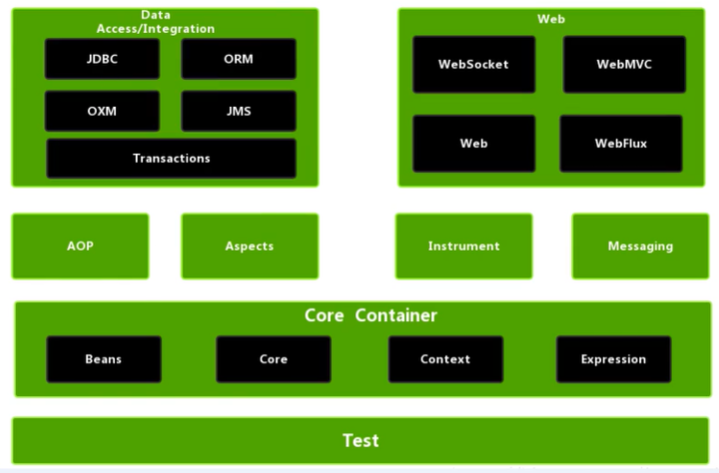
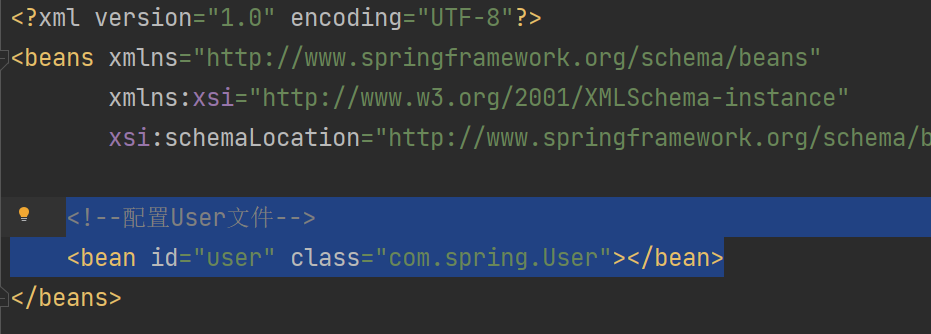
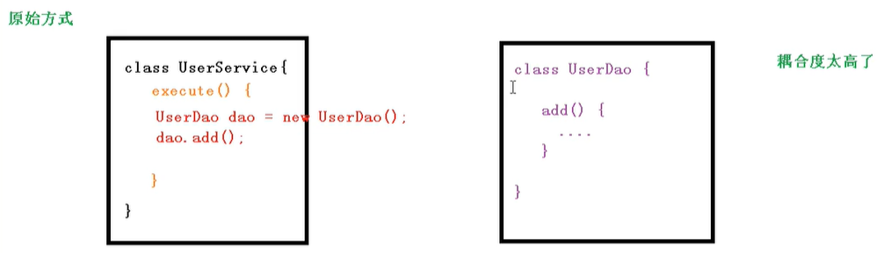
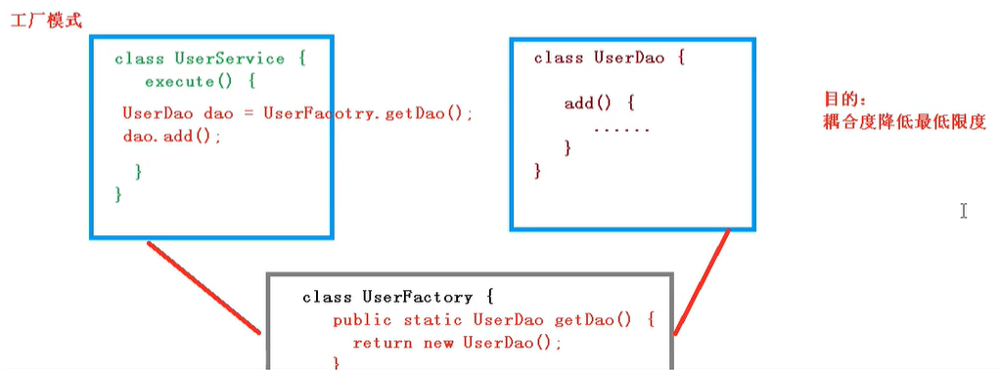
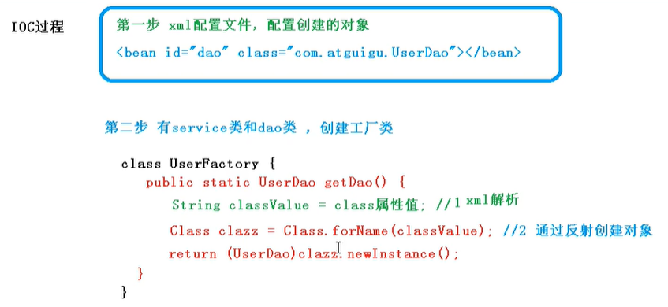

# Spring

## 0 简介

- Spring是轻量级的开源的JavaEE框架
- Spring可以解决企业应用开发的复杂性
- Spring有两个核心部分：IOC和Aop
  - IOC：控制反转，把创建对象过程交给Spring进行管理
  - Aop：面向切面，不修改源代码进行功能增强

- Spring特点
  - 方便解耦，简化开发
  - Aop编程支持
  - 方便程序测试
  - 方便和其他框架进行整合
  - 方便进行事务操作
  - 降低API开发难度

- jar包

  

### 例子

1. 创建一个普通项目，在项目之下（src并列）创建文件夹 lib，放入spring中基础的几个jar包

2. 在Project Structure中的依赖部分添加这几个jar包

3. 以User类的创建和实例化为例展示spring框架中如何创建对象

   ①首先在src目录下创建bean配置文件

   

   

   ②然后在包之下创建一个测试类

   ```java
   public class Test01 {
       @Test
       public void testAdd(){
           //1 加载spring配置文件
           ApplicationContext context = new ClassPathXmlApplicationContext("bean01.xml");
   
           //2 获取配置创建的对象
           User user = context.getBean("User", User.class);
   
           System.out.println(user);
           user.add();
       }
   }
   ```


## 1 IOC 容器

控制反转，把对象创建和对象之间的调用过程，交给Spring进行管理
使用IOC目的：为了耦合度降低
做入门案例就是IOC实现

### 1.1 IOC底层原理

- xml 解析
- 工厂原理
- 反射





#### IOC过程



### 1.2 IOC接口(BeanFactory)


### 1.3 OC操作Bean管理


