# Spring

## 0 简介

- Spring是轻量级的开源的JavaEE框架
- Spring可以解决企业应用开发的复杂性
- Spring有两个核心部分：IOC和Aop
  - IOC：控制反转，把创建对象过程交给Spring进行管理
  - Aop：面向切面，不修改源代码进行功能增强

- Spring特点
  - 方便解耦，简化开发
  - Aop编程支持
  - 方便程序测试
  - 方便和其他框架进行整合
  - 方便进行事务操作
  - 降低API开发难度

- jar包

  

### 例子

1. 创建一个普通项目，在项目之下（src并列）创建文件夹 lib，放入spring中基础的几个jar包

2. 在Project Structure中的依赖部分添加这几个jar包

3. 以User类的创建和实例化为例展示spring框架中如何创建对象

   ①首先在src目录下创建bean配置文件

   

   

   ②然后在包之下创建一个测试类

   ```java
   public class Test01 {
       @Test
       public void testAdd(){
           //1 加载spring配置文件
           ApplicationContext context = new ClassPathXmlApplicationContext("bean01.xml");
   
           //2 获取配置创建的对象
           User user = context.getBean("User", User.class);
   
           System.out.println(user);
           user.add();
       }
   }
   ```


## 1 IOC 容器

控制反转，把对象创建和对象之间的调用过程，交给Spring进行管理
使用IOC目的：为了耦合度降低
做入门案例就是IOC实现

### 1.1 IOC底层原理

- xml 解析
- 工厂原理
- 反射


#### IOC过程


### 1.2 IOC接口(BeanFactory)

#### 1.2.1 接口

Spring 提供IOC容器实现的两种方式（两个接口）：

1. BeanFactory：IOC容器基本实现，是Spring内部的使用接口，不提供开发人员进行使用
   - 加载配置文件时，不会创建对象，只有在获取、使用的时候才会创建对象。

2. ApplicationContext：BeanFactory接口的子接口，提供更多更强大的功能，一般提供开发人员进行使用
   - 加载配置文件时就会创建对象（在服务器启动时完成，而不是使用的时候再创建，因此更适合实用场景）

```java
// 加载配置文件的两个接口
ApplicationContext context = new ClassPathXmlApplicationContext("bean01.xml");
BeanFactory context = new ClassPathXmlApplicationContext("bean01.xml");

// 获取对象
```

#### 1.2.2 实现类

##### ApplicationContext

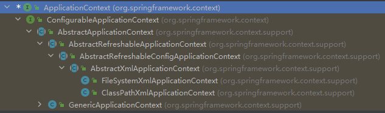

其中 FileSystemXmlApplicationContext 参数是带盘符的路径，如C盘；

ClassPathXmlApplicationContext 参数则是src下的路径

##### BeanFactory

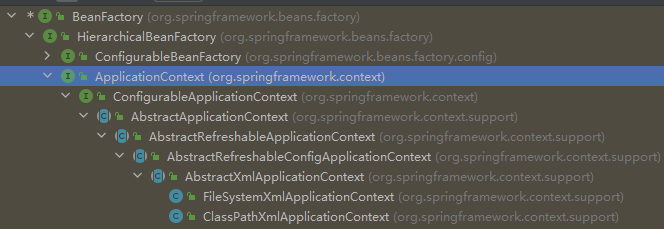


### 1.3 IOC操作Bean管理——基于xml配置文件方式实现

#### 1.3.1 创建对象

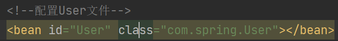

在 spring 配置文件中使用 bean 标签，标签里面添加对应**属性**，实现对象创建：

- id属性：唯一标识
- class属性：类的全路径（包含类名）
- name属性：（不常用了）相比于id可以有斜杠/的出现

创建对象的时候，默认执行**无参构造方法**完成对象创建

#### 1.3.2 注入属性

##### 基本类型属性注入方式（3种）

DI：依赖注入，就是注入属性（给属性赋值，这里使用set方法进行）

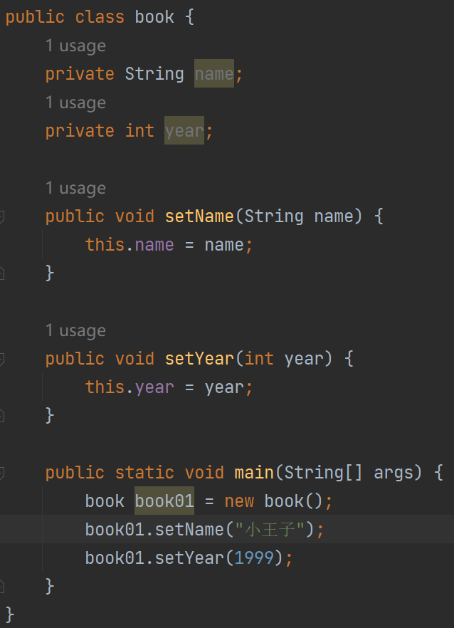

###### 使用 set 函数进行注入

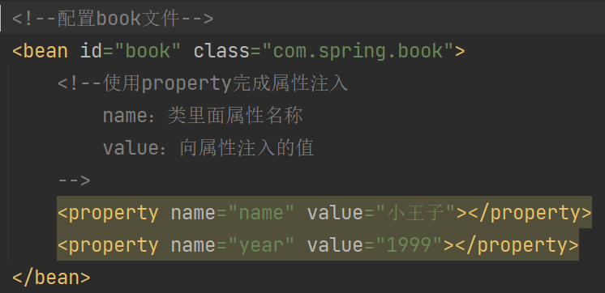

最后测试

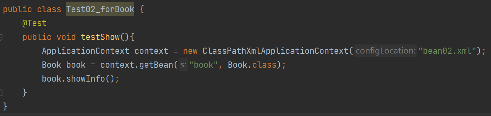

###### 使用有参数构造进行注入

创建类，定义属性，创建属性对应有参数构造

在spring文件中进行配置

注意：没有无参构造时会报错

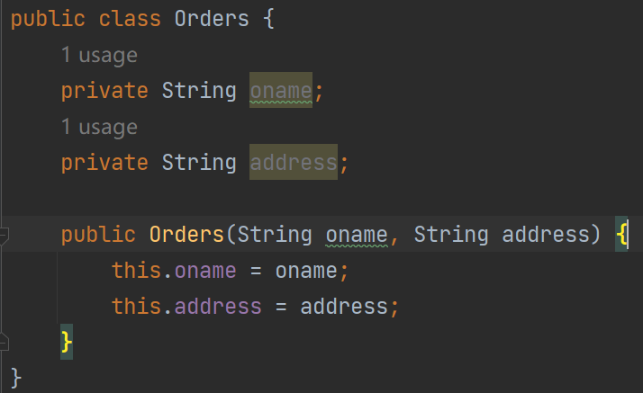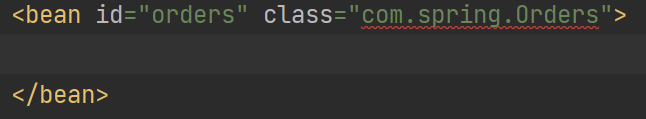

针对有参构造函数进行改进，得到

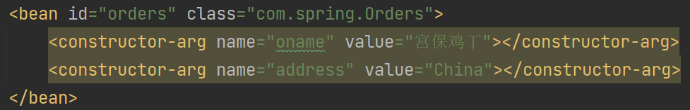

除了用 name 针对属性进行操作，也可以用 index（从0开始）表征属性的序号对齐进行操作。

###### p名称空间注入（对set方式进行简化）

添加 p 名称空间

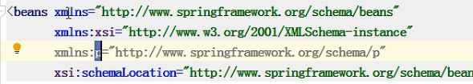

​       注入属性

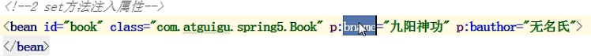

##### 注入其他类型属性

1. null 值

   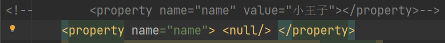

2. 属性值包含特殊符号

   ① 把<>进行转义

   &lt  是 < ，&gt  是  >

   ②把带特殊符号的内容写到CDATA

   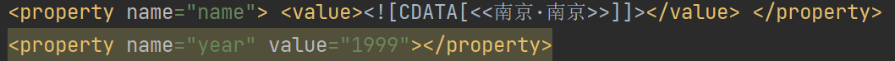

   ```xml
   <property name="name"> <value><![CDATA[<<南京·南京>>]]></value> </property>
   <property name="year" value="1999"></property>
   ```

##### 注入属性-外部bean

1. 创建两个类 service 类和 dao 类

   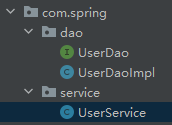

2. 在 service 调用dao里面的方法

   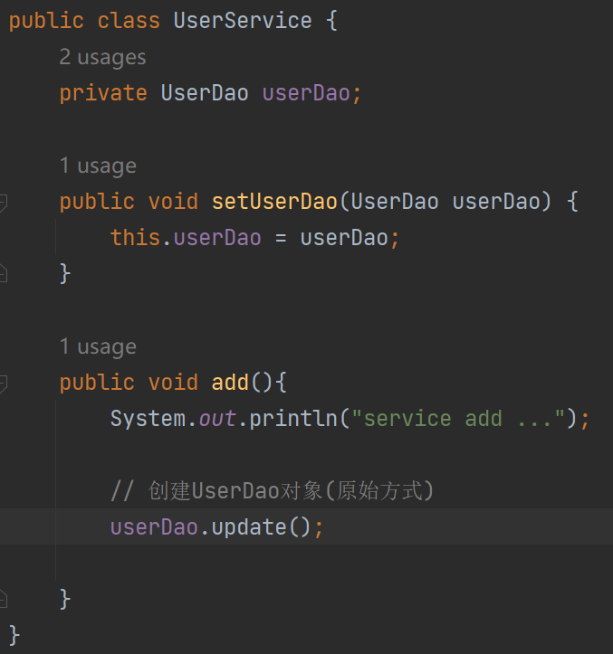

3. 在 spring 配置文件中进行配置

   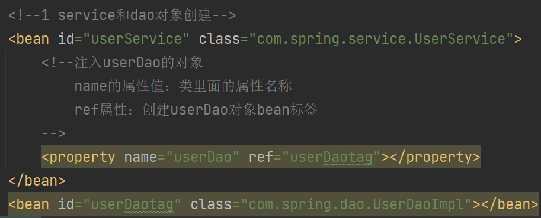

##### 注入属性-内联bean

1. 一对多关系（在实体类中表示）

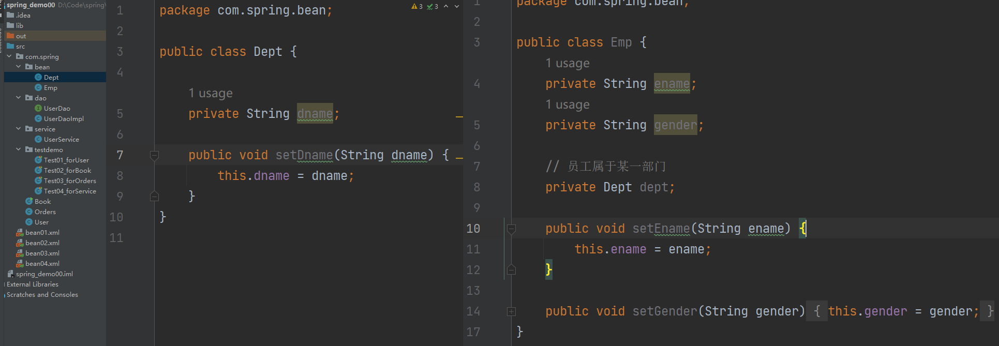

相应对象的创建配置

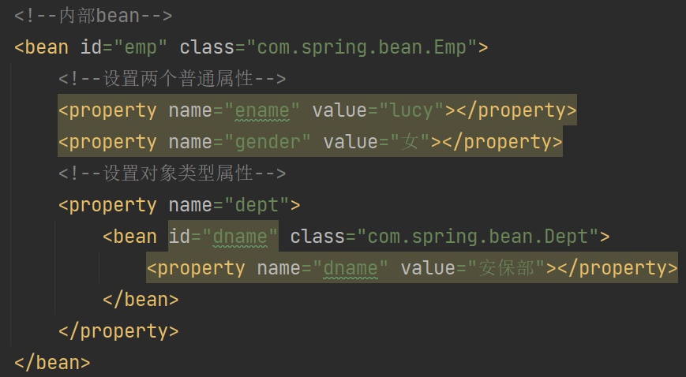

##### 注入属性-级联bean

第一种：

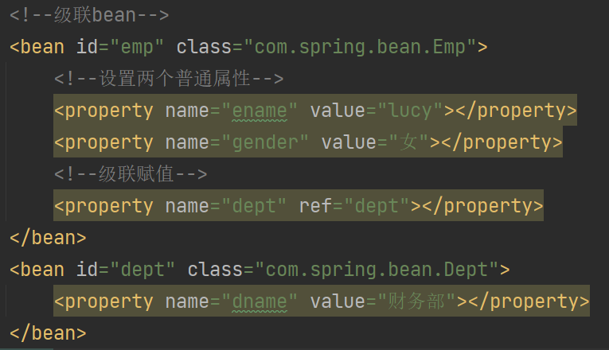

第二种

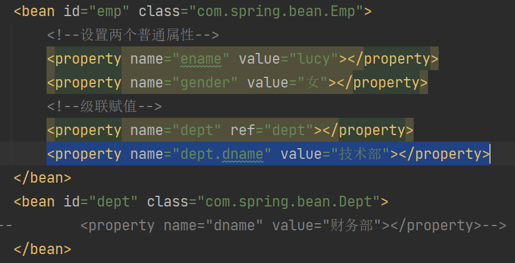

-----------但这种方式的前提是dept相应属性有get函数-----------------

##### 注入集合属性

1. 注入数组类型

2. 注入List

3. 注入Map

4. 注入Set

   ```xml
   <!--集合类型属性注入-->
       <bean id="stu" class="com.spring.collection.Stu">
           <!--数组类型属性注入-->
           <property name="course">
               <array>
                   <value>java课程</value>
                   <value>python课程</value>
               </array>
           </property>
           <!--list类型属性注入-->
           <property name="list">
               <list>
                   <value>zhangsan</value>
                   <value>lisi</value>
               </list>
           </property>
           <!--map类型属性注入-->
           <property name="map">
               <map>
                   <entry key="JAVA" value="java"></entry>
                   <entry key="PY" value="python"></entry>
               </map>
           </property>
           <!--set类型属性注入-->
           <property name="set">
               <set>
                   <value>MySQL</value>
                   <value>Redis</value>
               </set>
           </property>
       </bean>
   ```

5. 注入对象的集合

   ```xml
   <bean>
       ...
   <!--注入list集合类型，值是对象-->
       <property name="courseList">
           <list>
               <ref bean="course1"></ref>
               <ref bean="course2"></ref>
           </list>
       </property>
   </bean>
   
   <!--创建多个course对象-->
   <bean id="course1" class="com.spring.collection.Course">
       <property name="cname" value="Java"></property>
   </bean>
   <bean id="course2" class="com.spring.collection.Course">
       <property name="cname" value="Spring"></property>
   </bean>
   ```

6. 提取集合作为公共部分

   1. 在 spring 配置文件中引入名称空间 util

      ```xml
      <?xml version="1.0" encoding="UTF-8"?>
      <beans xmlns="http://www.springframework.org/schema/beans"
             xmlns:xsi="http://www.w3.org/2001/XMLSchema-instance"
             xmlns:util="http://www.springframework.org/schema/util"
             xsi:schemaLocation="http://www.springframework.org/schema/beans http://www.springframework.org/schema/beans/spring-beans.xsd
                                 http://www.springframework.org/schema/util http://www.springframework.org/schema/beans/spring-util.xsd">
      
      </beans>
      ```

   2. 使用 util 标签完成注入

      ```xml
      <!--1 提取list集合类型属性注入-->
      <util:list id="booklist">
          <value>小王子</value>
          <value>汤姆索亚历险记</value>
      </util:list>
      
      <!--2 提取list集合类型属性注入使用-->
      <bean id="book" class="com.spring.collection.Book">
          <property name="list" ref="booklist"></property>
      </bean>
      ```

#### 1.3.3 FactoryBean（工厂Bean）

- 普通 bean

  配置文件中定义的是什么类，返回的时候就是什么类

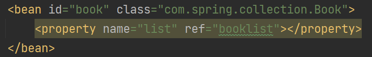

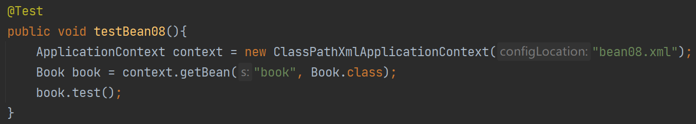

- FactoryBean（工厂Bean）

  配置文件中定义的类可以和返回的类不一样

  第一步：创建类，让这个类作为工厂bean，实现接口FactoryBean

  第二步：实现接口里面的方法，在实现的方法中定义返回的bean类型

  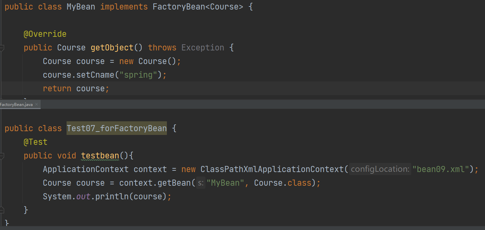

#### 1.3.4 Bean作用域——单实例&多实例

getBean 得到的对象为同一地址则为单实例，不同则为多实例。

设置单、多实例

- 在spring配置文件bean标签里面有属性(scope)用于设置单实例还是多实例

- scope属性值

  - 第一个值默认值，singleton，表示单实例对象

    ```xml
    <bean id="MyBean" class="com.spring.factoryBean.MyBean" scope="singleton"></bean>
    ```

    加载 spring 配置文件时就会创建对象

  - 第二个值prototype，表示多实例对象

    ```xml
    <bean id="MyBean" class="com.spring.factoryBean.MyBean" scope="prototype"></bean>
    ```

    获取对象时创建对象

  - request

  - session

#### 1.3.5 Bean生命周期

- (1) 通过构造器创建bean实例（无参数构造）

- (2) 为bean的属性设置值和对其他bean引用(调用set方法)

  - (2.5) 把 bean 实例传递给 bean 后置处理器的方法

    从BeanPostProcessor接口中复制过来并做改动，得到如下类

    ```java
    public class MyBeanPost implements BeanPostProcessor {
        @Override
        public Object postProcessBeforeInitialization(Object bean, String beanName) throws BeansException {
            System.out.println("在初始化之前执行的方法");
            return bean;
        }
    
        @Override
        public Object postProcessAfterInitialization(Object bean, String beanName) throws BeansException {
            System.out.println("在初始化之后执行的方法");
            return bean;
        }
    }
    ```

    之后再在bean中进行配置

    ```xml
    <bean id="orders" class="com.spring.bean.Orders" init-method="initMethod" destroy-method="destoryMethod">
        <property name="oname" value="flower"></property>
    </bean>
    <bean id="myBeanPost" class="com.spring.bean.MyBeanPost"></bean>
    ```

    此时所有bean都会被添加后置处理器

- (3) 调用bean的初始化的方法（需要进行配置初始化的方法）

  ```java
  public void initMethod(){
      System.out.println("第三步：执行初始化方法");
  }
  ```

  ```xml
  <bean id="orders" class="com.spring.bean.Orders" init-method="initMethod"></bean>
  ```

  - (3.5) 把 bean 实例传递给 bean 后置处理器的方法

    执行结果为

    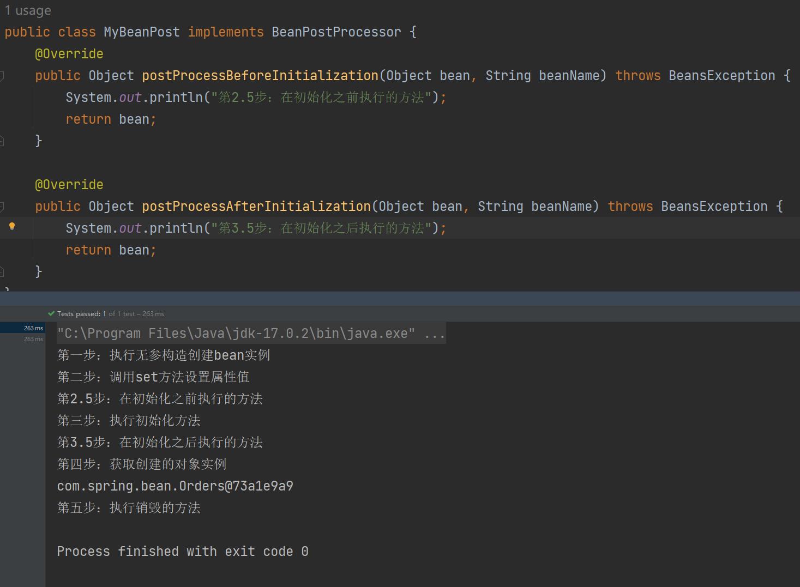

- (4) bean可以使用了（对象获取到了）

- (5) 当容器关闭时候，调用bean的销毁的方法（需要进行配置销毁的方法）

  ```java
  public void destoryMethod(){
      System.out.println("第五步：执行销毁的方法");
  }
  ```

  ```xml
  <bean id="orders" class="com.spring.bean.Orders" init-method="initMethod" destroy-method="destoryMethod"></bean>
  ```


```java
@Test
public void testLifecycle(){
    ApplicationContext context = new ClassPathXmlApplicationContext("bean10.xml");
    Orders orders = context.getBean("orders", Orders.class);
    System.out.println("第四步：获取创建的对象实例");
    System.out.println(orders);

    // 手动让bean实例销毁
    ((ClassPathXmlApplicationContext) context).close();
    
    // ApplicationContext 接口中并没有close()方法，因此调用时需要强转，不然的话也可以采用以下方法
    // ClassPathXmlApplicationContext context = new ClassPathXmlApplicationContext("bean10.xml");
    // context.close();
}
```

#### 1.3.6 xml自动注入

手动装配

```xml
<bean id="emp" class="com.spring.autowire.Emp">
    <!--手动装配-->
    <property name="dept" ref="dept"></property>
</bean>
<bean id="dept" class="com.spring.autowire.Dept"></bean>
```

自动装配

```xml
<bean id="emp" class="com.spring.autowire.Emp" autowire="byName"></bean>
<bean id="dept" class="com.spring.autowire.Dept"></bean>
```

其中根据名字注入和根据属性注入是最常用的（byName，byType）

byName（根据名字注入）——注入值bean的id值和类属性名称一样

byType（根据属性类型注入）——注入值bean类型和类属性一样

实际中很少用xml进行自动装配，一般是用注解方式进行自动装配

#### 1.3.7 外部属性文件

- 直接配置数据库信息

  ```xml
  <!--直接配置连接池-->
      <bean id="dataSource" class="com.alibaba.druid.pool.DruidDataSource">
          <property name="driverClassName" value="com.mysql.jdbc.Driver"></property>
          <property name="url" value="jdbc:mysql://localhost:3306/userDb"></property>
          <property name="username" value="root"></property>
          <property name="password" value="root"></property>
      </bean>
  ```

- 使用外部属性文件配置德鲁伊连接池

1. 引入德鲁伊

   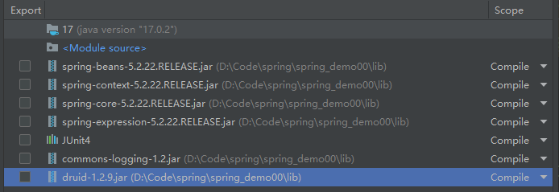

2. 引入外部属性文件配置数据库连接池

   - 创建外部属性文件，properties格式文件，写数据库信息

     ```properties
     prop.driverClass=com.mysql.jdbc.Driver
     prop.url=jdbc:mysql://localhost:3306/userDb
     prop.userName=root
     prop.password=root
     ```

   - 把外部properties属性文件引入到spring

     - 引入context名称空间

       ```xml
       <beans xmlns="http://www.springframework.org/schema/beans"
              xmlns:xsi="http://www.w3.org/2001/XMLSchema-instance"
              xmlns:util="http://www.springframework.org/schema/util"
              xmlns:context="http://www.springframework.org/schema/context"
              xsi:schemaLocation="http://www.springframework.org/schema/beans http://www.springframework.org/schema/beans/spring-beans.xsd
                                  http://www.springframework.org/schema/context http://www.springframework.org/schema/beans/spring-context.xsd">
       ```

     - 在spring配置文件使用标签引入外部属性文件

       ```xml
       <!--引入外部属性文件-->
       <context:property-placeholder location="classpath:jdbc.properties"/>
       ```

   - 配置数据库信息

     ```xml
     <!--引入外部属性文件-->
     <context:property-placeholder location="classpath:jdbc.properties"/>
     
     <bean id="dataSource" class="com.alibaba.druid.pool.DruidDataSource">
         <property name="driverClassName" value="${prop.driverClass}"></property>
         <property name="url" value="${prop.url}"></property>
         <property name="username" value="${prop.userName}"></property>
         <property name="password" value="${prop.password}"></property>
     </bean>
     ```

### 1.4 IOC操作Bean管理——基于注解方式实现

#### 1.4.1 概念

注解是代码特殊标记，格式：@注解名称(属性名称=属性值，属性名称=属性值)

使用注解，注解作用在类上面，方法上面，属性上面

可以简化 xml 配置

#### 1.4.2 Spring 提供用于 Bean 管理的注解

都可以用来创建bean实例

@Component

@Service

@Controller

@Repository

#### 1.4.3 基于注解方式实现对象的创建

- 引入 spring-aop 依赖

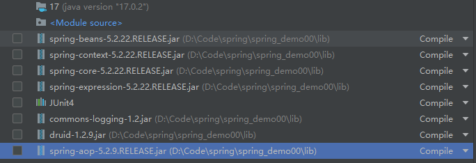

- 开启组件扫描

```xml
<!--开启组件扫描-->
    <!--扫描多个包的写法 1、用逗号隔开-->
    <context:component-scan base-package="com.spring.service,com.spring.dao"></context:component-scan>
    <!--扫描多个包的写法 2、扫描上层目录-->
    <context:component-scan base-package="com.spring"></context:component-scan>

</beans>
```

**配置细节**

```xml
<!--开启组件扫描-->
    <!--示例1-->
    <context:component-scan base-package="com.spring.service" use-default-filters="false">
		<context:include-filter type="annotation" expression="org.springfranmework.stereotype.Controller"/>
	</context:component-scan>
</beans>
```

use-default-filters="false" 表示不使用默认的 filter（就是扫描包下的所有类），而是自己配置规则

include-filter 设置扫描哪些内容——

​						type="annotation" expression="org.springfranmework.stereotype.Controller"

​						设置扫描 <<注解为Controller>>

```xml
<!--开启组件扫描-->
    <!--示例1-->
    <context:component-scan base-package="com.spring.service">
		<context:exclude-filter type="annotation" expression="org.springfranmework.stereotype.Controller"/>
	</context:component-scan>
</beans>
```

exclude-filter 设置不扫描哪些内容——

​						type="annotation" expression="org.springfranmework.stereotype.Controller"

​						设置不扫描 <<注解为Controller>>

- 添加注释

```java
import org.springframework.stereotype.Component;

// 在注解里value属性值可以不写，其默认值是类名称（首字母小写）
@Component(value = "userServiceForAop")  // 与<bean id="userServiceForAop" class=""></bean>写法类似
public class UserServiceForAop {

    public void add(){
        System.out.println("service add ...");
    }
}
```

#### 1.4.3 基于注解方式实现属性注入

##### @AutoWired

根据属性类型进行自动注入

1. 把 service 和 dao 对象创建，在 service 和 dao 类添加创建对象

2. 在 service 中注入 dao 对象，在 service 类添加 dao 类型属性，在属性上面使用注解（无需添加set方法）

   ```java
   @Service
   public class UserService {
       @Autowired
       private UserDao userDao;
   
       public void add(){
           System.out.println("service add ...");
           userDao.add();
       }
   }
   ```

3. 测试

##### @Qualifier

根据属性名称进行注入

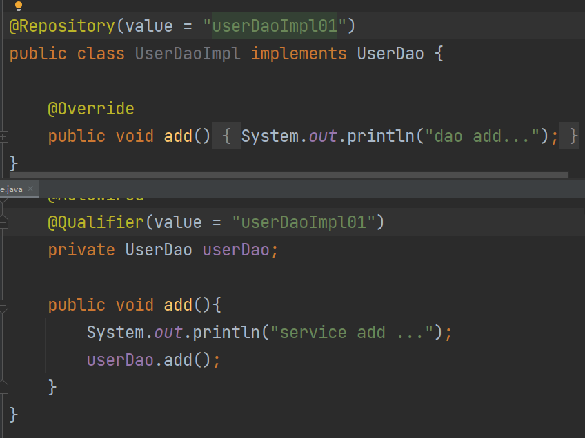

##### @Resourse

两者皆可

```java
@Resource                          // 根据类型
@Resource(name = "userDaoImpl01")  // 根据名称
private UserDao userDao;
```

##### @Value

针对普通类型输入

```java
public class UserService {

    @Value(value = "abc")
    private String name;
```

#### 1.4.4 完全注解开发

创建配置类，替代 xml 配置文件

```java
@Configuration
@ComponentScan(basePackages = {"com.spring.aop"})
public class SpringConfig {
}
```

测试类

```java
@Test
public void test02(){
    ApplicationContext context = new AnnotationConfigApplicationContext(SpringConfig.class);
    UserService userService = context.getBean("userService", UserService.class);
    System.out.println(userService);
    userService.add();
}
```

## 2 AOP

### 2.1 概念

(1) 面向切面编程（方面），利用AOP可以对业务逻辑的各个部分进行隔离，从而使得业务逻辑各部分之间的耦合度降低，提高程序的可重用性，同时提高了开发的效率。

(2) 通俗描述：不通过修改源代码方式，在主干功能里面添加新功能

### 2.2 底层原理

#### 2.2.1 动态代理

- 有接口情况——使用 JDK 动态代理

  创建接口的实现类**代理对象**，通过代理对象增强原方法，嫁接新方法

  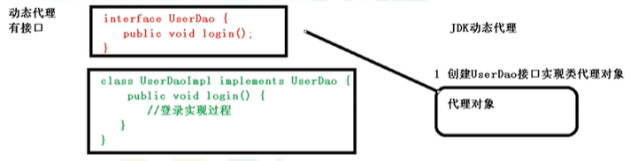

- 没有接口情况——使用 CGLIB 动态代理

  创建当前类子类的**代理对象**

  

以 JDK 动态代理实现为例

1. 调用 **newProxyInstance** 方法

   第一参数，类加载器
   第二参数，增强方法所在的类，这个类实现的接口，支持多个接口
   第三参数，实现这个接口InvocationHandler,创建代理对象，写增强的方法

2. 编写 JDK 动态代理代码

   （1）创建接口，定义方法

   ```java
   public interface UserDao {
       public int add(int a, int b);
       public String update(String id);
   }
   ```

   （2）创建接口实现类，实现方法

   ```java
   public class UserDaoImpl implements UserDao{
       @Override
       public int add(int a, int b) {
           return a+b;
       }
   
       @Override
       public String update(String id) {
           return id;
       }
   
   }
   ```

   （3）使用 Proxy 类创建接口代理对象

   ```java
   public class JDKProxy {
       public static void main(String[] args) {
           // 创建接口实现类代理对象
           Class[] interfaces = {UserDao.class};
           UserDaoImpl userDao = new UserDaoImpl();
           UserDao dao = (UserDao)Proxy.newProxyInstance(JDKProxy.class.getClassLoader(), interfaces, new UserDaoProxy(userDao));
           int result = dao.add(1,2);
           System.out.println("result:" + result);
       }
   }
   
   // 创建代理对象代码
   class UserDaoProxy implements InvocationHandler{
       // 1 把创建的是谁的代理对象，把谁传递过来
       // 有参数构造传递
       private Object obj;
       public UserDaoProxy(Object obj){
           this.obj = obj;
       }
       // 增强的逻辑
       @Override
       public Object invoke(Object proxy, Method method, Object[] args) throws Throwable {
           // 方法之前
           System.out.println("方法之前执行。。。" + method.getName() + ":传递的参数" + Arrays.toString(args));
           // 被增强的方法执行
           Object res = method.invoke(obj, args);
           // 方法之后
           System.out.println("方法之后执行。。。" + obj);
   
           return res;
       }
   }
   ```

### 2.3 术语

1. 连接点

   类里面**可以被增强**的方法就是连接点

2. 切入点

   类里面实际**被增强了的**方法就是切入点

3. 通知（逻辑）

   实际**增强的逻辑部分**被称为通知

   包括5种类型：

   - 前置通知

   - 后置通知

   - 围绕通知

   - 异常通知

   - 最终通知

4. 切面

   动作，把**通知应用到切入点**的过程

### 2.4 AOP操作

#### 2.4.1 准备

1. AspectJ  --AspectJ 不是 Spring 组成部分，独立 AOP 框架，一般把 Aspect 和 Spring 框架一起使用，进
   行AOP操作

2. 基于 AspectJ 实现 AOP 操作

   (1)基于 xml 配置文件实现

   (2)基于注解方式实现（使用）

3. 导入 AOP 相关依赖

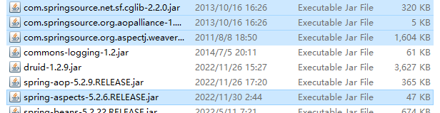

4. 切入点表达式

   知道对哪个类当中的哪个方法进行增强

   语法结构：

   ```
   execution([权限修饰符][返回类型][类全路径][方法名称]([参数列表]))
   ```

   举例1：对 com.spring.dao.BookDao 类里的 add 进行增强

   ```
   execution(* com.spring.dao.BookDao.add())
   ```

   举例2：对 com.spring.dao.BookDao 类里的**所有方法**进行增强

   ```
   execution(* com.spring.dao.BookDao.*())
   ```

   举例3：对 com.spring.dao包里的**所有类里的所有方法**进行增强

   ```
   execution(* com.spring.dao.*.*())
   ```


#### 2.4.2 AspectJ注解

1. 创建类，在其中定义方法

   ```java
   public class User {
       public void add(){
           System.out.println("add...");
       }
   }
   ```

2. 创建增强类

   ```java
   public class UserProxy {
       // 前置通知
       public void before(){
           System.out.println("before...");
       }
   }
   ```

3. 进行通知的配置

   - 在 spring 配置文件中，开启注解扫描

     ```xml
     <?xml version="1.0" encoding="UTF-8"?>
     <beans xmlns="http://www.springframework.org/schema/beans"
            xmlns:xsi="http://www.w3.org/2001/XMLSchema-instance"
            xmlns:context="http://www.springframework.org/schema/context"
            xmlns:aop="http://www.springframework.org/schema/aop"
            xsi:schemaLocation="http://www.springframework.org/schema/beans http://www.springframework.org/schema/beans/spring-beans.xsd
                                http://www.springframework.org/schema/context http://www.springframework.org/schema/beans/spring-context.xsd
                                http://www.springframework.org/schema/aop http://www.springframework.org/schema/beans/spring-aop.xsd">
     
         <!--开启注解扫描-->
         <context:component-scan base-package="com.spring.aop.aopanno"></context:component-scan>
     </beans>
     ```

   - 使用注解创建 User 和 UserProxy 对象

     ```java
     @Component
     public class User {
         public void add(){
             System.out.println("add...");
         }
     }
     ```

     

     ```java
     // 增强的类
     @Component
     public class UserProxy {
         // 前置通知
         public void before(){
             System.out.println("before...");
         }
     }
     ```

   - 在增强类上面添加注解@Aspect

     ```java
     // 增强的类
     @Component
     @Aspect  // 生成代理对象
     public class UserProxy {
         // 前置通知
         public void before(){
             System.out.println("before...");
         }
     }
     ```

   - 在 spring 配置文件中开启生成代理对象

     ```xml
     <!--开启注解扫描-->
     <context:component-scan base-package="com.spring.aop.aopanno"></context:component-scan>
     <!--开启Aspect生成代理对象-->
     <aop:aspectj-autoproxy></aop:aspectj-autoproxy>
     ```

4. 配置不同类型的通知

   在增强类的里面，在作为通知方法上面添加类型注解，使用切入点表达式配置

   ```java
   // 增强的类
   @Component
   @Aspect  // 生成代理对象
   public class UserProxy {
       // 前置通知
       // Before注解表示作为前置通知
       @Before(value = "execution(* com.spring.aop.aopanno.User.add(..))")
       public void before(){
           System.out.println("before...");
       }
   
       @After(value = "execution(* com.spring.aop.aopanno.User.add(..))")
       public void after(){
           // 在方法之后执行
           System.out.println("after...");
       }
   
       @AfterReturning(value = "execution(* com.spring.aop.aopanno.User.add(..))")
       public void afterReturning(){
           // 在方法返回结果之后执行
           System.out.println("afterReturning...");
       }
   
       @AfterThrowing(value = "execution(* com.spring.aop.aopanno.User.add(..))")
       public void afterThrowing(){
           System.out.println("afterThrowing...");
       }
   
       @Around(value = "execution(* com.spring.aop.aopanno.User.add(..))")
       public void around(ProceedingJoinPoint proceedingJoinPoint) throws Throwable{
           System.out.println("环绕之前...");
           // 被增强的方法执行
           proceedingJoinPoint.proceed();
           
           System.out.println("环绕之后...");
       }
   }
   ```

5. 公共切入点抽取

   ```java
   // 相同切入点抽取
   @Pointcut(value = "execution(* com.spring.aop.aopanno.User.add(..))")
   public void pointdemo(){
   
   }
   // 前置通知
   // Before注解表示作为前置通知
   @Before(value = "pointdemo()")
   public void before(){
       System.out.println("before...");
   }
   ```

6. 有多个增强类对同一个方法进行增强，设置增强类优先级

   在增强类上面添加注解@Order，设置数字类型值越小优先级越高

   ```java
   // 增强的类
   @Component
   @Aspect  // 生成代理对象
   @Order(1)
   public class UserProxy {
   ```

7. 补充：完全使用注解开发（无需创建xml文件）

   ```java
   @Configuration
   @ComponentScan(basePackages = "com.spring.aop.config")
   @EnableAspectJAutoProxy(proxyTargetClass = true)
   public class ConfigAop {
   
   }
   ```

#### 2.4.3 AspectJ配置文件

1. 创建两个类，包括增强类和被增强类，创建方法

2. 在 spring 配置文件中创建两个类对象

   ```xml
   <!--创建对象-->
   <bean id="book" class="com.spring.aop.aopxml.Book"></bean>
   <bean id="bookproxy" class="com.spring.aop.aopxml.BookProxy"></bean>
   ```

3. 在 spring 配置文件中配置切入点

   ```xml
   <!--创建对象-->
   <bean id="book" class="com.spring.aop.aopxml.Book"></bean>
   <bean id="bookproxy" class="com.spring.aop.aopxml.BookProxy"></bean>
   <!--配置aop增强-->
   <aop:config>
       <!--切入点-->
       <aop:pointcut id="p" expression="execution(* com.spring.aop.aopxml.Book.add(..))"/>
       <!--配置切面-->
       <aop:aspect ref="bookproxy">
           <!--增强作用在具体方法上-->
           <aop:before method="before" pointcut-ref="p"></aop:before>
       </aop:aspect>
   </aop:config>
   ```

## 3 JdbcTemplate

### 3.1 概念和准备

1. JdbcTemplate

   Spring框架对 JDBC 进行封装，使用 JdbsTemplate 方便实现对数据库操作

2. 准备工作

   引入依赖

   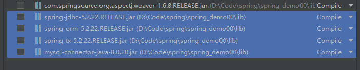
   
   连接池
   
   ```xml
   <!--数据库连接池-->
   <bean id="dataSource" class="com.alibaba.druid.pool.DruidDataSource" destroy-method="close">
       <property name="url" value="jdbc:mysql://localhost:3306/user_db"></property>
       <property name="username" value="root"></property>
       <property name="password" value="root"></property>
       <property name="driverClassName" value="com mysql.jdbc.Driver"/>
   </bean>
   ```

3. 配置 JdbcTemplate 对象，注入DataSource

   ```xml
   <!--JdbcTemplate对象-->
   <bean id="JdbcTemplate" class="org.springframework.jdbc.core.JdbcTemplate">
       <!--注入dataSource对象-->
       <property name="dataSource" ref="dataSource"></property>
   </bean>
   ```

4. 创建service类，创建dao类，在dao注入 JdbcTemplate 对象

   配置文件

   ```xml
   <!--组件扫描-->
   <context:component-scan base-package="com.spring.jdbcTemplate"></context:component-scan>
   ```

   service

   ```java
   @Service
   public class BookService {
       // 注入dao
       @Autowired
       private BookDao bookDao;
   }
   ```

   Dao

   ```java
   @Repository
   public class BookDaoImpl implements BookDao{
       // 注入JdbcTemplate
       @Autowired
       private JdbcTemplate jdbcTemplate;
   }
   ```

### 3.2 操作数据库——增删改

#### 3.2.1 对应数据库表创建实体类

```java
public class User {
    private String userid;
    private String username;
    private String ustatus;

    public void setUserid(String userid) {
        this.userid = userid;
    }

    public void setUsername(String username) {
        this.username = username;
    }

    public void setUstatus(String ustatus) {
        this.ustatus = ustatus;
    }

    public String getUserid() {
        return userid;
    }

    public String getUsername() {
        return username;
    }

    public String getUstatus() {
        return ustatus;
    }
}
```

#### 3.2.2 编写 service 和 dao

1. 在 dao 进行数据库添加操作

2. 在调用 JdbcTemplate 对象里面 **update** 方法实现添加操作

   

   两个参数：

   - sql 语句
   - 可变参数，设置 sql 语句值

   ```java
   // 添加的方法
   @Override
   public void add(User user) {
       // 1 创建sql语句
       String sql = "insert into t_user values(?,?,?)";
       // 2 调用方法实现
       int update = jdbcTemplate.update(sql, user.getUserid(), user.getUsername(), user.getUstatus());
       System.out.println(update);  // 返回的是影响的行数
   }
   ```

   或者可以

   ```java
   Object[] args = {user.getUserid(), user.getUsername(), user.getUstatus()};
   int update = jdbcTemplate.update(sql, args);
   System.out.println(update);  // 返回的是影响的行数
   ```

### 3.3 操作数据库——查询

#### 3.3.1 返回一个值

- 编写 service 和 dao 中相应的方法

- 在调用 JdbcTemplate 对象里面 **queryForObject** 方法实现查询操作

  

  两个参数：

  - sql 语句
  - 返回值的类型

#### 3.3.2 返回对象

- 编写 service 和 dao 中相应的方法

- 在调用 JdbcTemplate 对象里面 **queryForObject** 方法实现查询操作

  

  三个参数：

  - sql 语句
  - RowMapper 是接口，返回不同类型数据，使用这个接口里面的实现类完成数据封装
  - sql 语句值

举例一个使用例子

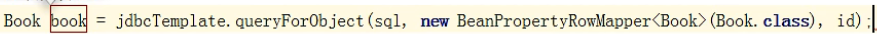

#### 3.3.3 返回集合

- 编写 service 和 dao 中相应的方法

- 在调用 JdbcTemplate 对象里面 **query** 方法实现查询操作

  

  三个参数：

  - sql 语句
  - RowMapper 是接口，返回不同类型数据，使用这个接口里面的实现类完成数据封装
  - sql 语句值

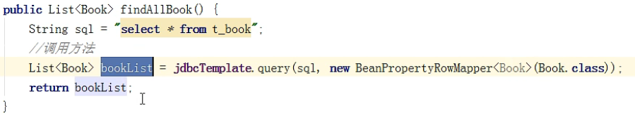

### 3.4 操作数据库——批量操作

#### 3.4.1 批量添加

- 编写 service 和 dao 中相应的方法

- 在调用 JdbcTemplate 对象里面 **batchUpdate** 方法实现批量操作

  

  两个参数：

  - sql 语句
  - List集合，添加多条记录数据

##### 举例

###### service

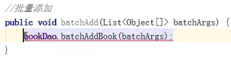

###### dao

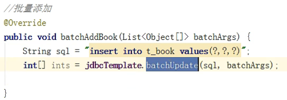

#### 3.4.1 批量修改

同上

##### 举例

###### dao

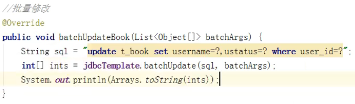

#### 3.4.2 批量删除

同上

##### 举例

###### dao

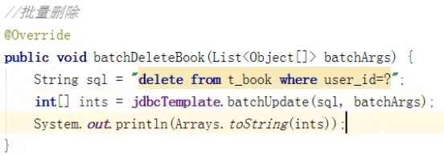

###### test

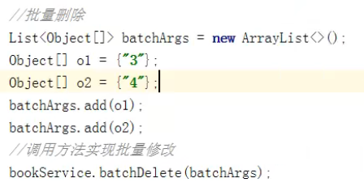

## 4 事务

事务——数据库操作基本单元，逻辑上的一组操作要么都成功，如果有一个失败所有操作都失败

事务四个特性：

原子性——要么成功，要么都失败

一致性——数据有些值不变（如总量）

隔离性——事务之间操作不影响

持久性——提交后表中数据真正发生变化

### 4.1 事务操作——搭建环境

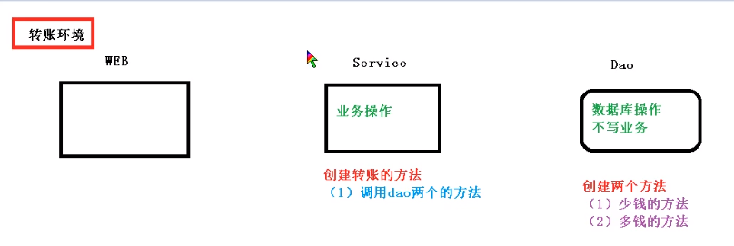

1. 创建数据库表，添加记录

   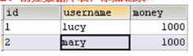

2. 创建service,搭建dao,完成对象创建和注入关系

   service 注入 dao，在 dao 注入 JdbcTemplate，在 JdbcTemlate 注入 DataSource

   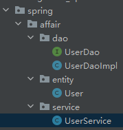

3. 在 Dao 创建两个方法：多钱和少钱的方法，在service创建方法（转账的方法）

4. 异常——模拟

   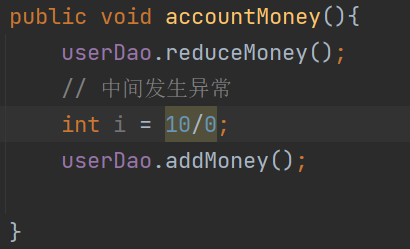

   此时钱少了但没多，**因此需要事务**

   

### 4.2 事务操作——声明式

1、建议事务在 Service 层中实现

2、在Spring进行事务管理操附

（1）有两种方式：编程式事务管理和**声明式事务管理**（使用）

3、声明式事务管理
（1）基于注解方式
（2）基于Xml配置文件方式

4、在 Spring 进行声明式事务管理，底层使用 **AOP**

5、Spring 事务管理 API

提供一个接口，代表事务管理器，这个接口针对不同的框架提供不同的实现类

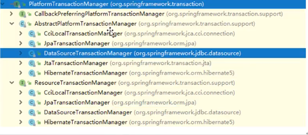

#### 4.2.1 注解声明式事务管理

1、创建事务管理器

```XML
<!--创建事务管理器-->
<bean id="transactionManager" class="org.springframework.jdbc.datasource.DataSourceTransactionManager">
    <property name="dataSource" ref="dataSource"></property>
</bean>
```

2、在spring配置文件，开启事务注解

（1）在spring配置文件引入名称空间 tx

```xml
<?xml version="1.0" encoding="UTF-8"?>
<beans xmlns="http://www.springframework.org/schema/beans"
       xmlns:xsi="http://www.w3.org/2001/XMLSchema-instance"
       xmlns:context="http://www.springframework.org/schema/context"
       xmlns:aop="http://www.springframework.org/schema/aop"
       xmlns:tx="http://www.springframework.org/schema/tx"
       xsi:schemaLocation="http://www.springframework.org/schema/beans http://www.springframework.org/schema/beans/spring-beans.xsd
                           http://www.springframework.org/schema/context http://www.springframework.org/schema/context/spring-context.xsd
                           http://www.springframework.org/schema/aop http://www.springframework.org/schema/aop/spring-aop.xsd
                           http://www.springframework.org/schema/tx http://www.springframework.org/schema/tx/spring-tx.xsd">
```

（2）开启事务注解

```xml
<!--创建事务管理器-->
<bean id="transactionManager" class="org.springframework.jdbc.datasource.DataSourceTransactionManager">
    <!--注入数据源-->
    <property name="dataSource" ref="dataSource"></property>
</bean>
<!--开启事务注解-->
<tx:annotation-driven transaction-manager="transactionManager"></tx:annotation-driven>
```

3、在 service 类上面（或者 service 类里面方法上面）添加事务注解

（1）@Transactional，这个注解添加到类上面，也可以添加方法上面，
（2）如果把这个注解添加类上面，这个类里面所有的方法都添加事务
（3）如果把这个注解添加方法上面，为这个方法添加事务

#### 4.2.2 声明式事务管理参数设置

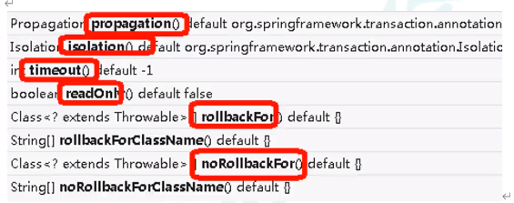

##### 

##### propagation：事务传播行为

多事务方法直接进行调用，这个过程中事务是如何进行管理的

Spring 定义了7种传播属性

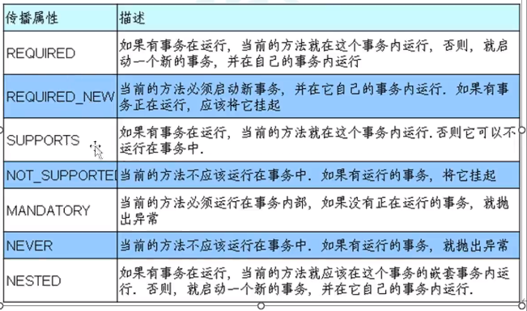

1. REQUIRED

   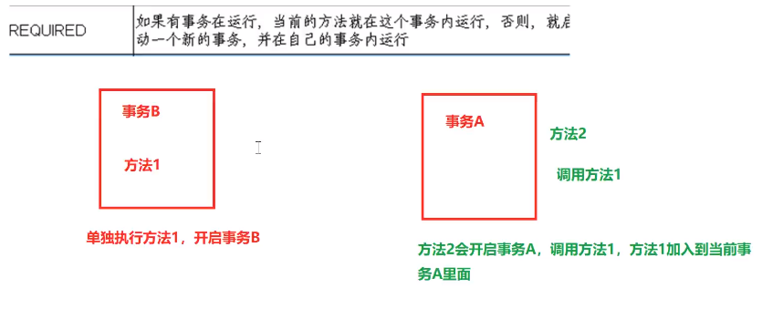

2. REQUIRED_NEW

   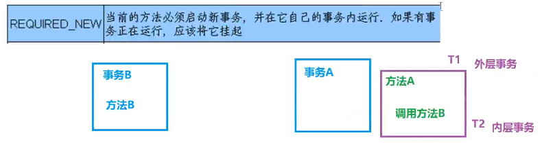

   

##### ioslation：事务隔离级别

- 事务有特性成为隔离性，多事务操作之间不会产生影响。不考虑隔离性产生很多问题

- 有三个读问题：脏读、不可重复读、虚（幻）读
  - 脏读：一个未提交事务读取到另一个未提交事务的数据
  - 不可重复读：—个未提交事务读取到另一提交事务修改数据
  - 虚读：一个未提交事务读取到另一提交事务添加数据

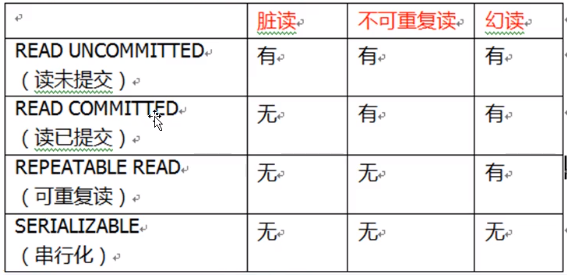

```java
@Service
@Transactional(propagation = Propagation.REQUIRED, isolation = Isolation.REPEATABLE_READ)
```

##### timeout：超时时间

事务需要在一定时间内进行提交，如果不提交进行回滚

默认值是-1，设置时间以秒单位进行计算

##### readOnly：是否只读

读：查询操作，写：添加修改别除操作

readOnly默认值alse,表示可以查询，可以添加修改删除操作

设置readOnly值是true,设置成true之后，只能查询

##### rollbackFor：回滚

设置出现哪些异常进行事务回滚

##### noRollbackFor：不回滚

设置出现哪些异常不进行事务回滚

#### 4.2.3 xml 声明式事务管理（不咋用）

##### 配置事务管理器

```xml
<!--创建事务管理器-->
<bean id="transactionManager" class="org.springframework.jdbc.datasource.DataSourceTransactionManager">
    <!--注入数据源-->
    <property name="dataSource" ref="dataSource"></property>
</bean>
```

##### 配置通知

```XML
<!--配置通知-->
    <tx:advice id="txadvice">
        <tx:attributes>
            <tx:method name="accountMoney" propagation="REQUIRED"/>
        </tx:attributes>
    </tx:advice>
```

##### 配置切入点和切耐

```xml
<!--配置切入点和切面-->
    <aop:config>
        <!--配置切入点-->
        <aop:pointcut id="pt" expression="execution(* com.spring.affair.service.UserService.*(..))"/>
        <!--配置切面-->
        <aop:advisor advice-ref="txadvice" pointcut-ref="pt"/>
    </aop:config>
```

#### 4.2.4 完全注解方式

```java
@Configuration
@ComponentScan(basePackages = "com.spring")
@EnableTransactionManagement  // 开启事务
public class TxConfig {
    // 创建数据库连接池
    @Bean
    public DruidDataSource getDruidDataSource(){
        DruidDataSource dataSource = new DruidDataSource();
        dataSource.setDriverClassName("com.mysql.jdbc.Driver");
        dataSource.setUrl("jdbc:mysql:///user_db");
        dataSource.setUsername("root");
        dataSource.setPassword("root");
        return null;
    }
}
```

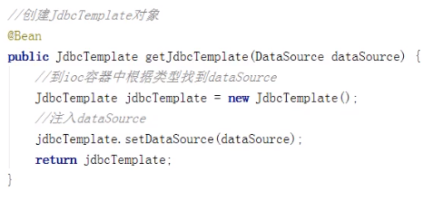

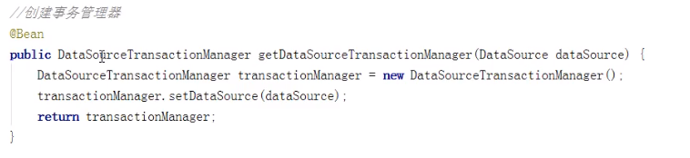
