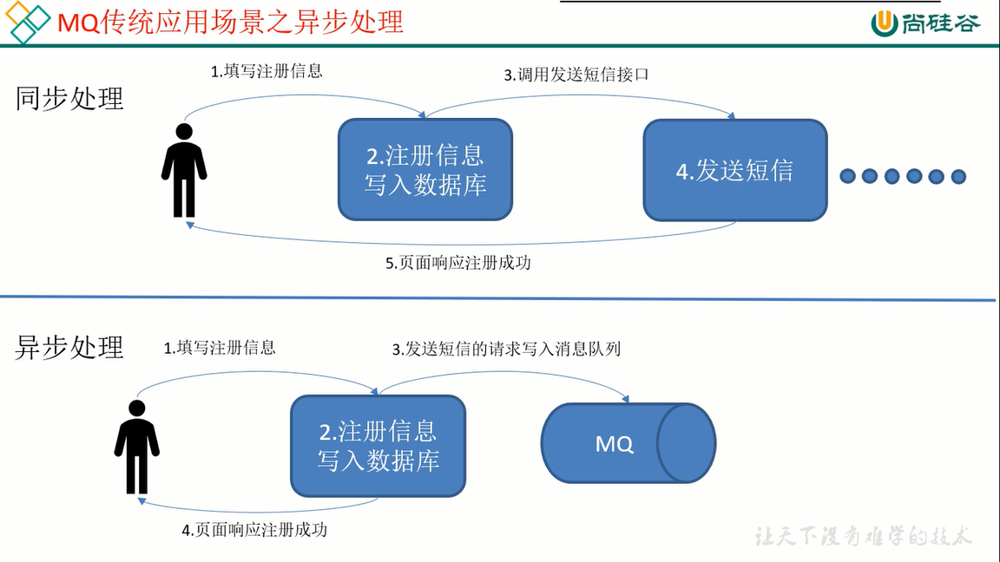
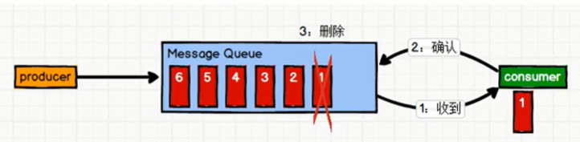
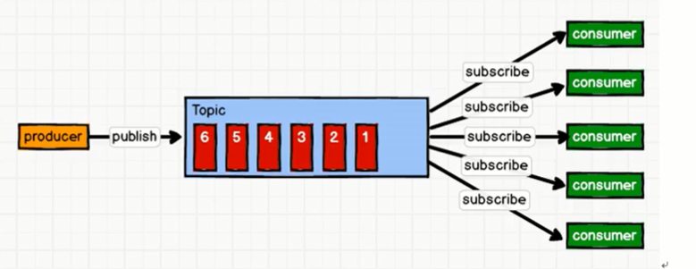
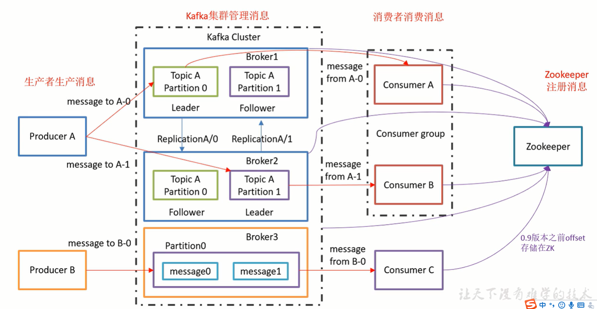

##### 尚硅谷学习资料

[尚硅谷全套课件整理：Java、前端、大数据、安卓、面试题 - 知乎 (zhihu.com)](https://zhuanlan.zhihu.com/p/404565210)

# 1 概述

Kafka是一个分布式的基于发布/订阅模式的消息队列(Message Queue),主要应用于大数据实时处理领域。

## 消息队列

### 传统消息队列的应用场景

优势

##### 点对点模式

##### 发布-订阅模式

- 消费者主动拉取数据
- 消息队列主动推送消息

#### 基础架构

同一个分区 Partition 只能被同一个消费者组里的一个消费者消费（一个组是一个整体）

