# mangoDB

## 0 简介

模式自由：可以把不同结构的文档存储在同一个数据库里
面向集合的存储：适合存储JSON风格文件的形式
完整的索引支持：对任何属性可索引
复制和高可用性：支持服务器之间的数据复制，支持主-从模式及服务器之间的相
互复制。复制的主要目的是提供冗余及自动故障转移
自动分片：支持云级别的伸缩性：自动分片功能支持水平的数据库集群，可动态添
加额外的机器
丰富的查询：支持丰富的查询表达方式，查询指令使用JSON形式的标记，可轻易
查询文档中的内嵌的对象及数组
快速就地更新：查询优化器会分析查询表达式，并生成一个高效的查询计划
高效的传统存储方式：支持二进制数据及大型对象（如照片或图片）

## 1 安装与卸载

### 安装参考步骤

[如何在 Ubuntu 22.04 上安裝和保護 MongoDB NoSQL 資料庫 - 0x資訊 (0xzx.com)](https://0xzx.com/zh-tw/2022062418502405750.html)

### 卸载参考步骤

[ubuntu下mongodb彻底卸载方式 - 知乎 (zhihu.com)](https://zhuanlan.zhihu.com/p/347614929)


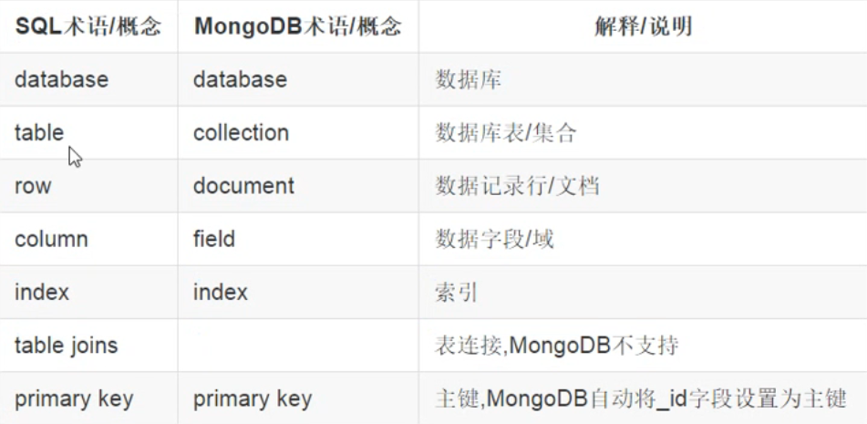

- 三元素：数据库，集合，文档

  - 集合就是关系数据库中的表

  - 文档对应着关系数据库中的行

- 文档，就是一·个对象，由键值对构成，是 json 的扩展 Bson 形式

```
{'name':'guojing','gender':'男‘}
```

- 集合：类似于关系数据库中的表，储存多个文档，结构不固定，如可以存储如下文档在一·个集合中


## 2 服务端mongod

- 配置文件在 /etc/mongod.conf
- 默认端口27017

- 启动

  ```
  sudo service mongod start
  ```

- 停止

  ```
  sudo service mongod stop
  ```

- 重启

  ```
  sudo service mongod restart
  ```

- 验证身份登录

  ```
  mongo -u username -p --authenticationDatabase admin
  ```


- 远程连接

  ```
  vim /etc/mongodb.conf    // 把bind_ip注释掉或改为0.0.0.0
  ```

  ```
  sudo service mongod restart    // 重新启动
  ```

  ```
  iptables -A INPUT -p tcp -m state --state NEW -m tcp --dport 27017 -j ACCEPT    // 防火墙开放端口
  ```

  

### 2.1 集合创建

- 语法

  db


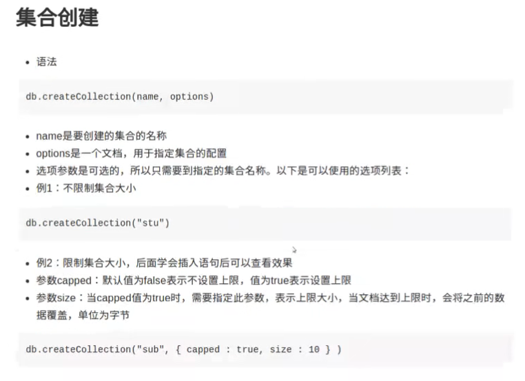

### 2.2 增删改查

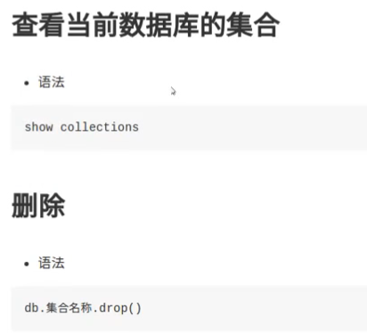


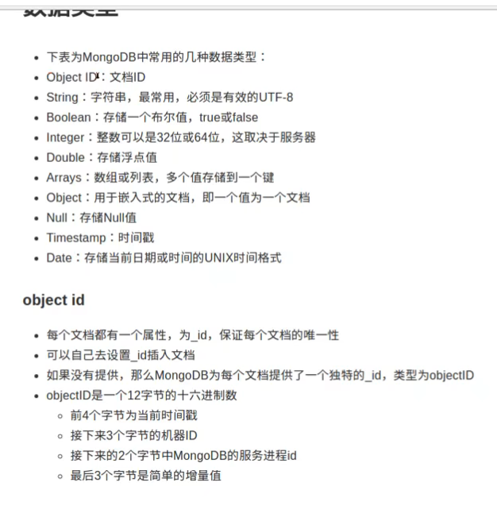

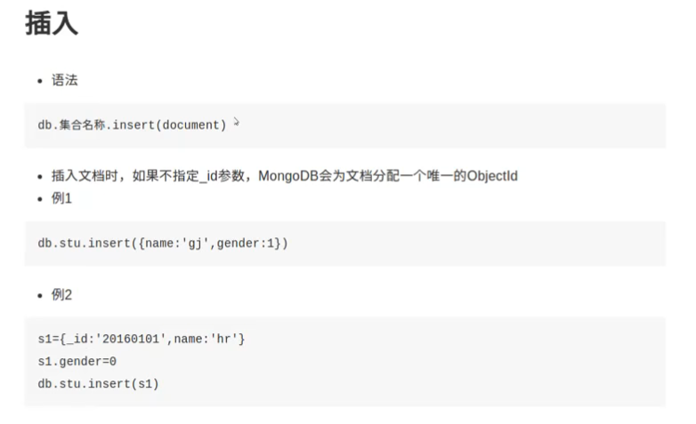

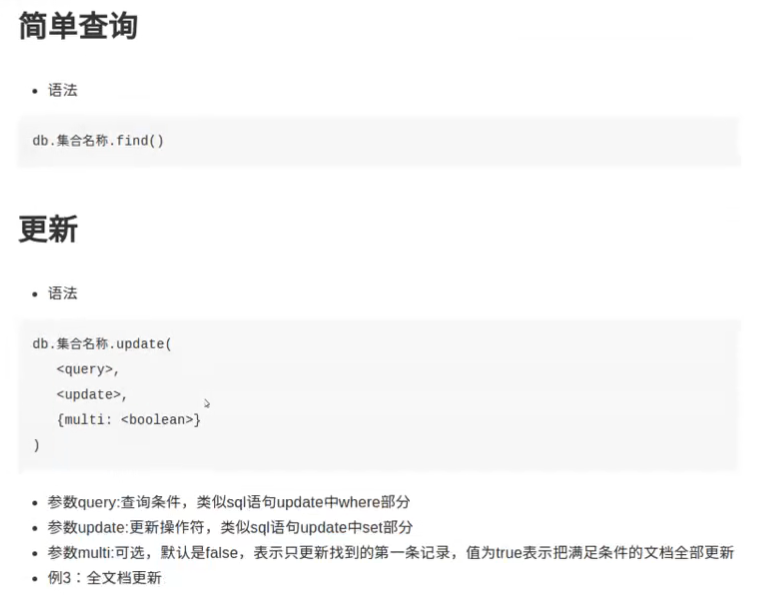


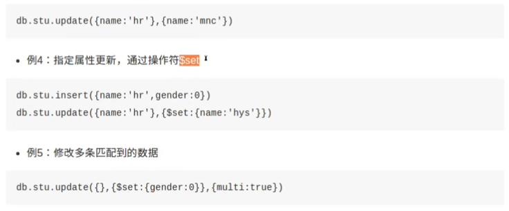

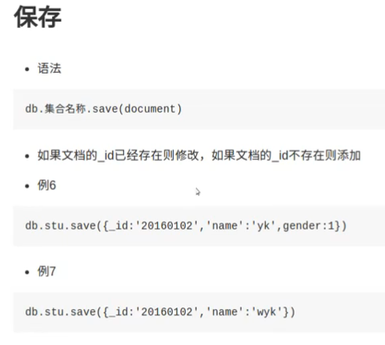

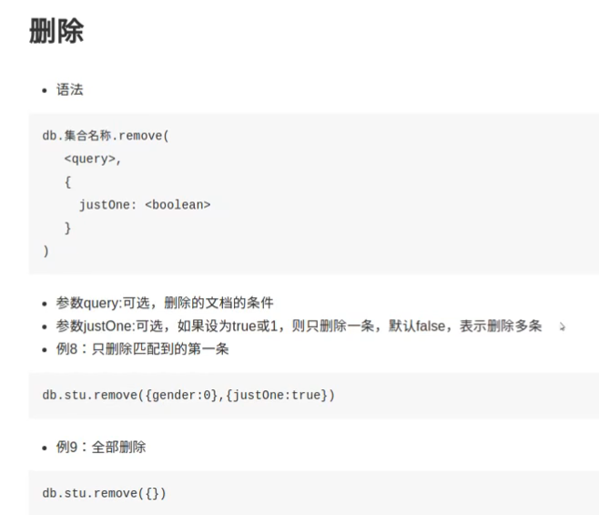

#### 数据操作

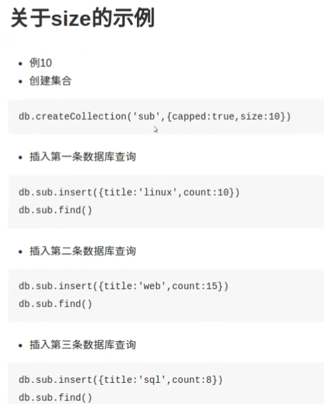

## 5 pymongo

### 5.1 建立连接并创建客户端

无安全认证

```
client=MongoClient('mongodb://localhost:27017')
```

有安全认证

```
client=MongoClient('mongodb://用户名:密码@localhost:27017/数据库名称')
```

### 5.2 主要方法

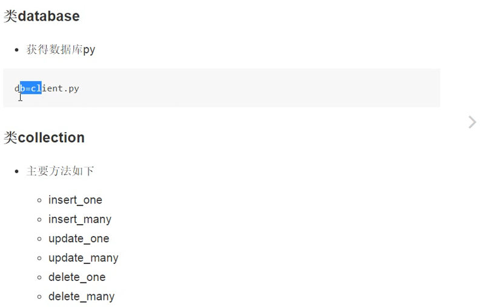

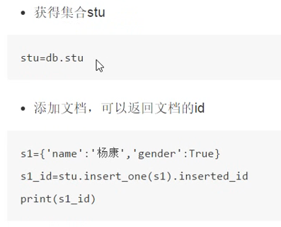

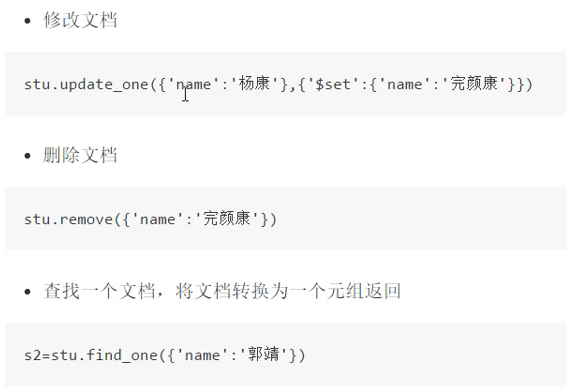

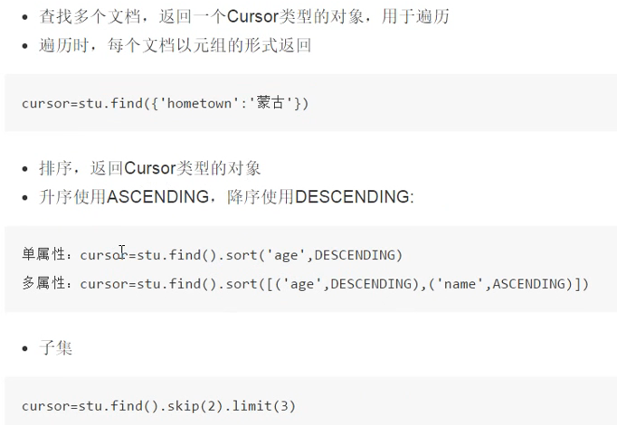

mongoEngine 学习参考

[MongoEngine中文文档 - zhenyuantg - 博客园 (cnblogs.com)](https://www.cnblogs.com/zhenyauntg/p/13201826.html)