# 0 项目简介

##### 业务流程

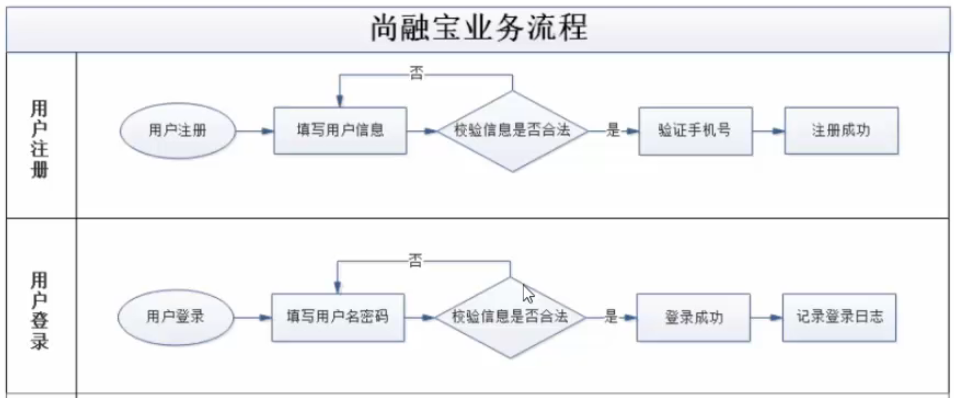

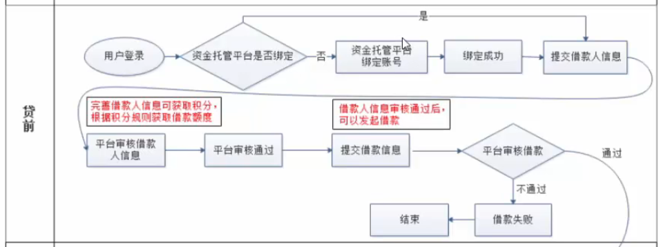

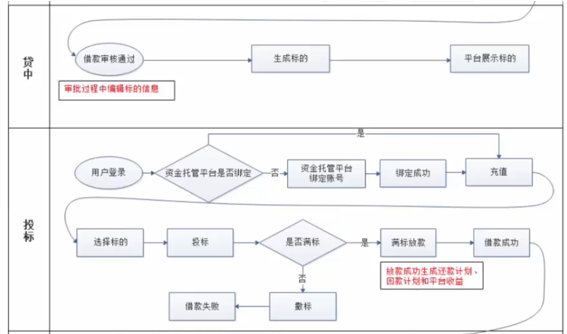

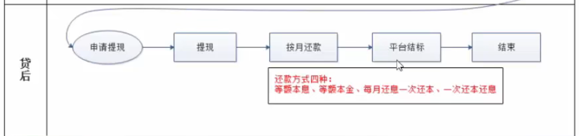


##### 参考代码

[GitHub - xyf527/srb](https://github.com/xyf527/srb)

##### 前期知识


##### 技术栈

###### 1、后端

SpringBoot 2.3.4.RELEASE
SpringCloud Hoxton.SR8：微服务基础设施-服务注册、服务发现、服务熔断、微服务网关、配置中心等
SpringCloud Alibaba 2.2.2.RELEASE
MyBatis Plus：持久层框架和代码生成器
Lombok：简化实体类开发
Swagger2：Api接口文档生成工具
Logback：日志系统
alibaba-easyexcel：Exceli读写
Spring Data Redis：Spring.项目中访问Rediss缓存
HTTPClient：基于Http协议的客户端，用来实现远程调用
Spring Task：定时任务

###### 2、数据库和中间件

MySQL5.7：关系型数据库
管理工具：Navicat
Redis5.0：缓存技术
管理工具：RedisDesktopManager
RabbitMQ3.8：消息中间件

###### 3、三方接口

阿里云短信：短信网关
阿里云OSS：分布式文件存储
资金托管平台API对接：汇付宝

###### 4、前端

Node.js：JavaScript运行环境
ES6：JavaScript的模块化版本
axios：一个发送Ajax请求的工具
vue.js：web界面的新进式框架
Element-U：前端组件库
模块化开发：解决javascript变量全局空间污染的问题
NPM：模块资源管理器
vue-element-admin：基于Vue.js的后台管理系统UI集成方案
NuxtJ过：基于Vue.js构建的服务器端渲染应用的轻量级框架

##### 开发环境检查

jdk 1.8
配置：JAVA HOME、path
maven 3.6
配置：MAVEN_HOME、本地仓库路径、中央仓库地址、jdk版本
idealU-2020.2.3:
注意：在idea的欢迎页面选择Confiqure>settings
配置：Java Compiler、File Encodings、Maven、Auto Import、Code Completion>Match case（取消）
插件：lombok、.MyBatisX

###### 附maven设置

配置文件

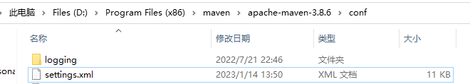

镜像设置

```xml
<mirror>
<id>nexus-aliyun</id>
<mirrorOf>central</mirrorOf>
<name>Nexus aliyun</name>
<url>http://maven.aliyun.com/nexus/content/groups/public</url>
</mirror>
```

编译环境


# 1 项目介绍和前端知识

## 基础知识

1、银行系

- 优势：第一，资金雄厚，流动性充足；第二，项目源质地优良，大多来自于银行原有中小型客户：第三，风险控制能力强。如
  恒丰银行、招商银行等旗下都有信用贷款平台。
- 劣势：收益率偏低，预期年化收益率处于5.5%-8.6%之间，略高于银行其他理财产品，对投资人吸引力有限。

2、国资系

- 优势：拥有国有背景股东的隐性背书，兑付能力有保障，业务模式较为规范，从业人员金融专业素养较高。
- 劣势：缺乏互联网基因；项目标的较大，起投门槛较高；且产品种类有限，多为企业信用贷：较为谨慎，层层审核的机制严重
  影响了平台运营效率；收益率不具有吸引力。

3、民营系
民营系平台数量最多，起步最早，但鱼龙混杂，不胜枚举。

- 优势：普惠金融，手续便捷；门槛极低，投资起点低最低起投门槛甚至50元；强大的互联网思维，产品创新能力高，市场化
  程度高；收益率高，投资收益率具有吸引力。
- 劣势：风险偏高，资本实力及风控能力偏弱，跑路及倒闭的高发区。

## 业务流程

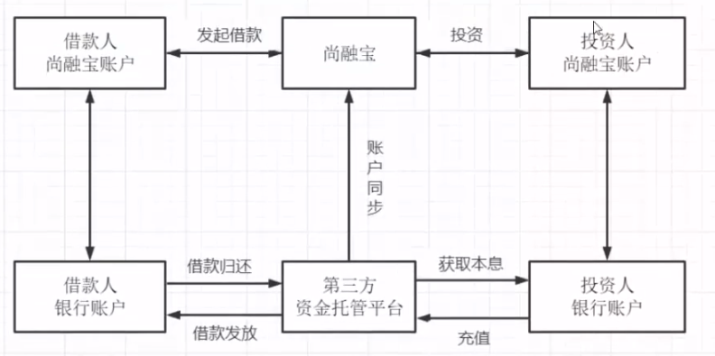

##### 1、借款人

##### 2、投资人

##### 3、资金池风险

资金池：一个大池子放钱，一边存进来（入水韵），一边贷出去（出水管）。不管是张三的钱、李四的钱、还是王五的钱，只罗进到池子里，就都叫池子的钱了。银行就是典型的资金池。

资金池风险：

- 第一种情况：投资入水管流量过大，池子里全是水。这种情况，平台亏钱，干不长。原因很简单，池子里的钱是有成本的，只进不出，没有利差，拿什么钱付投资人的利息，时间长了，就只能用投资人的本金还投资人的利息，借新还日，庞氏骗局。这个过程就直接背离了平台信息中介的身份，而成了与银行类以的金融机构。
- 第二种情况：突然来了这么多钱，怎么办？只能把放贷出水管的流量调大。放贷的这条出水管上有两个阀门，一个找项目，一个叫做风控，遇到这种情况，经常就是两个阀门一块儿放，钱是贷出去了，但由于放松了对风验的把控，能不能再流回来，就不好说了，危险。
- 第三种情况：提款的出水管流量变大。比例，一个黑天鹅事件，一个负面新闻，一个平台垮了，都可能诱发这种情况，这就是挤说。比如说某租宝事件后，不只这一家平台，很多其他平台的用户，也在疯狂的提现，有可能一直提到关门为止。
- 第四种情况最极端：平台把池子里的钱都提出来，走人。这个就不用解释了，就是跑路。

以上四种情况就是资金池最主要的几个风险一经营不善，风险失控，挤兑和跑路。银监会发布的《网络借贷信息中介机构业务活动管理暂行办法》让资金存管成为网贷平台的硬性要求，同时降低了平台建立资金池、挪用用户资金的风险

##### 4、资金托管平台

第三方存管模式：“第三方存管”的全称是“客户交易结算资金第三方存管”。这里的第三方存管机构，目前是指具备第三方
存首资格的商业银行。银行的流入资金成本低，风控体系较完善，资金池子足够大，而且是国家背书，不会跑路。

说明：由于我们是教学使用，无法申请到正式的资金托管平台的支特，所以我们根据资金托管平台P接口文档，自行开发模
拟一套API接口来满足业务需要，业务过程与实际开发基本一致。

## Mybatis-Plus快速入门

#### 基本使用流程

1、创建数据库

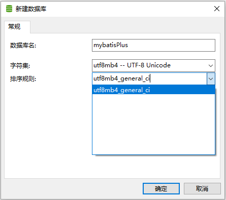


2、创建SpringBoot工程

3、引入依赖

4、修改配置文件

```properties
spring.datasource.driver-class-name=com.mysql.cj.jdbc.Driver
spring.datasource.url=jdbc:mysql://localhost:3306/mybatis_plus?serverTimezone-GMT%2B8&characterEncoding-utf-8
spring.datasource.username=root
spring.datasource.password=suxujia520
```

驱动

MySql 8及8以上驱动为  **com.mysql.cj.jdbc.Driver**

8以下则没有**cj**

url

针对上述8及8以上的驱动，url必须添加时区  **serverTimezone-GMT%2B8**

5、创建实体类

```java
package com.project.mybatisplus.entity;

import lombok.Data;

@Data
public class User {
    private Long id;
    private String name;
    private Integer age;
    private  String email;

}
```

6、创mapper接口

```java
import com.baomidou.mybatisplus.core.mapper.BaseMapper;
import com.project.mybatisplus.entity.User;

public interface UserMapper extends BaseMapper<User>{
    
}
```

7、启动类添加注解

启动类中针对mapper添加扫描注解

8、测试

针对UserMapper只有接口而无实现类这一点，有两种解决办法

第一种方式——障眼法（用Autowired注入，通过加@Repository注解骗过scan）

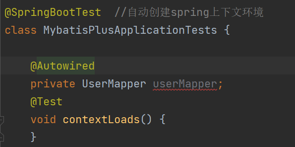

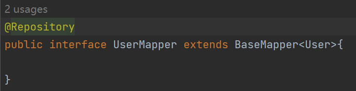

第二种更专业——用@Resource注入（j2EE）

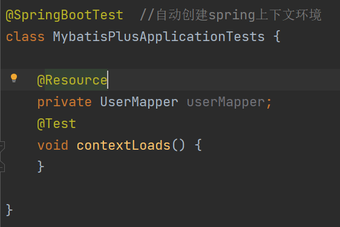

```java
package com.project.mybatisplus;

import com.project.mybatisplus.entity.User;
import com.project.mybatisplus.mapper.UserMapper;
import org.junit.jupiter.api.Test;
import org.springframework.beans.factory.annotation.Autowired;
import org.springframework.boot.test.context.SpringBootTest;

import javax.annotation.Resource;
import java.util.List;

@SpringBootTest  //自动创建spring上下文环境
class MybatisPlusApplicationTests {

    @Resource
    private UserMapper userMapper;
    @Test
    void contextLoads() {
        List<User> users = userMapper.selectList(null);
        users.forEach(System.out::println);
    }
}
```

补充、查看 Sql 输出日志

```properties
spring.datasource.driver-class-name=com.mysql.cj.jdbc.Driver
spring.datasource.url=jdbc:mysql://localhost:3306/mybatisplus?serverTimezone-GMT%2B8&characterEncoding-utf-8
spring.datasource.username=root
spring.datasource.password=suxujia520

#mybatis日志
mybatis-plus.configuration.log-impl=org.apache.ibatis.logging.stdout.StdOutImpl
```

#### Mapper通用

##### 增

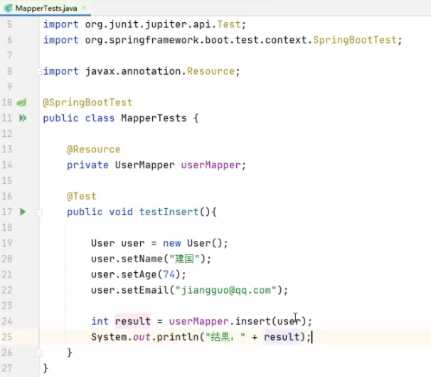

##### 查 


##### 改


##### 删


#### Service通用

##### 创建service接口和实现

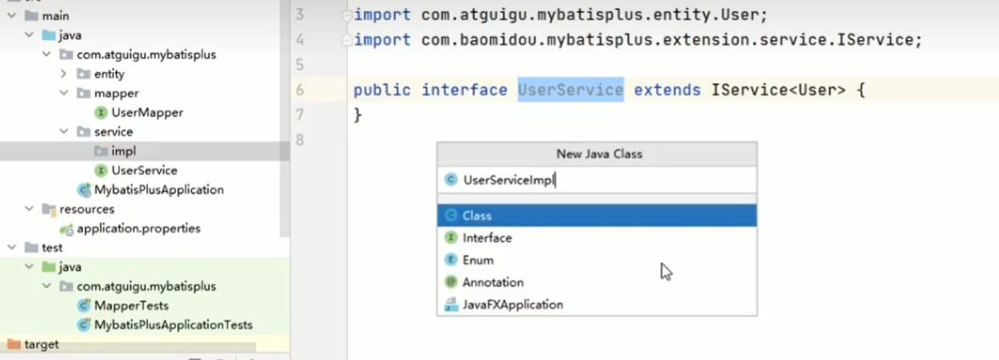


##### 测试实例

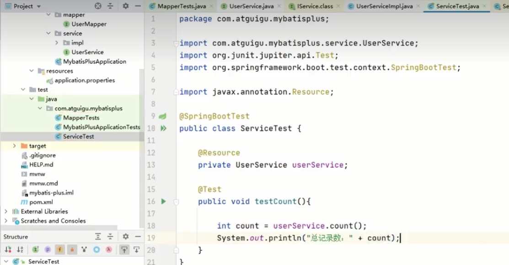

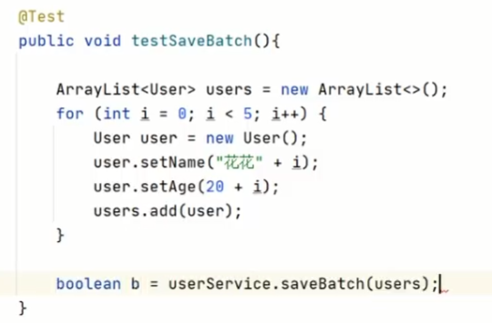

###### 附：简便操作设置

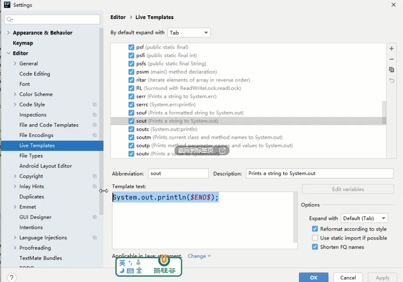
