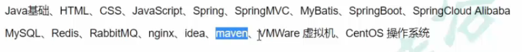

# 0 项目简介

##### 业务流程


##### 参考代码

[GitHub - xyf527/srb](https://github.com/xyf527/srb)

##### 前期知识



##### 技术栈

###### 1、后端

SpringBoot 2.3.4.RELEASE
SpringCloud Hoxton.SR8：微服务基础设施-服务注册、服务发现、服务熔断、微服务网关、配置中心等
SpringCloud Alibaba 2.2.2.RELEASE
MyBatis Plus：持久层框架和代码生成器
Lombok：简化实体类开发
Swagger2：Api接口文档生成工具
Logback：日志系统
alibaba-easyexcel：Exceli读写
Spring Data Redis：Spring.项目中访问Rediss缓存
HTTPClient：基于Http协议的客户端，用来实现远程调用
Spring Task：定时任务

###### 2、数据库和中间件

MySQL5.7：关系型数据库
管理工具：Navicat
Redis5.0：缓存技术
管理工具：RedisDesktopManager
RabbitMQ3.8：消息中间件

###### 3、三方接口

阿里云短信：短信网关
阿里云OSS：分布式文件存储
资金托管平台API对接：汇付宝

###### 4、前端

Node.js：JavaScript运行环境
ES6：JavaScript的模块化版本
axios：一个发送Ajax请求的工具
vue.js：web界面的新进式框架
Element-U：前端组件库
模块化开发：解决javascript变量全局空间污染的问题
NPM：模块资源管理器
vue-element-admin：基于Vue.js的后台管理系统UI集成方案
NuxtJ过：基于Vue.js构建的服务器端渲染应用的轻量级框架

##### 开发环境检查

jdk 1.8
配置：JAVA HOME、path
maven 3.6
配置：MAVEN_HOME、本地仓库路径、中央仓库地址、jdk版本
idealU-2020.2.3:
注意：在idea的欢迎页面选择Confiqure>settings
配置：Java Compiler、File Encodings、Maven、Auto Import、Code Completion>Match case（取消）
插件：lombok、.MyBatisX

###### 附maven设置

配置文件


镜像设置

```xml
<mirror>
<id>nexus-aliyun</id>
<mirrorOf>central</mirrorOf>
<name>Nexus aliyun</name>
<url>http://maven.aliyun.com/nexus/content/groups/public</url>
</mirror>
```

编译环境

