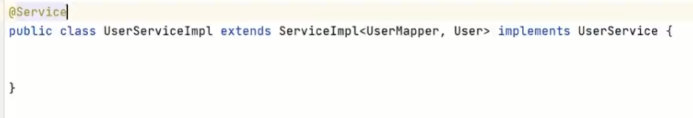
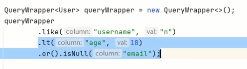

# 0 项目简介

##### 业务流程


##### 参考代码

[GitHub - xyf527/srb](https://github.com/xyf527/srb)

##### 前期知识


##### 技术栈

###### 1、后端

SpringBoot 2.3.4.RELEASE
SpringCloud Hoxton.SR8：微服务基础设施-服务注册、服务发现、服务熔断、微服务网关、配置中心等
SpringCloud Alibaba 2.2.2.RELEASE
MyBatis Plus：持久层框架和代码生成器
Lombok：简化实体类开发
Swagger2：Api接口文档生成工具
Logback：日志系统
alibaba-easyexcel：Exceli读写
Spring Data Redis：Spring.项目中访问Rediss缓存
HTTPClient：基于Http协议的客户端，用来实现远程调用
Spring Task：定时任务

###### 2、数据库和中间件

MySQL5.7：关系型数据库
管理工具：Navicat
Redis5.0：缓存技术
管理工具：RedisDesktopManager
RabbitMQ3.8：消息中间件

###### 3、三方接口

阿里云短信：短信网关
阿里云OSS：分布式文件存储
资金托管平台API对接：汇付宝

###### 4、前端

Node.js：JavaScript运行环境
ES6：JavaScript的模块化版本
axios：一个发送Ajax请求的工具
vue.js：web界面的新进式框架
Element-U：前端组件库
模块化开发：解决javascript变量全局空间污染的问题
NPM：模块资源管理器
vue-element-admin：基于Vue.js的后台管理系统UI集成方案
NuxtJ过：基于Vue.js构建的服务器端渲染应用的轻量级框架

##### 开发环境检查

jdk 1.8
配置：JAVA HOME、path
maven 3.6
配置：MAVEN_HOME、本地仓库路径、中央仓库地址、jdk版本
idealU-2020.2.3:
注意：在idea的欢迎页面选择Confiqure>settings
配置：Java Compiler、File Encodings、Maven、Auto Import、Code Completion>Match case（取消）
插件：lombok、.MyBatisX

###### 附maven设置

配置文件


镜像设置

```xml
<mirror>
<id>nexus-aliyun</id>
<mirrorOf>central</mirrorOf>
<name>Nexus aliyun</name>
<url>http://maven.aliyun.com/nexus/content/groups/public</url>
</mirror>
```

编译环境


# 1 项目介绍和前端知识

## 基础知识

1、银行系

- 优势：第一，资金雄厚，流动性充足；第二，项目源质地优良，大多来自于银行原有中小型客户：第三，风险控制能力强。如
  恒丰银行、招商银行等旗下都有信用贷款平台。
- 劣势：收益率偏低，预期年化收益率处于5.5%-8.6%之间，略高于银行其他理财产品，对投资人吸引力有限。

2、国资系

- 优势：拥有国有背景股东的隐性背书，兑付能力有保障，业务模式较为规范，从业人员金融专业素养较高。
- 劣势：缺乏互联网基因；项目标的较大，起投门槛较高；且产品种类有限，多为企业信用贷：较为谨慎，层层审核的机制严重
  影响了平台运营效率；收益率不具有吸引力。

3、民营系
民营系平台数量最多，起步最早，但鱼龙混杂，不胜枚举。

- 优势：普惠金融，手续便捷；门槛极低，投资起点低最低起投门槛甚至50元；强大的互联网思维，产品创新能力高，市场化
  程度高；收益率高，投资收益率具有吸引力。
- 劣势：风险偏高，资本实力及风控能力偏弱，跑路及倒闭的高发区。

## 业务流程


##### 1、借款人

##### 2、投资人

##### 3、资金池风险

资金池：一个大池子放钱，一边存进来（入水韵），一边贷出去（出水管）。不管是张三的钱、李四的钱、还是王五的钱，只罗进到池子里，就都叫池子的钱了。银行就是典型的资金池。

资金池风险：

- 第一种情况：投资入水管流量过大，池子里全是水。这种情况，平台亏钱，干不长。原因很简单，池子里的钱是有成本的，只进不出，没有利差，拿什么钱付投资人的利息，时间长了，就只能用投资人的本金还投资人的利息，借新还日，庞氏骗局。这个过程就直接背离了平台信息中介的身份，而成了与银行类以的金融机构。
- 第二种情况：突然来了这么多钱，怎么办？只能把放贷出水管的流量调大。放贷的这条出水管上有两个阀门，一个找项目，一个叫做风控，遇到这种情况，经常就是两个阀门一块儿放，钱是贷出去了，但由于放松了对风验的把控，能不能再流回来，就不好说了，危险。
- 第三种情况：提款的出水管流量变大。比例，一个黑天鹅事件，一个负面新闻，一个平台垮了，都可能诱发这种情况，这就是挤说。比如说某租宝事件后，不只这一家平台，很多其他平台的用户，也在疯狂的提现，有可能一直提到关门为止。
- 第四种情况最极端：平台把池子里的钱都提出来，走人。这个就不用解释了，就是跑路。

以上四种情况就是资金池最主要的几个风险一经营不善，风险失控，挤兑和跑路。银监会发布的《网络借贷信息中介机构业务活动管理暂行办法》让资金存管成为网贷平台的硬性要求，同时降低了平台建立资金池、挪用用户资金的风险

##### 4、资金托管平台

第三方存管模式：“第三方存管”的全称是“客户交易结算资金第三方存管”。这里的第三方存管机构，目前是指具备第三方
存首资格的商业银行。银行的流入资金成本低，风控体系较完善，资金池子足够大，而且是国家背书，不会跑路。

说明：由于我们是教学使用，无法申请到正式的资金托管平台的支特，所以我们根据资金托管平台P接口文档，自行开发模
拟一套API接口来满足业务需要，业务过程与实际开发基本一致。

## Mybatis-Plus快速入门

#### 参考文档

[简介 | MyBatis-Plus (baomidou.com)](https://baomidou.com/pages/24112f/#特性)

#### 基本使用流程

1、创建数据库


2、创建SpringBoot工程

3、引入依赖

4、修改配置文件

```properties
spring.datasource.driver-class-name=com.mysql.cj.jdbc.Driver
spring.datasource.url=jdbc:mysql://localhost:3306/mybatis_plus?serverTimezone-GMT%2B8&characterEncoding-utf-8
spring.datasource.username=root
spring.datasource.password=suxujia520
```

驱动

MySql 8及8以上驱动为  **com.mysql.cj.jdbc.Driver**

8以下则没有**cj**

url

针对上述8及8以上的驱动，url必须添加时区  **serverTimezone-GMT%2B8**

5、创建实体类

```java
package com.project.mybatisplus.entity;

import lombok.Data;

@Data
public class User {
    private Long id;
    private String name;
    private Integer age;
    private  String email;

}
```

6、创mapper接口

```java
import com.baomidou.mybatisplus.core.mapper.BaseMapper;
import com.project.mybatisplus.entity.User;

public interface UserMapper extends BaseMapper<User>{
    
}
```

7、启动类添加注解

启动类中针对mapper添加扫描注解

8、测试

针对UserMapper只有接口而无实现类这一点，有两种解决办法

第一种方式——障眼法（用Autowired注入，通过加@Repository注解骗过scan）


第二种更专业——用@Resource注入（j2EE）


```java
package com.project.mybatisplus;

import com.project.mybatisplus.entity.User;
import com.project.mybatisplus.mapper.UserMapper;
import org.junit.jupiter.api.Test;
import org.springframework.beans.factory.annotation.Autowired;
import org.springframework.boot.test.context.SpringBootTest;

import javax.annotation.Resource;
import java.util.List;

@SpringBootTest  //自动创建spring上下文环境
class MybatisPlusApplicationTests {

    @Resource
    private UserMapper userMapper;
    @Test
    void contextLoads() {
        List<User> users = userMapper.selectList(null);
        users.forEach(System.out::println);
    }
}
```

补充、查看 Sql 输出日志

```properties
spring.datasource.driver-class-name=com.mysql.cj.jdbc.Driver
spring.datasource.url=jdbc:mysql://localhost:3306/mybatisplus?serverTimezone-GMT%2B8&characterEncoding-utf-8
spring.datasource.username=root
spring.datasource.password=suxujia520

#mybatis日志
mybatis-plus.configuration.log-impl=org.apache.ibatis.logging.stdout.StdOutImpl
```

#### Mapper通用

##### 增


##### 查 


##### 改


##### 删


#### Service通用

##### 创建service接口和实现




##### 测试实例


###### 附：简便操作设置


#### 自定义Mapper

当通用Mapper无法满足我们的需求时，我们可以自定义基于Mapper接口的xml文件，并在xml文件中配置SOL语句

##### 接口方法定义

在UserMapper接口中定义如下方法

```java
 List<User> selectAllByName(String name);
```

##### 创建xml文件

resources目录下创建mapper文件夹，注意xml文件命名和Mapper一样

xml 配置完全同 MyBatis


进阶版


##### 测试


#### 自定义Service

##### 添加接口方法

```java
List<User> listAllByName(String name);
```

##### 实现接口方法


另一种更简洁的方法


##### 测试


#### 常用注解

##### @TableName

自定义mapper中不受影响，因为相应的sql语句可以自己手动修改，但通用Mapper中sql语句是应用反射机制自动生成的，因此类名是User则自动生成的表明就是user，如果想要**设置与类名不同的表名**，则需要用到**@TableName**

###### value 属性

实体类的名字是User,数据库表名是t_user


##### @TableId

###### 主键标识

但 MyBatis-Plus 仅能识别名字是id的为主键，并对之采用雪花算法，如果当前类和表中设置的主键名称不是id的话，那么需要标注其为id才不报错


###### value 属性

如果类中属性和表中字段名称不一致，那就在类中相应属性上标注对应字段的名字。


###### type 属性

IdType.ASSIGN_ID 对应的就是雪花算法，但不设置也可以，因为MyBatis-Plus的默认主键策略就是雪花算法


其中UUID策略中带下划线，因此相应的属性要改成String，字段改成varchar

###### 雪花算法

默认情况下数据库的id列使用的是基于雪花算法的策略生成

 

背景

随着业务规模的不断扩大，需要选择合适的方案去应对数据规模的增长，以应对逐渐增长的访问压力和数据量。
数据库的扩展方式主要包括：业务分库、主从复制，数据库分表。

数据库分表

将不同业务数据分散存储到不同的数据库服务器，能够支撑百万甚至千万用户规模的业务，但如果业务继续发展，同一业务的单表数据也
会达到单台数据库服务器的处理瓶颈。例如，淘宝的几亿用户数据，如果全部存放在一台数据库服务器的一张表中，肯定是无法满足性能
要求的，此时就需要对单表数据进行拆分。

单表数据拆分有两种方式：垂直分表和水平分表。示意图如下


- 垂直分表
  - 垂直分表适合将表中某些不常用且占了大量空间的列拆分出去。
  - 例如，前面示意图中的nickname和description字段，假设我们是一个婚恋网站，用户在筛选其他用户的时候，主要是用age和sex两个字段进行查询，而nickname和description两个字段主要用于展示，一般不会在业务查询中用到。description本身又比较长，因此我们可以将这两个字段独立到另外一张表中，这样在查询age和sex时，就能带来一定的性能提升。

- 水平分表

  - 水平分表适合表行数特别大的表，有的公司要求单表行数超过5000万就必须进行分表，这个数字可以作为参考，但并不是绝对标准，关键还是要看表的访问性能。对于一些比较复杂的表，可能超过1000万就要分表了；而对于一些简单的表，即使存储数据超过1亿行，也可以不分表。

  - 但不管怎样，当看到表的数据量达到千万级别时，作为架构师就要警觉起来，因为这很可能是架构的性能瓶颈或者隐患。

    水平分表相比垂直分表，会引入更多的复杂性，例如数据id

- 主键自增
  - 以最常见的用户D为例，可以按照1000000的范围大小进行分段，1~999999放到表1中，1000000~1999999放到表2中，以此类推。
  - 复杂点：分段大小的选取。分段太小会导致切分后子表数量过多，增加维护复杂度：分段太大可能会导致单表依然存在性能问题，一般建议分段大小在100万至2000万之间，具体需要根据业务选取合适的分段大小。
  - 优点：可以随看数据的增加平滑地扩充新的表。例如，现在的用户是100万，如果增加到1000万，只需要增加新的表就可以了，原有的数据不需要动。
  - 缺点：分布不均匀。假如按照1000万来进行分表，有可能某个分段实际存储的数据量只有1条，而另外一个分段实际存储的数据量有1000万条。

- Hash
  - 同样以用户ID为例，假数如我们一开始就规划了10个数据库表，可以简单地用user_id%10的值来表示数据所属的数据库表编号，ID为985的用户放到编号为5的子表中，ID为10086的用户放到编号为6的子表中。
  - 复杂点：初始表数量的确定。表数量太多维护比较麻烦，表数量太少又可能导致单表性能存在问题。
  - 优点：表分布比较均匀。
  - 缺点：扩充新的表很麻烦，所有数据都要重分布

- 雪花算法

  雪花算法是由Twitter公布的分布式注键生成算法，它能够保证不同表的主键的不重复性，以及相同表的主键的有序性。

  - 核心思想

    - 长度共 64 bit（一个long型）。

    - 首先是一个符号位，1bit 标识，由于 long 基本类型在 Java 中是带符号的，最高位是符号位，正数是0，负数是1，所以id一般是正数，最高位是0.

    - 41 bit 时间截（毫秒级），存储的是时间截的差值（当前时间截-开始时间截），结果约等于69.73年。

    - 10 bit 作为机器的ID（5个 bit 是数据中心，5个 bit 的机器 ID ，可以部署在1024个节点）。

    - 12 bit 作为毫秒内的流水号(意味看每个节点在每毫秒可以产生 4096 个 ID)。

      

  - 111

    

##### @TableField

###### value属性

功能同Tableld的value属性

注意：MP会自动将数据库中的下划线命名风格转化为实体类中的驼峰命名风格

例如，数据库中的列 create_time 和 update_time 自动对应实体类中的 createTime 和 updateTime


扩展知识：为什么建议使用你 LocalDateTime，而不是Date?https://zhuanlan.zhihu.com/p/8755537Z

- iava.util.Date 的大多数方法已经过时
- java.utl.Date 的输出可读性差
- jaya.util.Date 对应的格式化类 SimpleDateFormat 是线程不安全的类。阿里巴巴开发手册中禁用 static 修饰 SimpleDateFormat
- LocalDateTime 对应的格式化类 DateTimeFormatter是线程安全的

###### 自动填充——以创建/修改时间为例

1. 其中创建时间可以设置默认值，更新时间可以设置为根据当前时间戳更新

2. 自动填充

   需求描述：项目中经常会遇到一些数据，每次都使用相同的方式填充，例如记录的创建时间，更新时间等。我们可以使用MyBatis Plus的自动填充功能，完成这些字段的赋值工作。

   例如，阿里巴巴的开发手册中建议每个数据库表必须要有 create_time 和 update_time 字段，我们可以使用自动填充功能维护这两个字段

   - step1: 添加 fill 属性

     

   - step2: 实现元对像处理器接口->创建 handler 包，创建 MyMetaObjectHandler 类

     注意：不要忘记添加 **@Component** 注解

     

     

     

     之后增加日志输出，即@Slf4j注解

     

     优化1：如果不确定自动填充的字段有没有，就需要加上一个判断来提升效率，例如

     

     优化2：如果自动填充的对象已经手动赋值了，那就不用自动填充了

     

##### @TableLogic

###### 逻辑删除

物理刷除：真实册除，将对应数据从数据库中别除，之后查询不到此条被删除的数据
逻辑刷除：假别除，将对应数据中代表是否被别除字段的状态修改为被刷除状态”，之后在数据库中仍引旧能看到此条数据记录

使用场景：可以进行数据恢复

###### 实现逻辑删除

step1：数据库中创建逻辑删除状态列


step2：实体类中添加逻辑删除属性


或者


默认 0 表示没删，1表示删了 ，如果想自由设置，那就


#### 分页插件

##### 基础分页

1、添加配置类

 创建config包，创建MybatisPlusConfig类


2、测试


##### 添加查询的分页


第一个参数：分页

第二个参数：查询参数

右键可生成 statement

注：这里只需要写查询条件的语句，分页的语句会自动生成


测试


#### 实体类映射

针对表中的字段名和类中的属性名不一致的情况，作出一个映射

##### 第一种方法——resultMap


运用时就是


##### 第二种方法——别名


运用时还保持原来的就行


#### 乐观锁

准备：建新表做演示

①建表product

②创建实体类


③创建ProductMapper接口


④无锁测试


##### 乐观锁原理


##### 插件实现乐观锁

###### 实体类中设置version字段并对其添加 **@Version** 注解

###### 在配置类中添加乐观锁插件


测试


#### Wapper 条件构造器

在MP中我们可以使用通用Mapper(BaseMapper)实现基本查询，也可以使用自定义Mapper(自定义XML)来实现更高级的查询。当然你也可以结合条件构造器来方便的实现更多的高级查询。


Wrapper：条件构造抽象类，最顶端父类
AbstractWrapper：用于查询条件封装，生成sql的where条件
QueryWrapper：查询条件封装
UpdateWrapper：Update条件封装
AbstractLambdaWrapper：使用Lambda语法
LambdaQueryWrapper：用于Lambda语法使用的查i间Wrapper

##### 组装查询条件

测试1


测试2


上述两个测试可以串联实现


##### 组装排序条件


测试


##### 组装删除条件


测试 


##### 条件的优先级


测试

 

其中，原来写的顺序是



但为了让后两个相或的结果和第一个相与，采用lamda表达式的方法提高后两者的优先级


##### 组装select语句


测试


针对上述情况做优化（因为实际组装了所有）


##### 实现子查询


但上述方法容易引起sql注入，建议在mapper.xml文件中直接写sql语句，通过传递参数完成

在 **条件优先级测试** 的基础上，进行改进

第一步：将 Wrapper 语句改为更新的 Wrapper 语句


第二步：直接将更新语句组装在一起，然后在更新这一步**把 user 设置为 null**


