# 0 项目简介

##### 业务流程


##### 参考代码

[GitHub - xyf527/srb](https://github.com/xyf527/srb)

##### 前期知识


##### 技术栈

###### 1、后端

SpringBoot 2.3.4.RELEASE
SpringCloud Hoxton.SR8：微服务基础设施-服务注册、服务发现、服务熔断、微服务网关、配置中心等
SpringCloud Alibaba 2.2.2.RELEASE
MyBatis Plus：持久层框架和代码生成器
Lombok：简化实体类开发
Swagger2：Api接口文档生成工具
Logback：日志系统
alibaba-easyexcel：Exceli读写
Spring Data Redis：Spring.项目中访问Rediss缓存
HTTPClient：基于Http协议的客户端，用来实现远程调用
Spring Task：定时任务

###### 2、数据库和中间件

MySQL5.7：关系型数据库
管理工具：Navicat
Redis5.0：缓存技术
管理工具：RedisDesktopManager
RabbitMQ3.8：消息中间件

###### 3、三方接口

阿里云短信：短信网关
阿里云OSS：分布式文件存储
资金托管平台API对接：汇付宝

###### 4、前端

Node.js：JavaScript运行环境
ES6：JavaScript的模块化版本
axios：一个发送Ajax请求的工具
vue.js：web界面的新进式框架
Element-U：前端组件库
模块化开发：解决javascript变量全局空间污染的问题
NPM：模块资源管理器
vue-element-admin：基于Vue.js的后台管理系统UI集成方案
NuxtJ过：基于Vue.js构建的服务器端渲染应用的轻量级框架

##### 开发环境检查

jdk 1.8
配置：JAVA HOME、path
maven 3.6
配置：MAVEN_HOME、本地仓库路径、中央仓库地址、jdk版本
idealU-2020.2.3:
注意：在idea的欢迎页面选择Confiqure>settings
配置：Java Compiler、File Encodings、Maven、Auto Import、Code Completion>Match case（取消）
插件：lombok、.MyBatisX

###### 附maven设置

配置文件


镜像设置

```xml
<mirror>
<id>nexus-aliyun</id>
<mirrorOf>central</mirrorOf>
<name>Nexus aliyun</name>
<url>http://maven.aliyun.com/nexus/content/groups/public</url>
</mirror>
```

编译环境

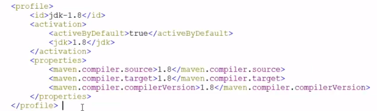

# 1 项目介绍和前端知识

## 1.1 基础知识

1、银行系

- 优势：第一，资金雄厚，流动性充足；第二，项目源质地优良，大多来自于银行原有中小型客户：第三，风险控制能力强。如
  恒丰银行、招商银行等旗下都有信用贷款平台。
- 劣势：收益率偏低，预期年化收益率处于5.5%-8.6%之间，略高于银行其他理财产品，对投资人吸引力有限。

2、国资系

- 优势：拥有国有背景股东的隐性背书，兑付能力有保障，业务模式较为规范，从业人员金融专业素养较高。
- 劣势：缺乏互联网基因；项目标的较大，起投门槛较高；且产品种类有限，多为企业信用贷：较为谨慎，层层审核的机制严重
  影响了平台运营效率；收益率不具有吸引力。

3、民营系
民营系平台数量最多，起步最早，但鱼龙混杂，不胜枚举。

- 优势：普惠金融，手续便捷；门槛极低，投资起点低最低起投门槛甚至50元；强大的互联网思维，产品创新能力高，市场化
  程度高；收益率高，投资收益率具有吸引力。
- 劣势：风险偏高，资本实力及风控能力偏弱，跑路及倒闭的高发区。

## 1.2 业务流程

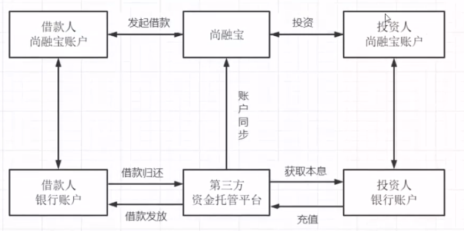

##### 1、借款人

##### 2、投资人

##### 3、资金池风险

资金池：一个大池子放钱，一边存进来（入水韵），一边贷出去（出水管）。不管是张三的钱、李四的钱、还是王五的钱，只罗进到池子里，就都叫池子的钱了。银行就是典型的资金池。

资金池风险：

- 第一种情况：投资入水管流量过大，池子里全是水。这种情况，平台亏钱，干不长。原因很简单，池子里的钱是有成本的，只进不出，没有利差，拿什么钱付投资人的利息，时间长了，就只能用投资人的本金还投资人的利息，借新还日，庞氏骗局。这个过程就直接背离了平台信息中介的身份，而成了与银行类以的金融机构。
- 第二种情况：突然来了这么多钱，怎么办？只能把放贷出水管的流量调大。放贷的这条出水管上有两个阀门，一个找项目，一个叫做风控，遇到这种情况，经常就是两个阀门一块儿放，钱是贷出去了，但由于放松了对风验的把控，能不能再流回来，就不好说了，危险。
- 第三种情况：提款的出水管流量变大。比例，一个黑天鹅事件，一个负面新闻，一个平台垮了，都可能诱发这种情况，这就是挤说。比如说某租宝事件后，不只这一家平台，很多其他平台的用户，也在疯狂的提现，有可能一直提到关门为止。
- 第四种情况最极端：平台把池子里的钱都提出来，走人。这个就不用解释了，就是跑路。

以上四种情况就是资金池最主要的几个风险一经营不善，风险失控，挤兑和跑路。银监会发布的《网络借贷信息中介机构业务活动管理暂行办法》让资金存管成为网贷平台的硬性要求，同时降低了平台建立资金池、挪用用户资金的风险

##### 4、资金托管平台

第三方存管模式：“第三方存管”的全称是“客户交易结算资金第三方存管”。这里的第三方存管机构，目前是指具备第三方
存首资格的商业银行。银行的流入资金成本低，风控体系较完善，资金池子足够大，而且是国家背书，不会跑路。

说明：由于我们是教学使用，无法申请到正式的资金托管平台的支特，所以我们根据资金托管平台P接口文档，自行开发模
拟一套API接口来满足业务需要，业务过程与实际开发基本一致。

## 1.3 Mybatis-Plus快速入门

#### 参考文档

[简介 | MyBatis-Plus (baomidou.com)](https://baomidou.com/pages/24112f/#特性)

#### 基本使用流程

1、创建数据库

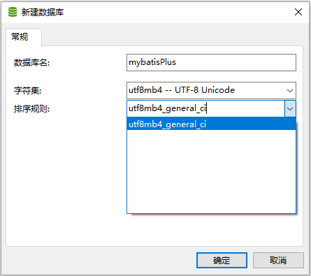


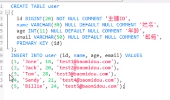

2、创建SpringBoot工程

3、引入依赖

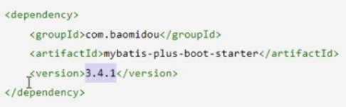

4、修改配置文件

```properties
spring.datasource.driver-class-name=com.mysql.cj.jdbc.Driver
spring.datasource.url=jdbc:mysql://localhost:3306/mybatis_plus?serverTimezone-GMT%2B8&characterEncoding-utf-8
spring.datasource.username=root
spring.datasource.password=suxujia520
```

驱动

MySql 8及8以上驱动为  **com.mysql.cj.jdbc.Driver**

8以下则没有**cj**

url

针对上述8及8以上的驱动，url必须添加时区  **serverTimezone-GMT%2B8**

5、创建实体类

```java
package com.project.mybatisplus.entity;

import lombok.Data;

@Data
public class User {
    private Long id;
    private String name;
    private Integer age;
    private  String email;

}
```

6、创mapper接口

```java
import com.baomidou.mybatisplus.core.mapper.BaseMapper;
import com.project.mybatisplus.entity.User;

public interface UserMapper extends BaseMapper<User>{
    
}
```

7、启动类添加注解

启动类中针对mapper添加扫描注解

8、测试

针对UserMapper只有接口而无实现类这一点，有两种解决办法

第一种方式——障眼法（用Autowired注入，通过加@Repository注解骗过scan）


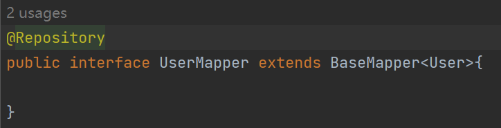

第二种更专业——用@Resource注入（j2EE）


```java
package com.project.mybatisplus;

import com.project.mybatisplus.entity.User;
import com.project.mybatisplus.mapper.UserMapper;
import org.junit.jupiter.api.Test;
import org.springframework.beans.factory.annotation.Autowired;
import org.springframework.boot.test.context.SpringBootTest;

import javax.annotation.Resource;
import java.util.List;

@SpringBootTest  //自动创建spring上下文环境
class MybatisPlusApplicationTests {

    @Resource
    private UserMapper userMapper;
    @Test
    void contextLoads() {
        List<User> users = userMapper.selectList(null);
        users.forEach(System.out::println);
    }
}
```

补充、查看 Sql 输出日志

```properties
spring.datasource.driver-class-name=com.mysql.cj.jdbc.Driver
spring.datasource.url=jdbc:mysql://localhost:3306/mybatisplus?serverTimezone-GMT%2B8&characterEncoding-utf-8
spring.datasource.username=root
spring.datasource.password=suxujia520

#mybatis日志
mybatis-plus.configuration.log-impl=org.apache.ibatis.logging.stdout.StdOutImpl
```

#### Mapper通用

##### 增


##### 查 

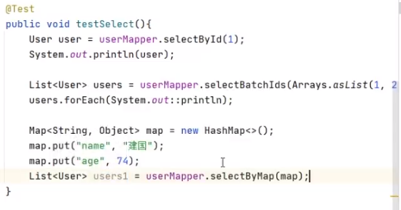

##### 改

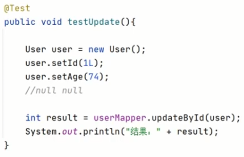

##### 删

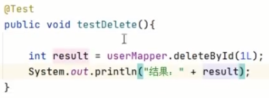

#### Service通用

##### 创建service接口和实现


##### 测试实例


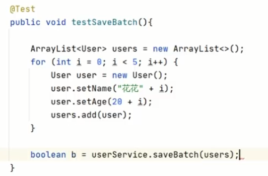

###### 附：简便操作设置


#### 自定义Mapper

当通用Mapper无法满足我们的需求时，我们可以自定义基于Mapper接口的xml文件，并在xml文件中配置SOL语句

注：application.properties 中要配置 **mybatis-plus.mapper-locations**=classpath:com/project/mybatisplus/mapper/*.xml

这里 com/project/mybatisplus/mapper 的部分对应 resources 下.xml文件所存储的目录

##### 接口方法定义

在UserMapper接口中定义如下方法

```java
 List<User> selectAllByName(String name);
```

##### 创建xml文件

resources目录下创建mapper文件夹，注意xml文件命名和Mapper一样

xml 配置完全同 MyBatis

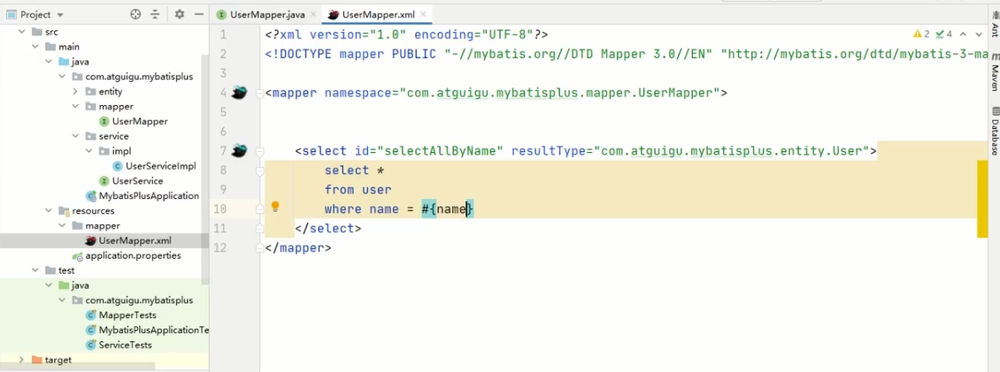

进阶版

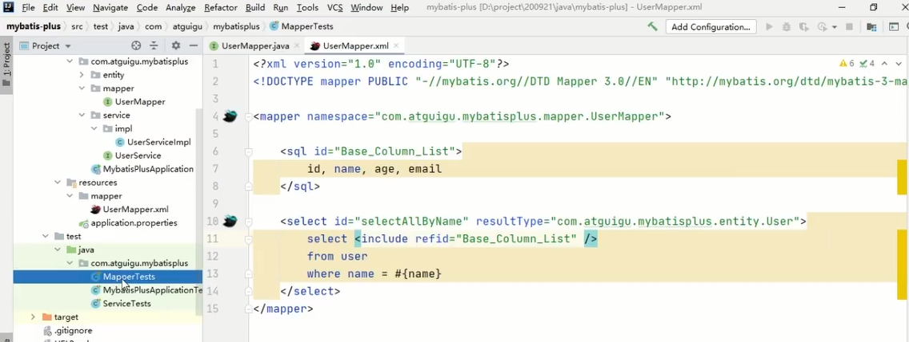

##### 测试

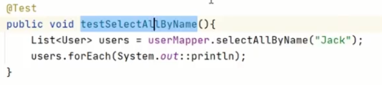

#### 自定义Service

##### 添加接口方法

```java
List<User> listAllByName(String name);
```

##### 实现接口方法


另一种更简洁的方法


##### 测试

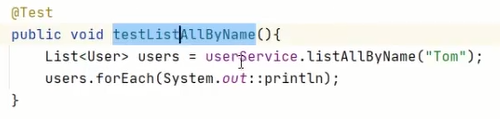

#### 常用注解

##### @TableName

自定义mapper中不受影响，因为相应的sql语句可以自己手动修改，但通用Mapper中sql语句是应用反射机制自动生成的，因此类名是User则自动生成的表明就是user，如果想要**设置与类名不同的表名**，则需要用到**@TableName**

###### value 属性

实体类的名字是User,数据库表名是t_user


##### @TableId

###### 主键标识

但 MyBatis-Plus 仅能识别名字是id的为主键，并对之采用雪花算法，如果当前类和表中设置的主键名称不是id的话，那么需要标注其为id才不报错

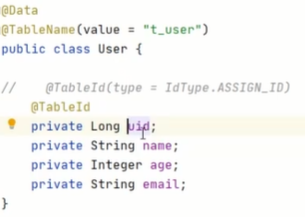

###### value 属性

如果类中属性和表中字段名称不一致，那就在类中相应属性上标注对应字段的名字。

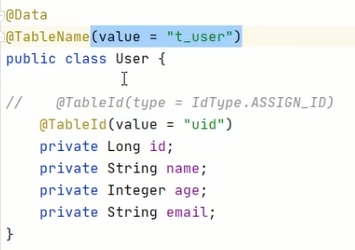

###### type 属性

IdType.ASSIGN_ID 对应的就是雪花算法，但不设置也可以，因为MyBatis-Plus的默认主键策略就是雪花算法

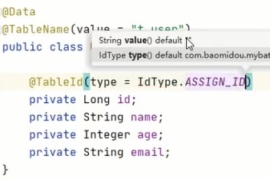

其中UUID策略中带下划线，因此相应的属性要改成String，字段改成varchar

###### 雪花算法

默认情况下数据库的id列使用的是基于雪花算法的策略生成

 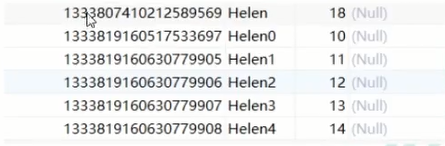

背景

随着业务规模的不断扩大，需要选择合适的方案去应对数据规模的增长，以应对逐渐增长的访问压力和数据量。
数据库的扩展方式主要包括：业务分库、主从复制，数据库分表。

数据库分表

将不同业务数据分散存储到不同的数据库服务器，能够支撑百万甚至千万用户规模的业务，但如果业务继续发展，同一业务的单表数据也
会达到单台数据库服务器的处理瓶颈。例如，淘宝的几亿用户数据，如果全部存放在一台数据库服务器的一张表中，肯定是无法满足性能
要求的，此时就需要对单表数据进行拆分。

单表数据拆分有两种方式：垂直分表和水平分表。示意图如下


- 垂直分表
  - 垂直分表适合将表中某些不常用且占了大量空间的列拆分出去。
  - 例如，前面示意图中的nickname和description字段，假设我们是一个婚恋网站，用户在筛选其他用户的时候，主要是用age和sex两个字段进行查询，而nickname和description两个字段主要用于展示，一般不会在业务查询中用到。description本身又比较长，因此我们可以将这两个字段独立到另外一张表中，这样在查询age和sex时，就能带来一定的性能提升。

- 水平分表

  - 水平分表适合表行数特别大的表，有的公司要求单表行数超过5000万就必须进行分表，这个数字可以作为参考，但并不是绝对标准，关键还是要看表的访问性能。对于一些比较复杂的表，可能超过1000万就要分表了；而对于一些简单的表，即使存储数据超过1亿行，也可以不分表。

  - 但不管怎样，当看到表的数据量达到千万级别时，作为架构师就要警觉起来，因为这很可能是架构的性能瓶颈或者隐患。

    水平分表相比垂直分表，会引入更多的复杂性，例如数据id

- 主键自增
  - 以最常见的用户D为例，可以按照1000000的范围大小进行分段，1~999999放到表1中，1000000~1999999放到表2中，以此类推。
  - 复杂点：分段大小的选取。分段太小会导致切分后子表数量过多，增加维护复杂度：分段太大可能会导致单表依然存在性能问题，一般建议分段大小在100万至2000万之间，具体需要根据业务选取合适的分段大小。
  - 优点：可以随看数据的增加平滑地扩充新的表。例如，现在的用户是100万，如果增加到1000万，只需要增加新的表就可以了，原有的数据不需要动。
  - 缺点：分布不均匀。假如按照1000万来进行分表，有可能某个分段实际存储的数据量只有1条，而另外一个分段实际存储的数据量有1000万条。

- Hash
  - 同样以用户ID为例，假数如我们一开始就规划了10个数据库表，可以简单地用user_id%10的值来表示数据所属的数据库表编号，ID为985的用户放到编号为5的子表中，ID为10086的用户放到编号为6的子表中。
  - 复杂点：初始表数量的确定。表数量太多维护比较麻烦，表数量太少又可能导致单表性能存在问题。
  - 优点：表分布比较均匀。
  - 缺点：扩充新的表很麻烦，所有数据都要重分布

- 雪花算法

  雪花算法是由Twitter公布的分布式注键生成算法，它能够保证不同表的主键的不重复性，以及相同表的主键的有序性。

  - 核心思想

    - 长度共 64 bit（一个long型）。

    - 首先是一个符号位，1bit 标识，由于 long 基本类型在 Java 中是带符号的，最高位是符号位，正数是0，负数是1，所以id一般是正数，最高位是0.

    - 41 bit 时间截（毫秒级），存储的是时间截的差值（当前时间截-开始时间截），结果约等于69.73年。

    - 10 bit 作为机器的ID（5个 bit 是数据中心，5个 bit 的机器 ID ，可以部署在1024个节点）。

    - 12 bit 作为毫秒内的流水号(意味看每个节点在每毫秒可以产生 4096 个 ID)。

      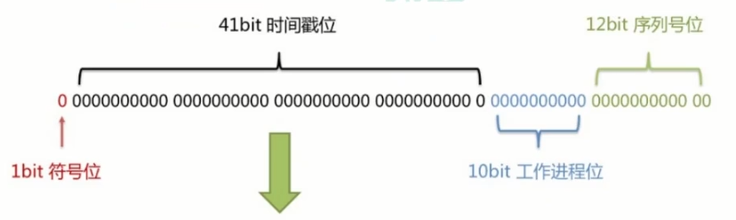

  - 111

    

##### @TableField

###### value属性

功能同Tableld的value属性

注意：MP会自动将数据库中的下划线命名风格转化为实体类中的驼峰命名风格

例如，数据库中的列 create_time 和 update_time 自动对应实体类中的 createTime 和 updateTime

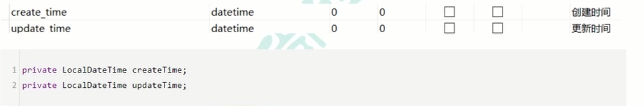

扩展知识：为什么建议使用你 LocalDateTime，而不是Date?https://zhuanlan.zhihu.com/p/8755537Z

- iava.util.Date 的大多数方法已经过时
- java.utl.Date 的输出可读性差
- jaya.util.Date 对应的格式化类 SimpleDateFormat 是线程不安全的类。阿里巴巴开发手册中禁用 static 修饰 SimpleDateFormat
- LocalDateTime 对应的格式化类 DateTimeFormatter是线程安全的

###### 自动填充——以创建/修改时间为例

1. 其中创建时间可以设置默认值，更新时间可以设置为根据当前时间戳更新

2. 自动填充

   需求描述：项目中经常会遇到一些数据，每次都使用相同的方式填充，例如记录的创建时间，更新时间等。我们可以使用MyBatis Plus的自动填充功能，完成这些字段的赋值工作。

   例如，阿里巴巴的开发手册中建议每个数据库表必须要有 create_time 和 update_time 字段，我们可以使用自动填充功能维护这两个字段

   - step1: 添加 fill 属性

     

   - step2: 实现元对像处理器接口->创建 handler 包，创建 MyMetaObjectHandler 类

     注意：不要忘记添加 **@Component** 注解

     

     

     

     之后增加日志输出，即@Slf4j注解

     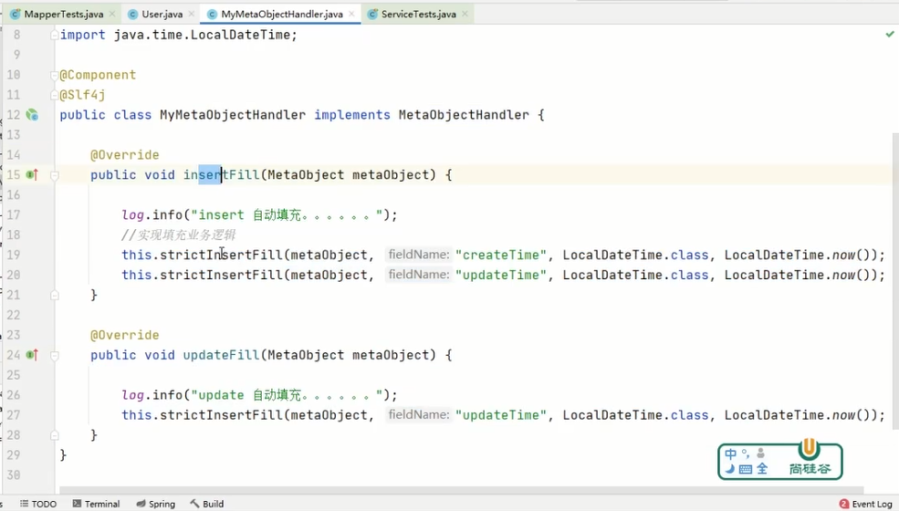

     优化1：如果不确定自动填充的字段有没有，就需要加上一个判断来提升效率，例如

     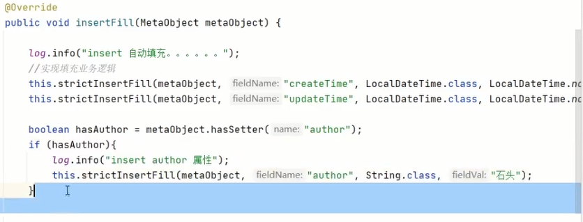

     优化2：如果自动填充的对象已经手动赋值了，那就不用自动填充了

     

##### @TableLogic

###### 逻辑删除

物理刷除：真实册除，将对应数据从数据库中别除，之后查询不到此条被删除的数据
逻辑刷除：假别除，将对应数据中代表是否被别除字段的状态修改为被刷除状态”，之后在数据库中仍引旧能看到此条数据记录

使用场景：可以进行数据恢复

###### 实现逻辑删除

step1：数据库中创建逻辑删除状态列


step2：实体类中添加逻辑删除属性

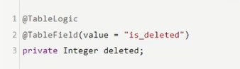

或者

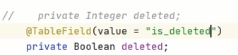

默认 0 表示没删，1表示删了 ，如果想自由设置，那就


#### 分页插件

##### 基础分页

1、添加配置类

 创建config包，创建MybatisPlusConfig类


2、测试

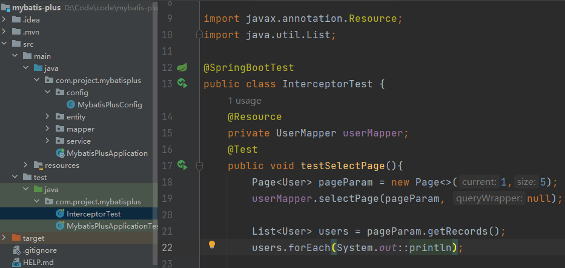

##### 添加查询的分页


第一个参数：分页

第二个参数：查询参数

右键可生成 statement

注：这里只需要写查询条件的语句，分页的语句会自动生成

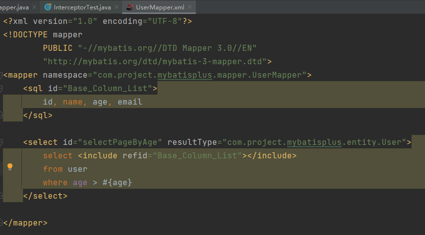

测试


#### 实体类映射

针对表中的字段名和类中的属性名不一致的情况，作出一个映射

##### 第一种方法——resultMap

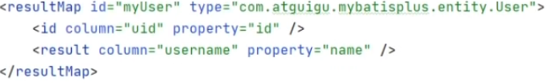

运用时就是

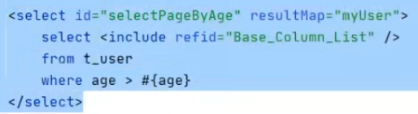

##### 第二种方法——别名

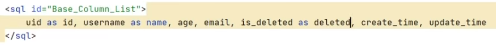

运用时还保持原来的就行


#### 乐观锁

准备：建新表做演示

①建表product

②创建实体类

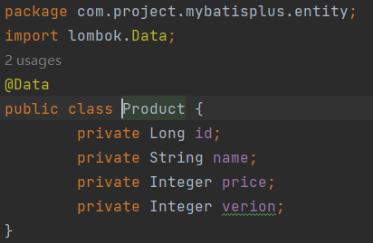

③创建ProductMapper接口

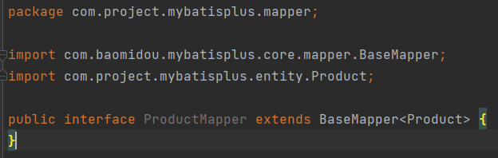

④无锁测试


##### 乐观锁原理


##### 插件实现乐观锁

###### 实体类中设置version字段并对其添加 **@Version** 注解

###### 在配置类中添加乐观锁插件


测试


#### Wapper 条件构造器（自定义Mapper的另一种实现）

在MP中我们可以使用通用Mapper(BaseMapper)实现基本查询，也可以使用自定义Mapper(自定义XML)来实现更高级的查询。当然你也可以结合条件构造器来方便的实现更多的高级查询。

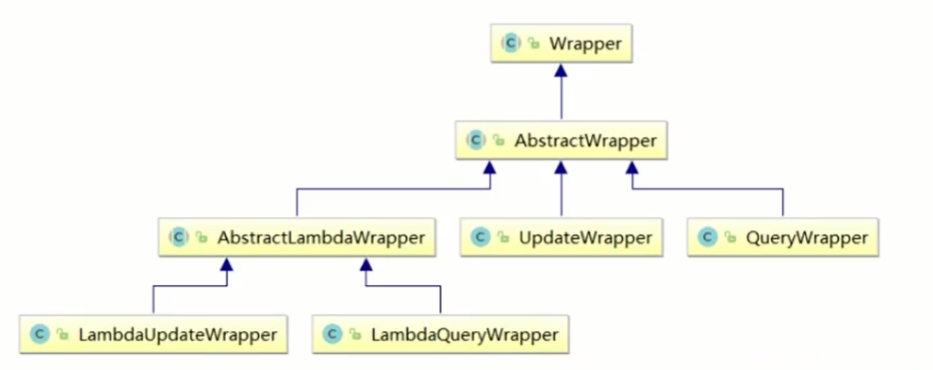

Wrapper：条件构造抽象类，最顶端父类
AbstractWrapper：用于查询条件封装，生成sql的where条件
QueryWrapper：查询条件封装
UpdateWrapper：Update条件封装
AbstractLambdaWrapper：使用Lambda语法
LambdaQueryWrapper：用于Lambda语法使用的查i间Wrapper

##### 1 组装查询条件

测试1


测试2

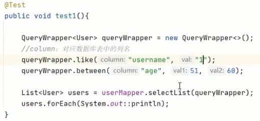

上述两个测试可以串联实现


##### 2 组装排序条件


测试


##### 3 组装删除条件


测试 

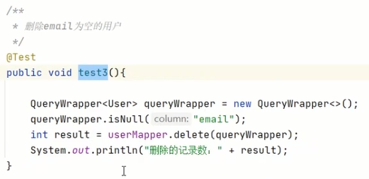

##### 4 条件的优先级

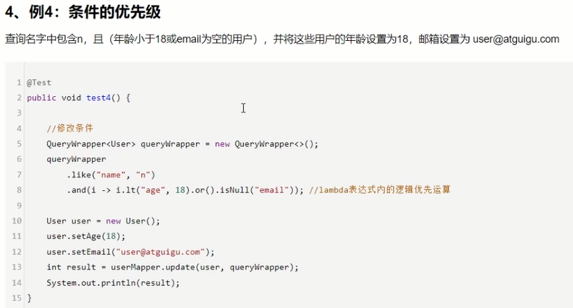

测试

 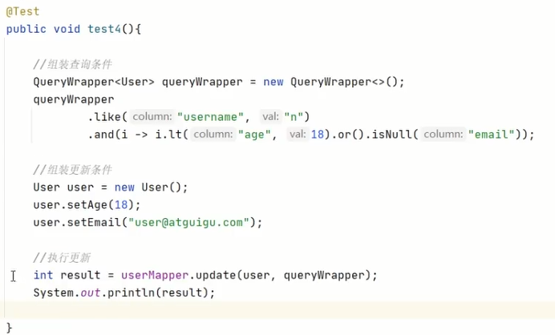

其中，原来写的顺序是


但为了让后两个相或的结果和第一个相与，采用lamda表达式的方法提高后两者的优先级


##### 5 组装select语句


测试

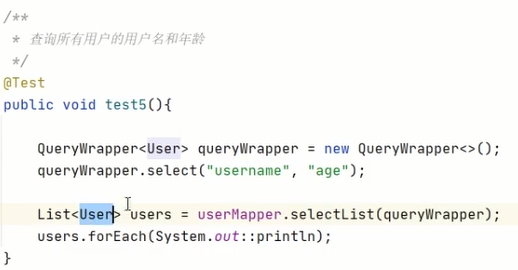

针对上述情况做优化（因为实际组装了所有）


##### 6 实现子查询

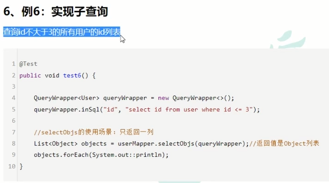


但上述方法容易引起sql注入，建议在mapper.xml文件中直接写sql语句，通过传递参数完成

##### 7 UpdateWrapper

在 **条件优先级测试** 的基础上，进行改进

第一步：将 Wrapper 语句改为更新的 Wrapper 语句


第二步：直接将更新语句组装在一起，然后在更新这一步**把 user 设置为 null**


但这里由于没有传入 user 对象，**自动填充部分的内容并不会执行**

第三步：考虑自动填充内容（实际上直接按例4的做法就好）

这里这样填就可以解决了

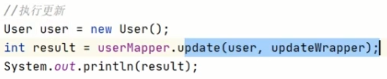

##### 8 condition

按字面意思普通地查找用户名以及年龄介于10到20之间的数据（需要考虑前端用户输入数据可能为空的情况）

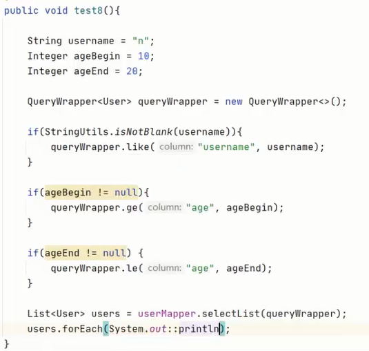

condition 版本的

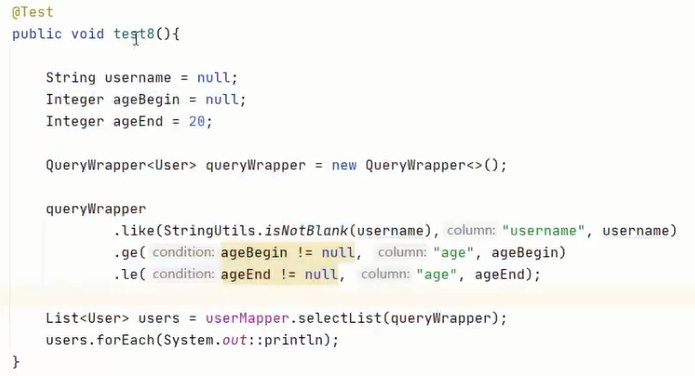

##### 9 LambdaXxxWrapper

###### LambdaQueryWrapper

需求同例8

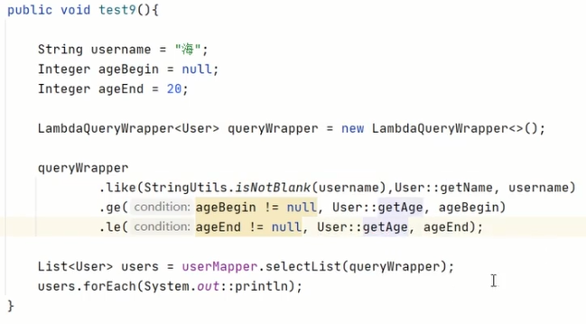

###### LambdaUpdateWrapper

 需求同例4、例7

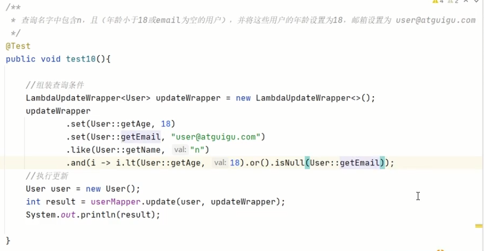

## 1.4 前端开发

### 准备——VsCode

#### 插件

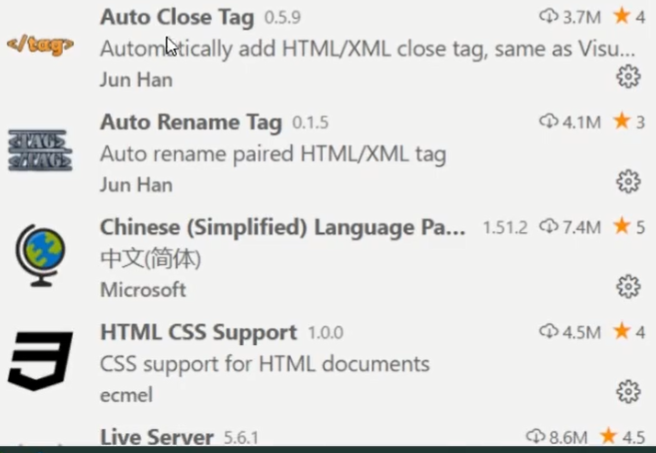

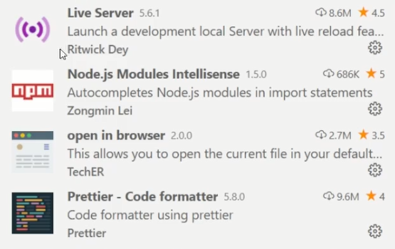


vscode 配置信息


### Node.js的概念

#### JavaScripti引擎

浏览器的内核包括两部分核心：

- DOM渲染引擎
- JavaScript解析l擎

创建文件夹01-Node demo

案例：dom 引擎和 js 引擎 html

#### 下载与安装

[Node.js (nodejs.org)](https://nodejs.org/en/)

查看版本以检测是否安装成功

```
node -v
```

#### 初始Node.js程序

##### 01-hello-node.js

```
console.log('Hello Node.js')
```

创建好后打开

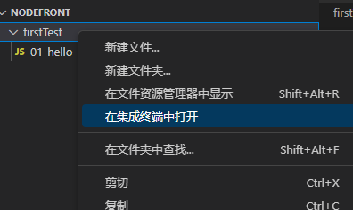

之后在命令框输入

```
node 01-hello-node.js
```

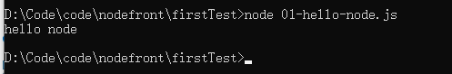

##### 02-read-file.js 文件的读取

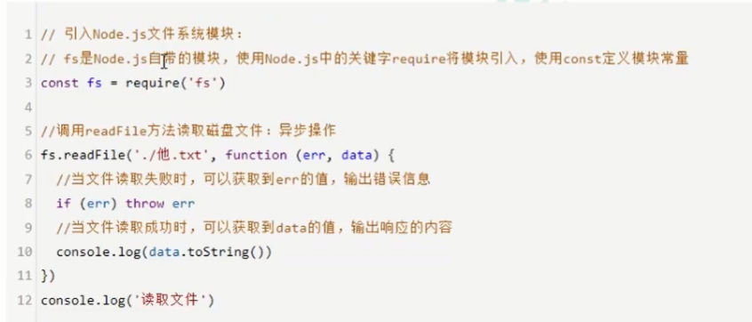

##### 03-node-server.js 服务器端

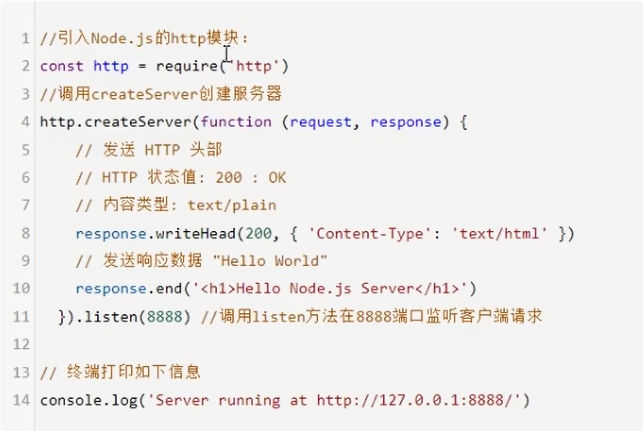


#### Node.js 的作用

##### Node.js 的应用场景

- 如果你是一个前端程序员想开发类似JavaWeb的简单后端程序，那么Node.js是一个非常好的选择
- 如果你是一个架构师，想部署一些高性能的服务，那么Node.jst也是一个非常好的选择。
  - 通常他会被用来作一个BFF层，即Backend For Frontend（服务于前端的后端），通俗的说是一个专门用于为前端业务提供数据的后端程序。

##### BFF 解决什么问题

一个前端页面向服务A和服务B发送请求，不同的微服务返回的值用于渲染页面中不同的组件。此时，所有的数据在PC端浏览器渲染

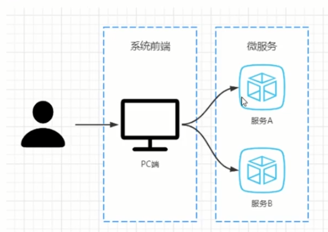


### ECMAScript6 简介

**ECMA**

ECMA(European Computer Manufacturers Association)中文名称为欧州计算机制造商协会，这个组织的目标是评估、开发和认可电信和计算机标准，1994年后该组织改名为Ecma国际，

**ECMAScript**

ECMAScript是由Ecm阳国通过ECMA-2G2标准化的脚本程序设计h语言，

**什么是ECMA-262**

Ecma国际制定了许多标准，而ECMA-262只是其中的一个


**ECMAScript 和 JavaScript 的关系**

一个常见的问题是，ECMAScript和JavaScript到底是什么关系？

要讲清楚这个问题，需要回顾历史。1996年11月，JavaScript 的创造者 Netscape 公司，决定将 JavaScript 提交给标准化组织 ECMA ，希望这种语言能够成为国际标准。次年，ECMA 发布262号标准文件(ECMA-262)的第一版，规定了浏览器脚本语言的标准，并将这种语言称为ECMAScript，这个版本就是1.0版。

因此，ECMAScript 和 JavaScript 的关系是，前者是后者的规格，后者是前者的一种实现（另外的 ECMAScript 方言还有 jscript 和
ActionScript)

#### 基础知识点

##### let声明变量

```JS
//声明变量
let a
let b,c,d
let e = 100
let f = 521, g = 'loveyou', h = []

//1。变量不能重复声明
let name = 'Helen'
// let name = '环'    //报错：SyntaxError:Identifier'name'has already been declared
//2。存在块儿级作用域
var flag = true
if (flag){
    let star =5
}
// console.1og(star)  //报错：star is not defined

//var和let都具备函数级别的作用域
function test1(){
    var f1 = '函数test1的变量'
    console.log(f1)
}
test1()
console.log(f1)

//3、变量提升
console.log(username)
let username // 正常报错
// var username   // var 声明的变量是默认在第一行的，因此这里会报错undefined，而使用let则还是按照次序
```

##### const声明常量

```js
//声明常量
const SCHO0L = '尚硅谷'
console.log(SCHOOL)
//1、一定要赋初始值
// const A    //报错：SyntaxError:Missing initializer in const declaration
//2、常量的值不能修改
SCHOOL = 'ATGUIGU'   //:TypeError:Assignment to constant variable.
console.log(PLAYER)  //报错:ReferenceError:PLAYER is not defined
//3、规范：大写字母和下划线
const A_B_C = 1
console.log(A_B_C)
//4、当常量的地址不变时，可以修改常量的内容
const TEAM = ['康师傅'，'雷神'，'阳哥'，'大海']
TEAM.push('环环')
console.log(TEAM)
```

##### 解构赋值

```js
//1、数组解构
const F4 = ['小沈阳','宋小宝','刘能','赵四']
console.log(F4)
//let shenyang =F4[0]
//let xiaobao=F4[1]
let [shenyang,xiaobao,liuneng,zhaosi] = F4
console.log(shenyang)
console.log(xiaobao)
console.log(liuneng)
console.log(zhaosi)
//2、对象解构
const abs = {
    username:'赵本山',
    age:'不详',
    yanxiaopin:function (){
        console.log(演小品)
},
}
// let username = abs.username
// let age = abs.age
// let yanxiaopin = abs.yanxiaopin
let {username,age,yanxiaopin } = abs  // 可以不用取全部
console.log(username)
console.log(age)
yanxiaopin()
```


##### 模板字符串

模板字符串相当于加强版的字符串，用反引号，除了作为普通字符串，还可以用来定义多行字符串，还可以在字符串中加入变量和表达式。

```js
// 1\声明一个字符串
let str1 = '我是字符串'
let str2 = `我也是一个字符串`
console.log(str1)
console.log(str2)

// 2、原样输出
let htmlStr = `<ul>
<li>沈腾</li>
<li>玛丽</li>
</ul>`
console.log(htmlStr)

// 3、变量拼接（插值表达式）
let star = '贾玲'
let out = `我喜欢${star}这个演员`
console.log(out)

```

##### 声明对象简写

```js
let username1 = 'tom'
let age1 = 2
let sing1 = function(){
    console.log('I LOVE MARY')
}
// 传统
let persion = {
    username: username1,
    age: age1,
    sing: sing1,
}
console.log(persion.username)
console.log(persion.age)
persion.sing()

// 简写形式为
let persion1 = {
    username1,
    age1,
    sing1,
}
console.log(persion1.username1)
console.log(persion1.age1)
persion1.sing1()
```

##### 定义方法简写

```js
// 传统
let persion = {
    sayHi:function(){
        console.log('Hi')
    },
    sing:function(){
        console.log('一闪一闪亮晶晶')
    },
}

persion.sayHi()
persion.sing()

// 简写
let persion1 = {
    sayHi(){
        console.log('Hi')
    },
    sing(){
        console.log('一闪一闪亮晶晶')
    },
}

persion1.sayHi()
persion1.sing()
```

##### 参数的默认值

注意：函数在 JavaScript 中也是一种数据类型，JavaScript中没有方法的重载

```js
function add(a){
    return 100 + a
}

function add(){
    return 100
}

let result = add(100)
console.log(result)
```

结果是100而不是200，不存在重载的情况，而是后定义的函数覆盖了之前函数的定义

```js
function add(a, b = 0){
    return a + b
}

let result = add(100)
console.log(result)
```

可以设置默认值

##### 对象拓展运算符

这样编写是引用赋值，两个对象的名字虽然不同，但是所存储的地址其实是一个，所以改一个两个就都改了

```JS
let persion = {username:'王路飞', age: 19}
let someone = persion

console.log(persion)
console.log(someone)

someone.username = '乔巴'

console.log(persion)
console.log(someone)
```

如果用对象拓展运算符则是不同地址存储两个不同的对象

```js
let persion = {username:'王路飞', age: 19}
// let someone = persion
let someone = {...persion}

console.log(persion)
console.log(someone)

someone.username = '乔巴'

console.log(persion)
console.log(someone)
```

##### 箭头函数

类似于lamda表达式

```js
// 第一种定义函数的方式
// let fn = function(a){
//     return a + 100
// }
// 第二种定义函数的方式
// let fn = function(a){
//     return a + 100
// }
// 第三种（箭头）定义函数的方式
// let fn = (a) =>{
//     return a + 100
// }
let fn = (a) => a + 100
console.log(fn(1))
```

##### Promise

Promise是ES6引入的异步编程的新解决方案。语法上Promise是一个构造函数，用来封装异步操作并可以获取其成功或失败的结果。

```JS
// 异步编程解决方案，如文件的读取，ajax等
const fs = require('fs')  // 引入node.js中的本地文件扩展模块

// 实例化Promise
const p = new Promise(() => {
    // 执行异步操作
    // 第一个参数：读取文件的路径
    // 第二个参数：读取过程中对相应结果的处理
    fs.readFile('./ta.txt', (e, data) =>{
        // 当文件读取失败是的错误对象
        if(e){
            console.log('文件读取失败')
            return
        }
        // 当文件读取成功时的文件内容
        console.log(data.toString())
    })
})
```

真正体现promise的作用其实是分离时间是否报错时相应的处理和响应

```js
// 异步编程解决方案，如文件的读取，ajax等
const fs = require('fs')  // 引入node.js中的本地文件扩展模块

// 实例化Promise
// Promise 对象有三个状态，初始化状态，成功、失败
// resolve:函数类型的参数，可以将promise的状态设置为成功
// reject:函数类型的参数，可以将promise的状态设置为失败
const p = new Promise(() => {
    // 执行异步操作
    // 第一个参数：读取文件的路径
    // 第二个参数：读取过程中对相应结果的处理
    fs.readFile('./ta.txt', (e, data) =>{
        // 当文件读取失败是的错误对象
        if(e){
            reject(e) // 将Promise的状态改为失败
        }
        // 当文件读取成功时的文件内容
        resolve(data)  // 将Promise的状态改为成功
    })
})
// p.then 当Promise的状态为成功时，then被调用
// p.catch 当Promise的状态为失败时，catch被调用
p.then((response) =>{
    // 成功业务逻辑
    console.log(response.toString())
}).catch((e) => {
    // 失败业务逻辑
    console.log('出错了')
    console.log(e)
})
```

### axios入门

参考网址  [axios中文网|axios API 中文文档 | axios (axios-js.com)](http://axios-js.com/)

#### index.html

```html
<IDOCTYPE html>
<html lang="en">
    <head>
        <meta charset="UTF-8"/>
        <meta http-equiv="X-UA-Compatible" content="IE=edge"/>
        <meta name="viewport" content="width=device-width,initial-scale=1.0"/>
        <title>Document</title>
    </head>
    <body>
        <script src="https://unpkg.com/axios/dist/axios.min.js"></script>
        <script>
            axios({
                url:'http://localhost:8080/user/list',
                method:'get',
            })
        </script>
    </body>
</html>
```

编写后端程序

首先在之前 mybatisplus 项目的基础上，在 pom.xml 文件中将starter依赖后面增加 **-web**，即**开启web服务**


#### 跨域


http 和 https 也属于跨域
如果域名和端口都相同，但是请求路径不同，不属于跨域，如：www.jd.com/item和 www.jd.com/goods
同源策略会阻止一个域的javascript脚本和另外一个域的内容进行交互。
而我们刚才是从localhost：5500端口去访问localhost:8080端口，这属于端口不同，跨域了。

##### 解决——跨域标签

在UserController类上添加跨域标签**@CrossOrigin**

```
@CrossOrigin  //解决跨域问题
```

在上述 index.html 中写明成功和失败的处理

```js
<IDOCTYPE html>
<html lang="en">
    <head>
        <meta charset="UTF-8"/>
        <meta http-equiv="X-UA-Compatible" content="IE=edge"/>
        <meta name="viewport" content="width=device-width,initial-scale=1.0"/>
        <title>Document</title>
    </head>
    <body>
        <script src="https://unpkg.com/axios/dist/axios.min.js"></script>
        <script>
            axios({
                url:'http://localhost:8081/myboot/hello',
                method:'get',
            }).then(response => {
                console.log('数据获取成功', response)  // response.data
            }).catch(response => {
                console.log('数据获取失败', error)
            })

            // 另一种写法
            axios
                .get('http://localhost:8081/myboot/hello')
                .then(response => {
                    console.log('数据获取成功', response.data)
                }).catch(response => {
                    console.log('数据获取失败', error)
                })
        </script>
    </body>
</html>
```

可在网页检查中看

到 console


#### 自定义配置

##### 配置axios实例

可以对axos进行配置，简化代码的编写

对于公用的信息，统一配置

```js
const request = axios.create({
                baseURL:'http://localhost:8081', // 主机地址
                timeout: 1000,// 超时时间（毫秒）
                header: {
                    token: 'helen123',
                }
            })
```

之后只需要利用这部分信息即可

```js
<IDOCTYPE html>
<html lang="en">
    <head>
        <meta charset="UTF-8"/>
        <meta http-equiv="X-UA-Compatible" content="IE=edge"/>
        <meta name="viewport" content="width=device-width,initial-scale=1.0"/>
        <title>Document</title>
    </head>
    <body>
        <script src="https://unpkg.com/axios/dist/axios.min.js"></script>
        <script>
            const request = axios.create({
                baseURL:'http://localhost:8081', // 主机地址
                timeout: 1000,// 超时时间（毫秒）
                header: {
                    token: 'helen123',
                }
            })
            request({
                url:'/myboot/hello',
                method:'get',
            }).then(response => {
                console.log('数据获取成功', response.data)
            }).catch(response => {
                console.log('数据获取失败', error)
            })
            // 另一种写法
            request
                .get('/myboot/hello')
                .then(response => {
                    console.log('数据获取成功', response.data)
                }).catch(response => {
                    console.log('数据获取失败', error)
                })
        </script>
    </body>
</html>
    
```

#### 拦截器

在请求或响应被then或catch处理前拦截他们。

##### 请求拦截器

在发送axos请求前，可以拦截请求，对请求做一些处理

```js
			const request = axios.create({
                baseURL:'http://localhost:8081', // 主机地址
                timeout: 1000,// 超时时间（毫秒）
                header: {
                    token: 'helen123',
                }
            })

            // 请求拦截器
            request.interceptors.request.use(function(config){
                // 正确处理
                console.log('请求拦截')
                console.log('config', config)
            },function(error){
                // 错误处理
                return Promise.reject(error)
            })

            request({
                url:'/myboot/hello',
                method:'get',
            }).then(response => {
                console.log('数据获取成功', response.data)
            }).catch(response => {
                console.log('数据获取失败', error)
            })
```

##### 响应拦截器

```js
//响应拦截器
            request.interceptors.response.use(
                function(response){
                    console.log('response', response)
                },
                function(error){
                    return Promise.reject(error)
                }
            )
```

### 模块化

#### 模块化规范

- CommonJS模块化规范(基于ES6语法之前)

  - 例如：node.js 中的 require 引入模块，exports导出模块

- ES6模块化规范(使用ES6语法)

  - export 导出模块

  - import 导入模块

#### 无模块化情况下


在 .html 文件中引入时，不规范的声明语句 var 不会报错，只是后声明的会覆盖前声明的；规范的声明语句 let 则会报错


#### 有模块化情况下

在各自的模块中进行封装

##### 导出——方式一


##### 导出——方式二

```js
export{star, sing}
```


##### 导入——方式一


在网页上如此显示


##### 导入——方式二

但要注意重名的情况要起其他名字，相对来说没有前一种灵活


##### 特殊导入——导入默认的模块

对于默认的模块


需要按照特殊的方式导入


##### 封装


之后在 .html 文件中导入


在网页中可以看到


上述前端知识实际上实现了前后端分离，其中前端端口是5500，后端端口是8081

### Vue.js

中文官网    https://cn.vuejs.org

下载地址   [安装 - vue.js (vuejs.org)](https://v1-cn.vuejs.org/guide/installation.html)

新进式JavaScript框架(核心+扩展)

- 优点

  体积小：压缩后33K
  更高的运行效率：于虚拟dom
  双向数据绑定：不操作dom,关注业务逻辑
  生态丰富、学习成本低：入门容易，学习资料多

#### 插值表达式

下载并引入**vue.js**


渲染效果为


通常一个文件中只有一个 Vue 对象，对应一个 app 元素，所有其他的部分都在这里面展开

#### 数据绑定指令（可能已经没用了）

```html
<IDOCTYPE html>
    <html lang="en">
        <head>
            <meta charset="UTF-8"/>
            <meta http-equiv="X-UA-Compatible" content="IE=edge"/>
            <meta name="viewport" content="width=device-width,initial-scale=1.0"/>
            <title>Document</title>
        </head>
        <body>
            <!-- 单页应用 -->
            <div id="app">
                <!-- 使用数据绑定指令渲染html的动态属性（但这里针对href这里实际上是可以访问链接的，相关技术已经做了更新） -->
                <a href="{{site}}">{{company}}</a>
                <!-- 教程中认为正确的形式应该是这样的（数据绑定指令） -->
                <a v-bind:href="site">{{company}}</a>
            </div>
            <script src="vue.js"></script>
            <script>
                new Vue({
                    el:'#app', // 使用css3选择器语法，指定element元素
                    data: {          // 对象类型
                        company:'Vue',
                        site:'http://cn.vuejs.org',
                    },
                })
            </script>
        </body>
    </html>
```

简写形式


#### 双向数据绑定指令

什么是双向数据绑定？

- 当数据发生变化的时候，视图也会跟看发生变化

  数据模型发生了改变，会直接显示在页面上

- 当视图发生变化的时候，数据也会跟看同步变化

  用户在页面上的修改，会自动同步到数据模型中去

**注意：v-model 只用于用户交互组件中（如文本框、下拉选择框等）**

```html
<IDOCTYPE html>
    <html lang="en">
        <head>
            <meta charset="UTF-8"/>
            <meta http-equiv="X-UA-Compatible" content="IE=edge"/>
            <meta name="viewport" content="width=device-width,initial-scale=1.0"/>
            <title>Document</title>
        </head>
        <body>
            <!-- 单页应用 -->
            <div id="app">
                <!-- 单向数据绑定 -->
                <input type="text" :value="company"/>
                <!-- 双向数据绑定 -->
                <input type="text" v-model="company"/>
            </div>
            <script src="vue.js"></script>
            <script>
                new Vue({
                    el:'#app', // 使用css3选择器语法，指定element元素
                    data: {          // 对象类型
                        company:'Vue',
                        site:'http://cn.vuejs.org',
                    },
                })
            </script>
        </body>
    </html>
```

单向的效果


双向的效果


#### MVVM


文本框、链接等都是 dom 元素

#### 绑定事件监听

使用 **v-on** 进行事件绑定，**v-on:click** 表示处理鼠标点击事件，事件调用的方法定义在 **vue** 对象声明的 methods 节点中


或者有参数的情况


还有简写方式


#### 计算属性


效果为


为了让结构更清晰，把函数和内容分开

```js
<IDOCTYPE html>
    <html lang="en">
        <head>
            <meta charset="UTF-8"/>
            <meta http-equiv="X-UA-Compatible" content="IE=edge"/>
            <meta name="viewport" content="width=device-width,initial-scale=1.0"/>
            <title>Document</title>
        </head>
        <body>
            <div id="app"> 
                <p>{{message}}</p>
                <p>
                    <!-- 反转字符串 -->
                    {{reversed()}}
                </p>
            </div>
            <script src="vue.js"></script>
            <script>
                new Vue({
                    el:'#app', // 使用css3选择器语法，指定element元素
                    data() {          // 对象类型
                        return{
                            message: 'hello',
                        }
                    },

                    methods:{
                        reversed(){
                            console.log('方法被调用')
                            return this.message.split('').reverse().join('')
                        },
                    }
                })
            </script>
        </body>
    </html>
```

如果是多次调用方法，那效率比较低，计算属性提供调用一次存储在缓存中的方式进行效率的提升

```js
<IDOCTYPE html>
    <html lang="en">
        <head>
            <meta charset="UTF-8"/>
            <meta http-equiv="X-UA-Compatible" content="IE=edge"/>
            <meta name="viewport" content="width=device-width,initial-scale=1.0"/>
            <title>Document</title>
        </head>
        <body>
            <div id="app"> 
                <p>{{message}}</p>
                <p>
                    <!-- 计算属性 -->
                    计算属性：{{reversedMessage}}
                    计算属性：{{reversedMessage}}
                    计算属性：{{reversedMessage}}
                </p>
            </div>
            <script src="vue.js"></script>
            <script>
                new Vue({
                    el:'#app', // 使用css3选择器语法，指定element元素
                    data() {          // 对象类型
                        return{
                            message: 'hello',
                        }
                    },

                    computed: {
                        reversedMessage(){
                            console.log('计算属性被计算')
                            return this.message.split('').reverse().join('')
                        }
                    },

                    methods:{
                        reversed(){
                            console.log('方法被调用')
                            return this.message.split('').reverse().join('')
                        },
                    }
                })
            </script>
        </body>
    </html>
```

测试用户全名的计算和拆分

```html
<IDOCTYPE html>
    <html lang="en">
        <head>
            <meta charset="UTF-8"/>
            <meta http-equiv="X-UA-Compatible" content="IE=edge"/>
            <meta name="viewport" content="width=device-width,initial-scale=1.0"/>
            <title>Document</title>
        </head>
        <body>
            <div id="app"> 
                姓: <input type="text" v-model='firstname'/>
                名: <input type="text" v-model='lastname'/>
                全名: {{fullname}}
                <input type="text" v-model="fullname"/>
            </div>
            <script src="vue.js"></script>
            <script>
                new Vue({
                    el:'#app', // 使用css3选择器语法，指定element元素
                    data() {          // 对象类型
                        return{
                            firstname: 'sherry',
                            lastname: 'kang',
                            fullname:'',
                        }
                    },

                    computed: {
                        fullname(){
                            console.log('fullname属性被计算')
                            return this.firstname + this.lastname
                        },
                    },
                })
            </script>
        </body>
    </html>
```

拆分


#### 监视

仅仅是以下部分替换了上面的 compute 部分，达到同样的效果


#### 条件渲染

v-if 和 v-else


#### 列表渲染


#### 生命周期函数

创建过程 & 渲染过程


#### 综合案例

第一步：整体框架为展示用户数据，在页面初始化过程，即创建过程展示数据


第二步：获取数据


第二步：列表渲染


### Vue UI 组件库

#### 常用组件库

1、Mint Ul
主页：http://mint-ui.github.io/#!/zh-cn
说明：饿了么开源的基于升Vue的**移动端**UI组件库

2、Element-Ul
主页：[Element - 网站快速成型工具](https://element.eleme.cn/#/zh-CN)
说明：饿了么开源的基于Vue的**PC端**UI组件库

#### 使用

其中**样式放在头部**，**组件库**要放在引入 **vue.js 之后**

```html
<!-- 引入样式 -->
<link rel="stylesheet" href="https://unpkg.com/element-ui/lib/theme-chalk/index.css">
<!-- 引入组件库 -->
<script src="https://unpkg.com/element-ui/lib/index.js"></script>
```

### Vue Router

引入vue-router.js

#### 路由和锚点

路由——动态加载相应内容

锚点——快速定位当前页面中的相应内容

# 2 项目基本功能的实现

## 2.1 后端接口工程搭建

### 2.1.1 创建尚融宝接口工程

#### 创建项目基本结构

##### 创建项目

删除 src 目录，在 pom.xml 文件中添加相应依赖

先修改 springboot 版本

```xml
	<parent>
        <groupId>org.springframework.boot</groupId>
        <artifactId>spring-boot-starter-parent</artifactId>
        <version>2.3.4.RELEASE</version>
        <relativePath/> <!-- lookup parent from repository -->
    </parent>
```

然后 增加 properties

```xml
<properties>
        <java.version>1.8</java.version>
        <spring-cloud-alibaba.version>2.2.2.RELEASE</spring-cloud-alibaba.version>
        <spring-cloud.version>Hoxton.SR8</spring-cloud.version>
        <mybatis-plus.version>3.4.1</mybatis-plus.version>
        <velocity.version>2.0</velocity.version>
        <swagger.version>2.9.2</swagger.version>
        <swagger-bootstrap-ui.version>1.9.2</swagger-bootstrap-ui.version>
        <commons-lang3.version>3.9</commons-lang3.version>
        <commons-fileupload.version>1.3.1</commons-fileupload.version>
        <commons-io.version>2.6</commons-io.version>
        <alibaba.easyexcel.version>2.1.1</alibaba.easyexcel.version>
        <apache.xmlbeans.version>3.1.0</apache.xmlbeans.version>
        <fastjson.version>1.2.28</fastjson.version>
        <gson.version>2.8.2</gson.version>
        <json.version>20170516</json.version>
        <aliyun-java-sdk-core.version>4.3.3</aliyun-java-sdk-core.version>
        <aliyun-sdk-oss.version>3.10.2</aliyun-sdk-oss.version>
        <jodatime.version>2.10.1</jodatime.version>
        <jwt.version>0.7.0</jwt.version>
        <httpclient.version>4.5.1</httpclient.version>
    </properties>
```

增加依赖管理

```xml
<dependencyManagement>
        <dependencies>
            <dependency>
                <groupId>org.springframework.cloud</groupId>
                <artifactId>spring-cloud-dependencies</artifactId>
                <version>${spring-cloud.version}</version>
                <type>pom</type>
                <scope>import</scope>
            </dependency>
            <!--Spring Cloud Alibaba-->
            <dependency>
                <groupId>com.alibaba.cloud</groupId>
                <artifactId>spring-cloud-alibaba-dependencies</artifactId>
                <version>${spring-cloud-alibaba.version}</version>
                <type>pom</type>
                <scope>import</scope>
            </dependency>
            <!--mybatis-plus-->
            <dependency>
                <groupId>com.baomidou</groupId>
                <artifactId>mybatis-plus-boot-starter</artifactId>
                <version>${mybatis-plus.version}</version>
            </dependency>
            <!--mybatis-plus代码生成器-->
            <dependency>
                <groupId>com.baomidou</groupId>
                <artifactId>mybatis-plus-generator</artifactId>
                <version>${mybatis-plus.version}</version>
            </dependency>
            <!--Mybat1sP1us代码生成器模板引擎-->
            <dependency>
                <groupId>org.apache.velocity</groupId>
                <artifactId>velocity-engine-core</artifactId>
                <version>${velocity.version}</version>
            </dependency>
            <!--swagger-->
            <dependency>
                <groupId>io.springfox</groupId>
                <artifactId>springfox-swagger2</artifactId>
                <version>${swagger.version}</version>
            </dependency>
            <!--swagger ui-->
            <dependency>
                <groupId>io.springfox</groupId>
                <artifactId>springfox-swagger-ui</artifactId>
                <version>${swagger.version}</version>
            </dependency>
            <!--swagger-bootstrap-ui-->
<!--            <dependency>-->
<!--                <groupId>com.github.xiaoymin</groupId>-->
<!--                <artifactId>swagger-bootstrap-ui</artifactId>-->
<!--                <version>${swagger-bootstrap-ui.version}</version>-->
<!--            </dependency>-->
            <!--commons-lang3-->
            <dependency>
                <groupId>org.apache.commons</groupId>
                <artifactId>commons-lang3</artifactId>
                <version>${commons-lang3.version}</version>
            </dependency>
            <!--文件上传-->
            <dependency>
                <groupId>commons-fileupload</groupId>
                <artifactId>commons-fileupload</artifactId>
                <version>${commons-fileupload.version}</version>
            </dependency>
            <!--commons -->
            <dependency>
                <groupId>commons-io</groupId>
                <artifactId>commons-io</artifactId>
                <version>${commons-io.version}</version>
            </dependency>
            <!--exce1解析-->
            <dependency>
                <groupId>com.alibaba</groupId>
                <artifactId>easyexcel</artifactId>
                <version>${alibaba.easyexcel.version}</version>
            </dependency>
            <!--exce1解折依赖-->
            <dependency>
                <groupId>org.apache.xmlbeans</groupId>
                <artifactId>xmlbeans</artifactId>
                <version>${apache.xmlbeans.version}</version>
            </dependency>
            <!--json-->
            <dependency>
                <groupId>com.alibaba</groupId>
                <artifactId>fastjson</artifactId>
                <version>${fastjson.version}</version>
            </dependency>
<!--            <dependency>-->
<!--                <groupId>org.json</groupId>-->
<!--                <artifactId>json</artifactId>-->
<!--                <version>${json.version}</version>-->
<!--            </dependency>-->
            <dependency>
                <groupId>com.google.code.gson</groupId>
                <artifactId>gson</artifactId>
                <version>${gson.version}</version>
            </dependency>
            <!--阿里云SDK远程调用-->
            <dependency>
                <groupId>com.aliyun</groupId>
                <artifactId>aliyun-java-sdk-core</artifactId>
                <version>${aliyun-java-sdk-core.version}</version>
            </dependency>
            <!--阿里云文件管理-->
            <dependency>
                <groupId>com.aliyun.oss</groupId>
                <artifactId>aliyun-sdk-oss</artifactId>
                <version>${aliyun-sdk-oss.version}</version>
            </dependency>
            <!--日期时间工具-->
            <dependency>
                <groupId>joda-time</groupId>
                <artifactId>joda-time</artifactId>
                <version>${jodatime.version}</version>
            </dependency>
            <!--jwt工具-->
            <dependency>
                <groupId>io.jsonwebtoken</groupId>
                <artifactId>jjwt</artifactId>
                <version>${jwt.version}</version>
            </dependency>
            <!--httpclient-->
            <dependency>
                <groupId>org.apache.httpcomponents</groupId>
                <artifactId>httpclient</artifactId>
                <version>${httpclient.version}</version>
            </dependency>
        </dependencies>
    </dependencyManagement>
```

##### 创建模块 guigu-common

添加依赖

```xml
<dependencies>
        <dependency>
            <groupId>org.springframework.boot</groupId>
            <artifactId>spring-boot-starter-web</artifactId>
        </dependency>
        <!--lombok用来简化实体类：需要安装lombok插件-->
        <dependency>
            <groupId>org.projectlombok</groupId>
            <artifactId>lombok</artifactId>
        </dependency>
    </dependencies>
```

##### 创建模块 service-base

#### 代码生成器

```java
package com.uestc.srb.core;

import com.baomidou.mybatisplus.annotation.DbType;
import com.baomidou.mybatisplus.annotation.IdType;
import com.baomidou.mybatisplus.generator.AutoGenerator;
import com.baomidou.mybatisplus.generator.config.*;
import com.baomidou.mybatisplus.generator.config.rules.NamingStrategy;
import org.junit.Test;

public class CodeGenerator {
    @Test
    public void genCode(){
        // 1、创建代码生成器
        AutoGenerator mpg = new AutoGenerator();

        // 2、全局配置
        GlobalConfig gc = new GlobalConfig();
        String projectPath = System.getProperty("user.dir");
        gc.setOutputDir(projectPath + "/src/main/java");
        gc.setAuthor("Sherry");
        gc.setOpen(false); //生成后是否打开资源管理器
        gc.setServiceName("%sService");	//去掉Service接口的首字母I
        gc.setIdType(IdType.AUTO); //主键策略
        gc.setSwagger2(true);//开启Swagger2模式
        mpg.setGlobalConfig(gc);

        // 3、数据源配置
        DataSourceConfig dsc = new DataSourceConfig();
        dsc.setUrl("jdbc:mysql://localhost:3306/srb_core?serverTimezone=GMT%2B8&characterEncoding=utf-8");
        dsc.setDriverName("com.mysql.cj.jdbc.Driver");
        dsc.setUsername("root");
        dsc.setPassword("suxujia520");
        dsc.setDbType(DbType.MYSQL);
        mpg.setDataSource(dsc);

        // 4、包配置
        PackageConfig pc = new PackageConfig();
        pc.setParent("com.uestc.srb.core");
        pc.setEntity("pojo.entity"); //此对象与数据库表结构一一对应，通过 DAO 层向上传输数据源对象。
        mpg.setPackageInfo(pc);

        // 5、策略配置
        StrategyConfig strategy = new StrategyConfig();
        strategy.setNaming(NamingStrategy.underline_to_camel);//数据库表映射到实体的命名策略

        strategy.setColumnNaming(NamingStrategy.underline_to_camel);//数据库表字段映射到实体的命名策略
        strategy.setEntityLombokModel(true); // lombok
        strategy.setLogicDeleteFieldName("is_deleted");//逻辑删除字段名
        strategy.setEntityBooleanColumnRemoveIsPrefix(true);//去掉布尔值的is_前缀（确保tinyint(1)）
        strategy.setRestControllerStyle(true); //restful api风格控制器
        mpg.setStrategy(strategy);

        // 6、执行
        mpg.execute();
    }
}

```


### 2.1.2 积分等级CRUD

#### 2.2.1 积分等级接口的展示

这里controller包含前端以及管理员后台的控制，为结构清晰，建立各自的文件夹存储。这里后台就是admin。

当前的接口主要是展示一下积分等级数据表中的数据


#### 2.2.2 逻辑删除接口


使用 postman 工具验证结果


##### swagger 配置与使用——单元测试

实体对象中 @ApiModel 和 @ApiModelProperty 等注释都是 swagger 依赖产生的

###### 配置

其中 Docket 是 swagger 文档类型


###### 常用注释

**实体类注解：**entity的实体类中可以添加一些自定义设置，例如：

```java
@ApiModelProperty(value = "创建时间", example = "2019-01-01 8:00:00")
private LocalDateTime createTime;
@ApiModelProperty(value = "更新时间", example = "2019-01-01 8:00:00")
private LocalDateTime updateTime;
```

**controller注解：**

定义在类上

```java
@Api(tags = "积分等级管理")
```

定义在方法上

```java
@ApiOperation("积分等级列表")
```

```java
@ApiOperation(value = "根据id删除积分等级", notes = "逻辑删除")
```

定义在参数上

```java
@ApiParam(value = "数据id", required = true, example = "100")
```

针对**类**和**方法**的注释


相应改变为


针对**参数**的注释


分组管理


以及分组过滤


当然这里要在相应的 Controller 设置


文档描述（封装为方法，在需要的地方直接调用）


### 2.1.3 统一返回结果


其中 ResponseEnum 规定了响应码和响应消息的各种情况。

@Getter 和 @ToString 两个定义了 @Data 的一部分，我们只需要用到这些即可。

而 R 则设置的每次返回的值为自己，其中除了上述枚举中的响应码和响应消息，还有响应的返回数据，数据用 map 存储。

### 2.1.4 统一异常处理

思路

目的：在控制台显示报错异常

1. 捕获所有类型的异常

   

2. 针对特定异常有特定的报错信息

   

3. 自定义异常

   各种具体的异常太多，因此可以自定义异常，捕捉某一类的异常（该异常必须继承**运行时异常 RuntimeException**）

   针对数据库数据借款数目不能为空这一点距离，展示了自定义异常

   

   

4. Assert 优化异常

   

   

5. 分离Controller前的异常 和 业务层异常


### 2.1.5 统一日志处理


## 2.2 管理平台前端搭建

#### 认识、学习npm

NPM全称Node Package Manager，是Node.js包管理工具

#### 运用模板搭建后台管理前端


这里遇到一个问题是：前后端联调的时候，发现前端获取数据id时，最后两位变成0了，如果数据id较小就没有这个情况，猜测可能是前端代码运行时数据精度设置有问题，但不知道怎么改（因为雪花策略下生成的id都是比较大的数，不可避免）


## 2.3 EasyExcel

### 2.3.1 EasyExcel读写运用

依赖

```xml
<dependency>
            <groupId>com.alibaba</groupId>
            <artifactId>easyexcel</artifactId>
            <version>2.1.7</version>
        </dependency>
        <dependency>
            <groupId>org.slf4j</groupId>
            <artifactId>slf4j-simple</artifactId>
            <version>1.7.5</version>
        </dependency>
        <dependency>
            <groupId>org.apache.xmlbeans</groupId>
            <artifactId>xmlbeans</artifactId>
            <version>3.1.0</version>
        </dependency>
        <dependency>
            <groupId>org.projectlombok</groupId>
            <artifactId>lombok</artifactId>
            <version>1.18.12</version>
        </dependency>
        <dependency>
            <groupId>junit</groupId>
            <artifactId>junit</artifactId>
            <version>4.12</version>
        </dependency>
```

创建实体类

```java
package com.uestc.easyexcel.dto;

import com.alibaba.excel.annotation.ExcelProperty;
import lombok.Data;

import java.util.Date;

@Data
public class ExcelStudentDTO {
//    @ExcelProperty("姓名")
    private String name;

//    @ExcelProperty("生日")
    private Date birthday;

//    @ExcelProperty("薪资")
    private Double salary;
}

```

创建测试类

```java
package com.uestc.easyexcel;

import com.alibaba.excel.EasyExcel;
import com.uestc.easyexcel.dto.ExcelStudentDTO;
import org.junit.Test;

import java.util.ArrayList;
import java.util.Date;
import java.util.List;

public class ExcelWriteTest {
    @Test
    public void simplekritexlsx(){
        String fileName = "d:/excel/simpleWrite.xlsx"; //需要提前新建目录
        // 这里 需要指定写用哪个class去写，然后写到第一个sheet，名字为模板 然后文件流会自动关闭
        EasyExcel.write(fileName, ExcelStudentDTO.class).sheet("模板").doWrite(data());
    }
    //辅助方法
    private List<ExcelStudentDTO> data() {
        List<ExcelStudentDTO> list = new ArrayList<>();
        //算上标题，做多可写65536行
        //超出：java.lang.IllegalArgumentException: Invalid row number (65536) outside allowable range (0..65535)
        for (int i = 0; i < 1; i++) {
            ExcelStudentDTO data = new ExcelStudentDTO();
            data.setName("Helen" + i);
            data.setBirthday(new Date());
            data.setSalary(123456.1234);
            list.add(data);
        }
        return list;

    }
}

```

### 2.3.2 数据字典服务

设计思路

1. AdminDictController  

   

   **AdminDictController**  设计请求端口参数为一个  **MultipartFile**  文件，这里还涉及把文件转换为输入流，以及伴随流的异常捕捉（try catch），当发送请求后

2. DictService

   AdminDictController  提供  DictService  服务，服务按照常规设置有一个接口和实现类，其中主要的方法  **importData**  完成输入流中的数据从 excel 文件中到内存的写入

   

3. importData 

   按照上述  easyexcel  的学习，需要有一个  ExcelDictDTO  对象与表中各列的数据相对应，以及面向该对象的监听器  ExcelDictDTOListener  ，有了监听器就可以执行  **EasyExcel.read**   实现写入数据

   


这里注意 .xml 文件想被找到需要设置

在 pom 文件中

```xml
<build>
        <!-- 项目打包时会将java目录中的*.xml文件也进行打包 -->
        <resources>
            <resource>
                <directory>src/main/java</directory>
                <includes>
                    <include>**/*.xml</include>
                </includes>
                <filtering>false</filtering>
            </resource>
        </resources>
    </build>
```

## 2.4 redis

## 2.5 阿里云短信


对于该配置有相应的设置


这样设置可以自动弹出


##### 测试设置

如果依赖中的测试是这个


而不是这个


那就要写这个注解


## 2.6 分布式文件传输储存（oss）

## 2.7 单点登录——用户访问令牌

## 2.7 考虑SOE的前端——综合服务端渲染（有利于爬虫）和客户端渲染（前后端分离）

## 2.8 Nuxt学习

目录文件设置与前端网址访问的关系


嵌套路由


## 2.9 用户注册


UserinfoController移植


这里泛型有个问题


对用户信息的状态作如下更新


还要设置UserInfoServiceImpl


用户密码设置的部分需要引入MD5的java文件


common这一部分实现了一些基础的验证功能，如手机号的正则


## 用户登录

访问令牌


创建用户登录对象


同样也是在UserInfoController中定义方法


其中用到UserInfoServiceImpl中的login方法


token是从请求头中获得


## 2.10 会员分页列表显示

创建用户信息查询对象


创建后台用户信息控制器


以及在其实现类中设置


日期格式化（针对LocalDateTime的解决方案，可以移植到其他地方接着使用）


需要个性化设置时可以采用如下方法


会员日志显示


# 4 业务核心代码实现

## 4.1 账户绑定——涉及与汇付宝的接口交互

该方法可实现  **从原数据对象拷贝到目标数据对象上，其中两个对象的属性名对应相同**


最后进行优化——事务处理

添加@Transaction注解，保护数据绑定整个流程

## 4.2 申请借款额度

### 需求


### 数据库关系

涉及 integral_grade，borrower，borrower_attach，user_info

borrower-borrower_attach   一对多

borrower-user_info   一对一

user_intergral 存 user_info 中积分历史明细

### 步骤

#### 借款人申请提交

前端需要提供步骤一的申请表单，涉及表单字典中的数据展示和前端交互数据打包返回，以及一些凭证附件的存储。

从前端获取借款人请求报头中的账号信息（token）以及借款人对象的信息（通过前端填写表单提交）


借款人服务接口创建方法保存借款人至数据库


在实现类中编写具体方法


同样利用BeanUtils.copyProperties方法完成borrowerVO对象到borrower对象的对应属性赋值，同时根据userId将userInfo表中的其他信息也复制到borrower表；

对于借款人所上传的图片附件，一个一个地放在borrowerAttach表中；

更新user_info表中的会员状态

#### 获取借款人认证状态

前端需要在提交申请之后跳转至步骤二审批中，以及通过查询借款人借款审核状态返回结果到页面。

在borrowerController中创建方法


在service接口中创建方法并用实现类实现

查询借款人表中有没有这个账号，有的话返回借款申请、审批状态


## 4.3 借款额度审核

### 步骤

#### 搜索借款人对象


在服务实现类中查询关键字返回数据


#### 借款人详情展示

首先要有BorrowerDetailVO，其中包含借款人具体信息，以及BorrowerAttachVO，其中包含借款人上传的各个附件的信息


在controller中创建展示的方法（需要前端传来借款人id）


以及在service实现类中的数据库交互

```java
  @Override
    public BorrowerDetailVO getBorrowerDetailVOById(Long id) {
    //获取借款人信息
    Borrower borrower = baseMapper.selectById(id);

    //填充基本借款人信息
    BorrowerDetailVO borrowerDetailVO = new BorrowerDetailVO();
    BeanUtils.copyProperties(borrower,borrowerDetailVO);

    //婚否
    borrowerDetailVO.setMarry(borrower.getMarry()?"是":"否");

    //男女
    borrowerDetailVO.setSex(borrower.getSex()==1?"男":"女");

    //下拉列表
    borrowerDetailVO.setEducation(dictService.getNameByParentDictCodeAndValue("education",borrower.getEducation()));
    borrowerDetailVO.setIndustry(dictService.getNameByParentDictCodeAndValue("industry",borrower.getIndustry()));
    borrowerDetailVO.setIncome(dictService.getNameByParentDictCodeAndValue("income",borrower.getIncome()));
    borrowerDetailVO.setReturnSource(dictService.getNameByParentDictCodeAndValue("returnSource",borrower.getReturnSource()));
    borrowerDetailVO.setContactsRelation(dictService.getNameByParentDictCodeAndValue("relation",borrower.getContactsRelation()));

    //审批状态
    String status = BorrowerStatusEnum.getMsgByStatus(borrower.getStatus());
    borrowerDetailVO.setStatus(status);
    
    //附件列表
    List<BorrowerAttachVO> borrowerAttachVOList =  borrowerAttachService.selectBorrowerAttachVOList(id);
    borrowerDetailVO.setBorrowerAttachVOList(borrowerAttachVOList);

    return borrowerDetailVO;

}
```

这里需要把borrower对象中的一些整型数据转换为实际意义的字符串存储在BorrowerDetailVO，因此在DictService中创建方法找


以及同样的方式对附件们，在borrowerAttachService中创建方法把BorrowerAttach的list转化成BorrowerAttachVO的list


#### 借款人审批

先创建借款人审批对象BorrowerApprovalVO


之后创建controller


在BorrowerServiceImpl中进行后端与数据库的交互

这里涉及用户积分明细userInteral的判断、计算和存储，以及把增加的积分值更新到user_info表中的interal字段

还有修改borrower表的借款申请审核状态、修改user_info表中的借款申请审核状态

```java
@Resource
private UserIntegralMapper userIntegralMapper;

@Transactional(rollbackFor = Exception.class)
@Override
public void approval(BorrowerApprovalVO borrowerApprovalVO) {

    //获取借款额度申请id
    Long borrowerId = borrowerApprovalVO.getBorrowerId();

    //获取借款额度申请对象
    Borrower borrower = baseMapper.selectById(borrowerId);

    //设置审核状态
    borrower.setStatus(borrowerApprovalVO.getStatus());
    baseMapper.updateById(borrower);

    //获取用户id
    Long userId = borrower.getUserId();
    UserInfo userInfo = userInfoMapper.selectById(userId);

    //用户的原始积分
    Integer integral = userInfo.getIntegral();

    //计算基本信息积分
    UserIntegral userIntegral = new UserIntegral();
    userIntegral.setUserId(userId);
    userIntegral.setIntegral(borrowerApprovalVO.getInfoIntegral());
    userIntegral.setContent("借款人基本信息");
    userIntegralMapper.insert(userIntegral);

    //身份证积分
    int curIntegral = userInfo.getIntegral() + borrowerApprovalVO.getInfoIntegral();
    if(borrowerApprovalVO.getIsIdCardOk()) {
        curIntegral += IntegralEnum.BORROWER_IDCARD.getIntegral();
        userIntegral = new UserIntegral();
        userIntegral.setUserId(userId);
        userIntegral.setIntegral(IntegralEnum.BORROWER_IDCARD.getIntegral());
        userIntegral.setContent(IntegralEnum.BORROWER_IDCARD.getMsg());
        userIntegralMapper.insert(userIntegral);
    }

    //房产积分
    if(borrowerApprovalVO.getIsHouseOk()) {
        curIntegral += IntegralEnum.BORROWER_HOUSE.getIntegral();
        userIntegral = new UserIntegral();
        userIntegral.setUserId(userId);
        userIntegral.setIntegral(IntegralEnum.BORROWER_HOUSE.getIntegral());
        userIntegral.setContent(IntegralEnum.BORROWER_HOUSE.getMsg());
        userIntegralMapper.insert(userIntegral);
    }

    //车辆积分
    if(borrowerApprovalVO.getIsCarOk()) {
        curIntegral += IntegralEnum.BORROWER_CAR.getIntegral();
        userIntegral = new UserIntegral();
        userIntegral.setUserId(userId);
        userIntegral.setIntegral(IntegralEnum.BORROWER_CAR.getIntegral());
        userIntegral.setContent(IntegralEnum.BORROWER_CAR.getMsg());
        userIntegralMapper.insert(userIntegral);
    }

    //设置用户总积分
    userInfo.setIntegral(curIntegral);
    //修改审核状态
    userInfo.setBorrowAuthStatus(borrowerApprovalVO.getStatus());
    userInfoMapper.updateById(userInfo);

}
```

## 4.4 借款申请

### 步骤

#### 获取借款额度

**baseMapper是在什么情况下使用的，本service的对应对象吗**

查询时获取用户的积分，然后在积分表中找处于对应区间的记录，返回该区间的最大值，若找不到则返回0。

#### 借款申请

前端需要有一些填写表单的信息，以及展示可以申请的最大额度

附：前端mounted方法是在浏览器中执行，可以直接获得token；如果是created的话是现在前端服务器执行，获取不到token，但nuxt可以在失败之后再在浏览器获取，所以虽然报错但也可以正常运行。

##### 问题1


服务实现类里边这个this为什么能够这个方法

##### 问题2

BigDecimal这个类是有divide方法吧，直接做算数的相关方法。

#### 获取借款申请状态

##### 问题

为什么是获取第一条记录，如果历史上有多次申请，那记录是默认按时间远近来排的吗？

## 4.5 借款审核

### 借款详情

前端明细的展示，可能涉及多个表，因此处理方式可以是创建一个新的VO对象，也可以是在原有表的基础上做扩展。

这里展示在原有基础上做扩展的方法，其中涉及**关联查询**的步骤


并在服务实现时调用创建列表，根据字典找到相对应的字符串内容并放入列表 


##### build的作用


xml文件不再resources目录下，不加的话不能成功打包。

### 借款审批

服务实现类中主要解决两个问题：

1. 更改borrow_info中的status
2. 创建新的标的到表lent中

## 4.6 标的管理
