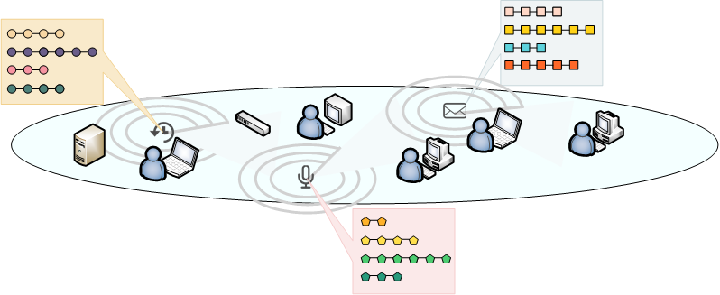
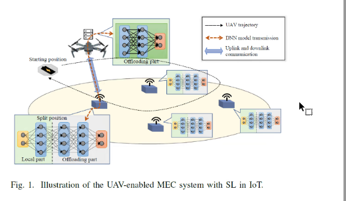

# The Technology of Constructing Network Space Fingerprint Database Based on Association Reasoning

## 面向关联推理的网络空间指纹库构建技术

### 1 Introduction

### 2 Related Work

#### 2.1 网络设备指纹构建

IP地址、MAC地址等标识符

GTID等基于时钟

基于流量

#### 2.2 关联规则挖掘

#### 2.3 关联分类算法典型应用

### 3 The Proposed Method

A. System Model and Assumptions

如图为无线网络空间的设备组成示意图，我们在所考察的空间里放置多个不同功能的传感器用于收集设备信息。各个传感器负责采集其探测有效范围内的一个或多个设备信息。每个传感器能够依据所采集数据形式对来源不同的数据加以区分。如利用麦克风阵列收集与设备配套的键盘音频时，能够通过音源角度区分数据来源，图中每个五边形链表示从同一音频原生数据处理得到的音频特征集，各个五边形分别表示不同的特征。其他传感器所获取的数据特征也一应以此方式表示。

数据的采集与处理在设备指纹构建的流程中是第一步也是极其重要的一步。但由于这并不是本篇文章研究的重点，因此假设我们已经从原生数据得到了易于处理的数据格式，即特征标签集。同样以音频数据为例，以{空心A}={a1, a2, ... , an}表示音频特征全集，它包含了所有能够从音频数据可分析得到的特征标签，该特征集的大小为n。A含于{空心A}表示某一设备可能表现出的特征。。类似的表示同样适用于加密流量、红外等其他类型的特征。由于一个设备会同时表现出不同类型的多种特征，设备某一时刻的特征集可以由F={A, P, I, ...}表示。

B. 构建关联规则库

在介绍了上述关于设备特征集的定义的前提下，我们着力探究设备特征之间，尤其是不类型的特征之间的关系。

C. 生成指纹

#### 声音

Voiceprint recognition of multi scene network devices based on transfer learning

基于迁移学习的多场景网络设备声纹识别、

#### 多尺度

Dynamic Scale Detection Strategy for Network Target Based on Deep Learning

一种基于深度学习的网络目标动态尺度探测策略

#### 设备指纹

Fingerprint generation method based on multi feature weighted voting ensemble classifier for intrusion detection system

面向入侵检测系统的一种基于多特征加权投票集成分类器的指纹生成方法

#### 特征指纹

Extraction of Structured and Unstructured Features of Network Devices based on Triplet and Simhash

基于Simhash和Triplet的网络设备结构化及非结构化特征提取

