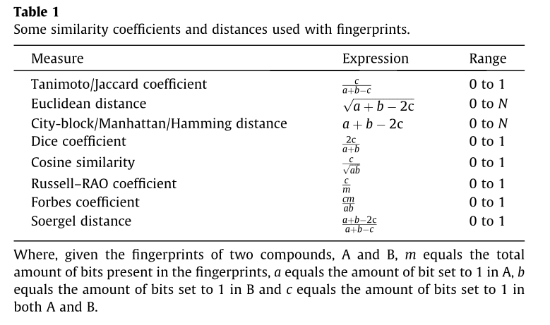

# ProgramingStudy
only hot-fix & not main has changed sth here


# 指纹相似性不同计算方式




# url 反向解析

## 出现场景

1，模板【html中】
① <a href='url'>超链接</a>
点击后页面跳转至url
② <form action='url' method='post'>
form表单中的数据用post方法提交至url
2，视图函数中- 302跳转HttpResponseRedirect('url')
将用户地址栏中的地址跳转到url

## 书写规范

1，绝对地址
http://127.0.0.1:8000/page/12，

|       相对地址        |                   实际url                    |                             举例                             |
| :-------------------: | :------------------------------------------: | :----------------------------------------------------------: |
| /page/1（开头有 / ）  |         当前协议+ip+端口+该相对地址          | 例 当前为 http://127.0.0.1:8000/page/3，则相对地址对应的为 http://127.0.0.1:8000 + /page/1 |
| page/1（开头没有 / ） | 当前url的最后一个/之前的内容加上该相对地址， | 例 当前地址栏地址为http://127.0.0.1:8000/topic/detail，则相对地址对应为http://127.0.0.1:8000/topic/ + page/1 |

## 反向解析

--是指在视图或模板中，用path定义的名称来动态查找或计算出相应的路由

### path函数的语法

```python
 path(route, views, name="别名")
 path( page', views.page_view, name="page_url")
```

根据path中的`name=`关键字传参给url确定了个唯一确定的名字，在模板或视图中，可以通过这个名字反向推断出此url信息

### 模板中

#### url 标签

```html


```

例如

```html


```

即在原来 url.py 的文件中的路径基础山添加·别名 


响应模板为

或者带参数的


响应模板为

### 视图函数中

调用django中的reverse方法进行反向解析

```python
from django.urls import reverse
reverse('别名'，args=[] ，kwargs={})
例如
print( reverse('pagen' ,args=[300] ) ) 
print( reverse('person'，kwargs={'name' :'xixi' ，age' :18}) )
```

# 静态文件

1、配置静态文件的访问路径 [该配置默认存在]

```
 STATIC URL = '/static/'
```

2、配置静态文件的存储路径 STATICEILES DIRS

STATICFIL ES_ DIRS = PATH(BASE_DIR, "static"),

3、访问静态文件

普通的方式在写路径 src 时可以采用绝对路径或者相对路径，django这里提供另外一种方案。

###### 通过标签访问静态文件

1.加载static - 
2.使用静态资源- 
3.样例 


### 应用

步骤1

用manage.py中的子命令startapp创建应用文件夹

```
python3 manage.py startapp music
```

步骤2

在settings.py的INSTALLED_ _APPS列表中配置安装此应用

#### 
